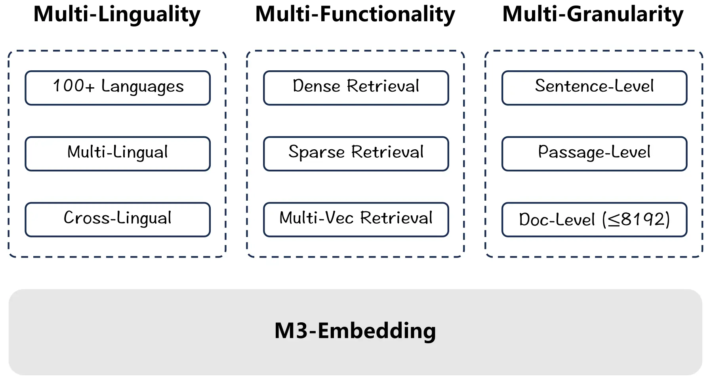

# 02주차 · 토큰화와 희소 문서 벡터

- 원본 연계: *Hands-On Large Language Models*, Chapter 2 + 고전 정보검색
- 연결 슬라이드: [`week02_tokenization_sparse.md`](../slides/week02_tokenization_sparse.md)
- 실습 노트북: [`week02.ipynb`](../notebooks/week02.ipynb)
- 권장 학습시간: 개념 50분 · 수학 35분 · 노트북 60분 · 토론과 정리 25분

## 이번 주에 답할 질문

문자열은 그대로 신경망이나 검색기에 들어갈 수 없다. 먼저 문자열을 단위로 나누고 각 단위를 정수나 벡터로 바꾸어야 한다. 이때 토큰화는 단순한 정리 작업이 아니라 모델이 관측할 최소 단위를 정하는 가설이다.

> “목포대학교”, “목포”, “대학교” 중 무엇을 한 단위로 볼 것인가?

“신청하지 않았다”를 잘못 나누면 부정 정보가 약해질 수 있다. 반대로 학번, 서식 번호, 최신 법령명처럼 정확히 일치해야 하는 표현은 밀집 임베딩보다 희소 검색이 더 잘 찾을 수 있다. 이번 주에는 문자열이 토큰과 희소 벡터를 거쳐 검색 점수가 되는 전 과정을 추적한다.

## 학습목표

학습을 마치면 다음을 할 수 있어야 한다.

1. 토큰, 어휘집, 미등록어, 부분 단어와 바이트 단위를 구분한다.
2. 정규화–사전 분절–부분 단어 모형–정수 ID 변환의 순서를 설명한다.
3. BPE, WordPiece, Unigram의 학습 아이디어와 차이를 설명한다.
4. 원-핫 벡터, 단어 주머니, TF–IDF와 BM25를 작은 예제로 계산한다.
5. 희소 표현과 밀집 표현이 서로 다르게 실패하는 이유를 분석한다.
6. 점수 결합과 역순위 융합으로 희소·밀집 혼합 검색을 설계한다.
7. 토큰화기의 품질을 토큰 수뿐 아니라 손실, 과업 성능과 비용으로 평가한다.

## 1. 문자열에서 토큰 ID까지

일반적인 토큰화기는 다음 단계의 조합이다.

문자열 → 정규화 → 사전 분절 → 부분 단어 분절 → 정수 ID → 특수 토큰 추가

### 1.1 핵심 용어

- **토큰(token)**: 모델이 한 위치에서 처리하는 기호 단위다. 언어학적 단어와 같을 필요가 없다.
- **어휘집(vocabulary)**: 토큰 문자열과 정수 ID의 대응표다.
- **미등록어(out-of-vocabulary, OOV)**: 어휘집에 없는 입력 단위다.
- **부분 단어(subword)**: 단어보다 작고 문자보다 클 수 있는 재사용 가능한 문자열 단위다.
- **특수 토큰**: 문장 시작·종료, 구분, 가림, 채움과 같은 기능을 표시한다.

정규화에서는 대소문자, 유니코드 조합, 공백, 악센트 등을 바꿀 수 있다. 사전 분절은 공백·구두점 등을 기준으로 후보 덩어리를 만든다. 부분 단어 모형은 후보를 학습된 어휘 항목으로 나눈다. 마지막으로 토큰을 정수 ID로 바꾸고 모델이 요구하는 특수 토큰을 붙인다.

토큰화기 설정은 모델 매개변수만큼 중요하다. 같은 모델 이름이라도 토큰화기 파일이나 정규화 규칙이 달라지면 입력 ID가 달라져 재현성이 깨진다. 모델 버전과 함께 토큰화기 버전도 기록해야 한다.

## 2. 토큰 단위의 선택

| 단위 | 장점 | 한계 |
|---|---|---|
| 단어·형태소 | 사람이 해석하기 쉬움 | 신조어·복합어·형태 변이와 분석기 오류 |
| 문자 | 미등록어가 거의 없음 | 시퀀스가 길고 의미 단위가 지나치게 분해됨 |
| 부분 단어 | 시퀀스 길이와 어휘 크기의 절충 | 학습 말뭉치와 언어에 따라 분절 품질이 다름 |
| 바이트 | 모든 유니코드 문자열을 표현 가능 | 토큰 수가 늘고 사람이 읽기 어려움 |

한국어는 어간에 조사와 어미가 결합하며 띄어쓰기 변이도 많다. 한글·영문·숫자가 섞인 “AI·SW융합교육원 2026-2” 같은 표현도 흔하다. 영어 중심 토큰화기에서 한국어 한 문장이 더 많은 토큰으로 나뉘면 같은 문맥 창에 넣을 수 있는 내용이 줄고 추론 비용도 증가한다.

“토큰 수가 적다”만으로 좋은 토큰화기라고 결론 내릴 수는 없다. 너무 큰 토큰은 희귀 조합을 외워 일반화가 나빠질 수 있고, 너무 작은 토큰은 의미 단위를 잃고 계산량을 늘릴 수 있다.

## 3. 부분 단어 학습 방법

### 3.1 BPE

Byte Pair Encoding(BPE)은 현재 기호열에서 빈도가 가장 높은 인접 쌍을 반복해서 합친다.

1. 단어를 문자 또는 바이트 단위로 시작한다.
2. 말뭉치의 인접 기호 쌍 빈도를 센다.
3. 가장 빈번한 쌍을 새 기호로 합친다.
4. 목표 어휘 크기나 병합 횟수에 도달할 때까지 반복한다.

예를 들어 `학생`, `학생들`, `학생회`가 자주 나타난다고 하자. 초기에 `학 생`, `학 생 들`, `학 생 회`로 시작하면 `(학, 생)` 쌍이 반복된다. 이를 `학생`으로 합친 뒤 `(학생, 들)`이나 `(학생, 회)`를 추가로 합칠 수 있다. 빈번한 문자열은 긴 토큰이 되고 희귀 문자열은 더 작은 단위로 남는다.

BPE가 학습하는 것은 의미 사전이 아니라 순서가 있는 병합 규칙 목록이다. 공백 표시, 바이트 폴백, 정규화 방법은 구현마다 다르므로 “BPE 사용”이라는 설명만으로는 재현할 수 없다.

### 3.2 WordPiece

WordPiece는 BERT 계열 토큰화기에서 널리 알려진 부분 단어 방식이다. 가능한 결합이 학습 자료의 우도를 얼마나 개선하는지를 고려하는 계열로 이해할 수 있다. `playing`을 `play`, `##ing`으로 나타내는 것처럼 단어 중간 토큰에 표식을 붙이는 구현이 흔하다.

BPE와 WordPiece는 구현 세부와 선택 점수가 다르지만, 빈번한 문자열을 재사용 가능한 부분 단어로 만들고 희귀어를 조각으로 표현한다는 목적을 공유한다.

### 3.3 Unigram 언어 모형

Unigram 방식은 큰 후보 어휘에서 시작해 각 토큰의 확률을 학습하고, 전체 자료의 우도를 덜 해치는 토큰을 차례로 제거한다. 하나의 문자열에 여러 가능한 분절이 있을 때 전체 확률이 큰 분절을 선택할 수 있다. SentencePiece는 Unigram과 BPE를 지원하며 공백도 입력 기호의 일부로 처리할 수 있다.

세 방법의 이름만 보고 실제 동작을 단정하지 말고 `normalizer`, 사전 분절기, 부분 단어 모형, 후처리기와 특수 토큰 설정을 확인한다.

## 4. 토큰화 품질 측정

토큰화기는 다음 세 수준에서 평가한다.

| 수준 | 대표 측정 | 해석 |
|---|---|---|
| 분절 효율 | 단어·문장당 토큰 수, 중앙값, p95 | 문맥 창과 계산 비용에 미치는 영향 |
| 문자열 보존 | `[UNK]` 비율, 문자 손실, 잘림 비율 | 입력을 빠짐없이 표현하는가 |
| 과업 성능 | 검색 재현율, 분류 F1, 지연시간 | 실제 서비스에서 유용한가 |

평균 토큰 수만 보면 긴 문장과 고유명사의 문제가 숨을 수 있다. 언어, 문장 길이, 숫자, 코드, 이모지, 고유명사별 부분집합을 나누어 분포를 본다. 같은 입력을 `decode(encode(text))`하여 정규화로 어떤 문자가 달라졌는지도 확인한다.

문맥 창이 512토큰인 모델에서 한국어 문장이 영어보다 두 배 많은 토큰을 사용한다면, 문자 수가 같아도 실제로 넣을 수 있는 정보량이 줄어든다. 토큰화는 정확도뿐 아니라 비용과 입력 한도의 문제다.

## 5. 원-핫 벡터와 단어 주머니

어휘 $V=[\text{관광},\text{복지},\text{산업},\text{해양}]$의 크기가 4라 하자. `해양`의 원-핫 벡터는 다음과 같다.

$$
\operatorname{onehot}(\text{해양})=[0,0,0,1]
$$

원-핫 벡터끼리는 서로 직교하므로 `해양`과 `관광`이 자주 함께 쓰여도 벡터 자체에는 관계가 없다. 문서의 단어 주머니(Bag of Words, BoW)는 각 어휘 항목의 출현 횟수를 센다.

| 문서 | 관광 | 복지 | 산업 | 해양 |
|---|---:|---:|---:|---:|
| `해양 관광` | 1 | 0 | 0 | 1 |
| `해양 산업` | 0 | 0 | 1 | 1 |
| `복지 관광` | 1 | 1 | 0 | 0 |

이 행렬은 0이 많으므로 희소 행렬로 저장한다. 희소 표현(sparse representation)은 대부분의 좌표가 0인 표현이다. 실제 구현은 모든 0을 저장하지 않고 0이 아닌 열 위치와 값만 보관한다.

BoW는 정확한 키워드를 보존하고 해석하기 쉽지만 어순을 잃는다. “학생이 교수를 평가한다”와 “교수가 학생을 평가한다”는 같은 단어를 한 번씩 사용하므로 동일한 BoW가 된다. 동의어도 별도 열이므로 “분할납부”와 “나눠 내다”를 자동으로 연결하지 못한다.

## 6. TF–IDF

단어 빈도–역문서 빈도(TF–IDF)는 한 문서에서 자주 나타나면서 전체 말뭉치에서는 드문 단어에 높은 가중치를 준다. 강의에서 사용하는 한 가지 정의는 다음과 같다.

$$
\operatorname{tfidf}(t,d)=\operatorname{tf}(t,d)
\log\frac{N+1}{\operatorname{df}(t)+1}
$$

- $N$: 전체 문서 수
- $\operatorname{tf}(t,d)$: 문서 $d$ 안의 토큰 $t$ 빈도
- $\operatorname{df}(t)$: 토큰 $t$가 등장한 문서 수

문서가 3개일 때 `해양`이 2개 문서에 나오면 IDF는 $\log(4/3)\approx0.288$이다. `복지`가 1개에만 나오면 $\log(4/2)=\log2\approx0.693$이다. 희귀한 `복지`가 문서를 더 잘 구분하므로 가중치가 크다.

그러나 희귀한 오타도 높은 IDF를 얻는다. `min_df`, 철자 정규화, 사용자 사전 등으로 잡음을 줄일 수 있지만 실제 고유명사까지 제거하지 않도록 개발 데이터에서 확인해야 한다.

라이브러리마다 로그 밑, 평활화, 로그 TF, 마지막 $+1$, L2 정규화가 다르다. 예를 들어 scikit-learn의 기본 평활 IDF는 $\log((1+N)/(1+\operatorname{df}))+1$이다. 논문과 코드에서는 수식뿐 아니라 구현 옵션까지 기록한다.

TF–IDF 문서 벡터를 L2 정규화하면 질의 벡터와의 내적은 코사인 유사도와 같다. 노트북의 `(X @ q.T)`가 점수로 사용되는 이유가 이것이다.

## 7. BM25

BM25는 TF–IDF의 아이디어를 확장해 단어 빈도 포화와 문서 길이 보정을 명시적으로 포함한다.

$$
\operatorname{BM25}(q,d)=\sum_{t\in q}\operatorname{IDF}(t)
\frac{f(t,d)(k_1+1)}
{f(t,d)+k_1(1-b+b|d|/\operatorname{avgdl})}
$$

- $f(t,d)$: 문서 안의 질의 토큰 빈도
- $|d|$, $\operatorname{avgdl}$: 문서 길이와 평균 문서 길이
- $k_1$: 단어 빈도의 포화 속도
- $b$: 문서 길이 보정 강도

문서 길이가 평균과 같고 $k_1=1.2$이면 빈도 항은 $f(t,d)\times2.2/(f(t,d)+1.2)$다. 빈도 1일 때 1, 빈도 2일 때 1.375, 빈도 10일 때 약 1.964다. 같은 단어를 10번 반복해도 점수가 10배가 되지 않는 포화 효과를 확인할 수 있다.

긴 문서는 우연히 많은 단어를 포함하므로 $b>0$일 때 길이에 대한 불이익을 받는다. BM25는 고전적 방법이지만 식별자, 고유명사, 법령명처럼 정확한 어휘 일치가 중요한 검색에서 여전히 강한 기준선이다.

## 8. 역색인과 희소 검색

희소 검색은 보통 역색인(inverted index)을 사용한다. 문서마다 모든 토큰을 비교하는 대신 각 토큰이 등장하는 문서 목록을 저장한다.

```text
해양 → (문서 1, 빈도 1), (문서 2, 빈도 1)
관광 → (문서 1, 빈도 1), (문서 3, 빈도 1)
```

질의에 `해양`이 있으면 이 목록의 문서만 점수 계산 후보가 된다. 희소 행렬과 역색인은 같은 정보를 서로 다른 계산 목적에 맞게 표현한다. `CountVectorizer`와 `TfidfVectorizer`가 반환하는 CSR 행렬도 0이 아닌 값 중심으로 저장된다.

## 9. 희소 표현과 밀집 표현의 실패 비교

| 질의 | 희소 검색 | 밀집 검색 |
|---|---|---|
| `근로장학 B-17 서식` | 정확한 코드에 강함 | 코드 의미가 벡터에서 희석될 수 있음 |
| `등록금을 나눠 낼 수 있나요?` | `분할납부`와 어휘 불일치 | 의미 대응 가능 |
| `신청하지 않은 학생` | 부정 토큰을 직접 반영 | 부정 차이를 놓칠 수 있음 |
| 새로 개정된 법령명 | 색인만 갱신하면 즉시 반영 | 학습 자료에 없을 수 있음 |

희소 표현은 표면 문자열을 보존하고 밀집 표현은 학습된 의미 관계를 활용한다. 어느 하나가 항상 우월하지 않다. 두 방법의 오류가 서로 다르기 때문에 결합할 가치가 있다.

## 10. 희소·밀집 혼합 검색

### 10.1 점수 결합

각 점수의 범위를 먼저 맞춘 뒤 가중합할 수 있다.

$$
s_{\mathrm{hybrid}}(q,d)=
\alpha\tilde s_{\mathrm{dense}}(q,d)
+(1-\alpha)\tilde s_{\mathrm{sparse}}(q,d)
$$

BM25 점수와 코사인 점수의 범위는 다르므로 원점수를 그대로 더하면 한쪽이 우연히 지배할 수 있다. 정규화 방식과 $\alpha$는 개발 데이터에서 정하고 최종 평가 데이터는 마지막 한 번의 평가에만 사용한다.

### 10.2 역순위 융합

역순위 융합(Reciprocal Rank Fusion, RRF)은 점수 대신 순위만 결합한다.

$$
\operatorname{RRF}(d)=\sum_{r}\frac{1}{k+\operatorname{rank}_r(d)}
$$

예를 들어 $k=60$이고 문서 A가 희소 검색 1위, 밀집 검색 4위라면 점수는 $1/61+1/64\approx0.0320$이다. 서로 다른 검색기의 점수 보정 없이도 결합할 수 있지만 $k$, 후보 수, 동순위 처리 규칙은 기록해야 한다.

메타데이터 필터를 검색 전 적용할지 후보 결합 후 적용할지도 결과와 속도에 영향을 준다. 날짜·학과·문서 권한처럼 반드시 지켜야 하는 조건은 벡터 유사도에 맡기지 말고 구조화된 필터로 처리하는 편이 안전하다.

## 11. *Hands-On LLM* 2장과의 연결

교재는 `bert-base-uncased`, `gpt2`, T5 등 여러 학습된 토큰화기에 같은 문자열을 넣어 분절 결과를 비교한다. 영어 대소문자, 음악 기호, 한자, 코드 연산자, 숫자와 공백을 함께 넣어 모델마다 다른 ID가 나오는 것을 보여준다.

한국어 강의에서는 다음 세 문장을 추가해 비교한다.

```python
texts = [
    "국립목포대학교 장학금 신청 안내",
    "AI·SW융합교육원 2026-2 프로그램",
    "신청하지 않은 학생은 제외합니다",
]
```

출력 토큰을 눈으로 보는 데서 끝내지 않고 문장당 토큰 수, p95, 미등록어, 숫자·영문·고유명사 분절, 복원 결과를 표로 만든다. 이후 희소 기준선과 밀집 임베딩을 같은 검색 정답으로 평가하면 토큰화가 비용과 과업 성능으로 전달되는 과정을 볼 수 있다.

## 12. 논문 읽기: BGE-M3

BGE-M3는 하나의 모델에서 다음 세 검색 표현을 지원하도록 설계되었다.

- 밀집 표현: 문장·문서당 하나의 벡터
- 학습된 희소 표현: 어휘 항목별 가중치
- 다중 벡터 표현: 토큰 수준의 후기 상호작용

논문 제목의 M3는 다국어(multi-lingual), 다기능(multi-functionality), 다중 세분성(multi-granularity)을 가리킨다. 논문은 100개 이상의 언어와 최대 8,192토큰 입력을 보고하지만, 자신의 한국어·도메인·하드웨어에서 재현해야 실제 선택 근거가 된다.



*그림 1. 다국어, 다기능, 다중 세분성의 세 축을 하나의 임베딩 모델에 통합하려는 BGE-M3의 범위.
출처: Chen et al. (2024), “BGE M3-Embedding,” Figure 1,
[ACL Anthology 원문](https://aclanthology.org/2024.findings-acl.137/).*

그림은 세 원이 겹치는 중앙을 먼저 본다. “하나의 최고 벡터”가 아니라 동일 인코더에서 밀집 검색, 희소 검색, 다중 벡터 검색 신호를 함께 제공하는 것이 핵심이다. 다음으로 각 바깥 영역의 언어 범위, 입력 길이와 학습 자료를 확인한다. 그림은 가능 기능을 보여주지만 모든 기능이 모든 자료에서 같은 성능을 낸다는 증거는 아니다.

*Hands-On LLM*의 토큰화기·밀집 벡터와 8장의 의미 검색을 함께 읽으면 토큰화가 밀집 입력뿐 아니라 학습된 희소 가중치와 토큰 수준 다중 벡터에도 영향을 준다는 점을 이해할 수 있다.

## 13. 노트북 실습 안내

[`week02.ipynb`](../notebooks/week02.ipynb)은 다섯 개의 지역 정책 문서로 희소 검색 기준선을 만든다.

### 실행 점검 1 · 자료와 가설

문서 목록을 읽고 질의 `해양 관광 창업 지원`의 1위 문서를 실행 전에 예측한다. 어떤 토큰이 순위를 결정할지 표시한다. 공통 토큰 `지원`과 더 구체적인 `해양`, `관광`, `창업`의 문서 빈도를 예상한다.

### 실행 점검 2 · 단어 빈도 행렬

`CountVectorizer` 셀을 실행하고 `count_df`의 행·열 의미를 확인한다. `X_count.shape`와 `X_count.nnz`를 출력한 뒤 `nnz/(행 수×열 수)`로 0이 아닌 값의 비율을 계산한다. 이 값이 낮을수록 행렬이 더 희소하다.

### 실행 점검 3 · TF–IDF 검색

`TfidfVectorizer`의 기본값에는 L2 정규화와 scikit-learn 방식 IDF가 포함된다. 따라서 `(X @ q.T)`는 정규화된 벡터의 코사인 유사도와 같다. 상위 문서의 공통 토큰과 각 토큰의 IDF를 출력해 점수를 설명한다.

### 실행 점검 4 · 표현 변경

질의를 세 번 바꾸고 `ngram_range=(1,2)`를 적용한다. “해양 관광” 같은 2-그램이 순위에 주는 효과를 비교한다. `분할납부` 문서와 `등록금을 나눠 내다` 질의를 추가해 어휘 불일치 실패 사례를 만든다.

### 실행 점검 5 · 기록

모델 이름만 적지 말고 문서 목록, 토큰화 규칙, 어휘 크기, 희소도, 질의, 상위 결과와 실패 원인을 저장한다. 생성형 AI가 제안한 동의어 확장도 최종 평가 자료와 분리된 개발 질의에서 검증한다.

## 14. 실험 설계 예시

같은 30개 문서와 10개 질의를 사용해 다음 네 조건을 비교할 수 있다.

| 조건 | 표현 | 조정 자료 | 측정 |
|---|---|---|---|
| A | 공백 토큰 TF–IDF 1-그램 | 개발 데이터 | 상위 5개 재현율, 어휘 크기, 희소도 |
| B | 사용자 사전 TF–IDF 1–2그램 | 개발 데이터 | 동일 |
| C | 문장 밀집 임베딩 | 개발 데이터 | 상위 5개 재현율, 토큰 수, 지연시간 |
| D | B와 C의 RRF | 개발 데이터 | 상위 5개 재현율, 오류 유형 |

토큰화기와 결합 가중치를 최종 평가 데이터에서 선택하면 데이터 누수가 생긴다. 개발 데이터에서 모든 선택을 마친 뒤 설정을 고정하고 최종 평가 데이터는 한 번만 사용한다.

## 15. 흔한 오해와 교정

1. **“토큰은 단어다.”** 토큰은 모델의 처리 단위이며 문자, 부분 단어, 바이트 또는 특수 기호일 수 있다.
2. **“토큰 수가 적을수록 항상 좋다.”** 비용은 줄 수 있지만 의미 분해와 과업 성능을 함께 봐야 한다.
3. **“부분 단어를 쓰면 OOV 문제가 완전히 사라진다.”** 문자열 표현은 가능해도 희귀 개념을 잘 학습했다는 뜻은 아니다.
4. **“TF–IDF는 의미를 전혀 다루지 못하므로 쓸모없다.”** 식별자·고유명사·정확한 문구 검색에서는 매우 강한 기준선이다.
5. **“BM25는 TF를 그대로 더한다.”** 단어 빈도 포화와 문서 길이 보정을 사용한다.
6. **“희소와 밀집 점수를 그대로 더하면 된다.”** 점수 범위가 달라 정규화나 순위 결합이 필요하다.
7. **“최종 평가 데이터에서 가장 좋은 α를 고르면 된다.”** 설정 선택에 최종 평가 정보를 사용하면 일반화 성능을 과대평가한다.

## 16. 핵심 정리

- 토큰화는 모델이 관측하는 최소 단위와 계산 비용을 동시에 정한다.
- BPE, WordPiece, Unigram은 부분 단어 어휘를 만드는 목표와 선택 방식이 다르다.
- BoW와 TF–IDF는 정확한 어휘 단서를 보존하는 해석 가능한 희소 표현이다.
- BM25는 단어 빈도 포화와 문서 길이 보정으로 검색 점수를 안정화한다.
- 밀집 표현은 어휘 불일치를 줄이지만 부정, 코드, 최신 고유명사를 놓칠 수 있다.
- 희소·밀집 혼합 검색은 서로 다른 실패 유형을 결합하며 설정은 개발 데이터에서 정한다.
- 최신 임베딩 모델도 희소 표현을 폐기하기보다 밀집·다중 벡터 표현과 통합하는 방향을 보인다.

## 17. 복습문제

1. 토큰화가 단순 전처리가 아니라 모델 가설인 이유를 한국어 예로 설명하라.
2. BPE와 Unigram 방식의 시작 상태와 반복 연산이 어떻게 다른가?
3. 어휘가 `[관광, 복지, 산업, 해양]`일 때 `해양 관광 관광`의 BoW를 작성하라.
4. 전체 9개 문서 중 2개 문서에 등장하는 토큰의 $\log((N+1)/(df+1))$ IDF를 계산하라.
5. scikit-learn TF–IDF 값이 강의 수식의 값과 다를 수 있는 이유는 무엇인가?
6. BM25에서 $k_1$과 $b$가 각각 무엇을 제어하는가?
7. 희소 검색과 밀집 검색이 서로 반대로 성공하는 질의를 하나씩 설계하라.
8. BM25와 코사인 원점수를 그대로 합치는 것이 위험한 이유를 설명하라.
9. RRF에서 $k$를 매우 크게 하면 순위 차이의 영향이 어떻게 달라질지 추론하라.
10. 토큰화기 비교 실험에서 최종 평가 데이터 누수를 막는 절차를 쓰라.

## 18. 참고문헌

1. Alammar, J., & Grootendorst, M. (2024). *Hands-On Large Language Models*, Chapter 2. [공개 실습 저장소](https://github.com/HandsOnLLM/Hands-On-Large-Language-Models/tree/main/chapter02)
2. Sennrich, R., Haddow, B., & Birch, A. (2016). “Neural Machine Translation of Rare Words with Subword Units.” [ACL Anthology](https://aclanthology.org/P16-1162/)
3. Wu, Y. et al. (2016). “Google’s Neural Machine Translation System: Bridging the Gap between Human and Machine Translation.” [arXiv](https://arxiv.org/abs/1609.08144)
4. Kudo, T., & Richardson, J. (2018). “SentencePiece: A Simple and Language Independent Subword Tokenizer and Detokenizer for Neural Text Processing.” [EMNLP](https://aclanthology.org/D18-2012/)
5. Kudo, T. (2018). “Subword Regularization: Improving Neural Network Translation Models with Multiple Subword Candidates.” [ACL Anthology](https://aclanthology.org/P18-1007/)
6. Robertson, S., & Zaragoza, H. (2009). “The Probabilistic Relevance Framework: BM25 and Beyond.” [Foundations and Trends in Information Retrieval](https://doi.org/10.1561/1500000019)
7. Cormack, G. V., Clarke, C. L. A., & Büttcher, S. (2009). “Reciprocal Rank Fusion Outperforms Condorcet and Individual Rank Learning Methods.” [SIGIR](https://doi.org/10.1145/1571941.1572114)
8. Chen, J. et al. (2024). “BGE M3-Embedding: Multi-Lingual, Multi-Functionality, Multi-Granularity Text Embeddings Through Self-Knowledge Distillation.” [ACL Anthology](https://aclanthology.org/2024.findings-acl.137/)
9. scikit-learn developers. “TfidfVectorizer.” [공식 문서](https://scikit-learn.org/stable/modules/generated/sklearn.feature_extraction.text.TfidfVectorizer.html)
