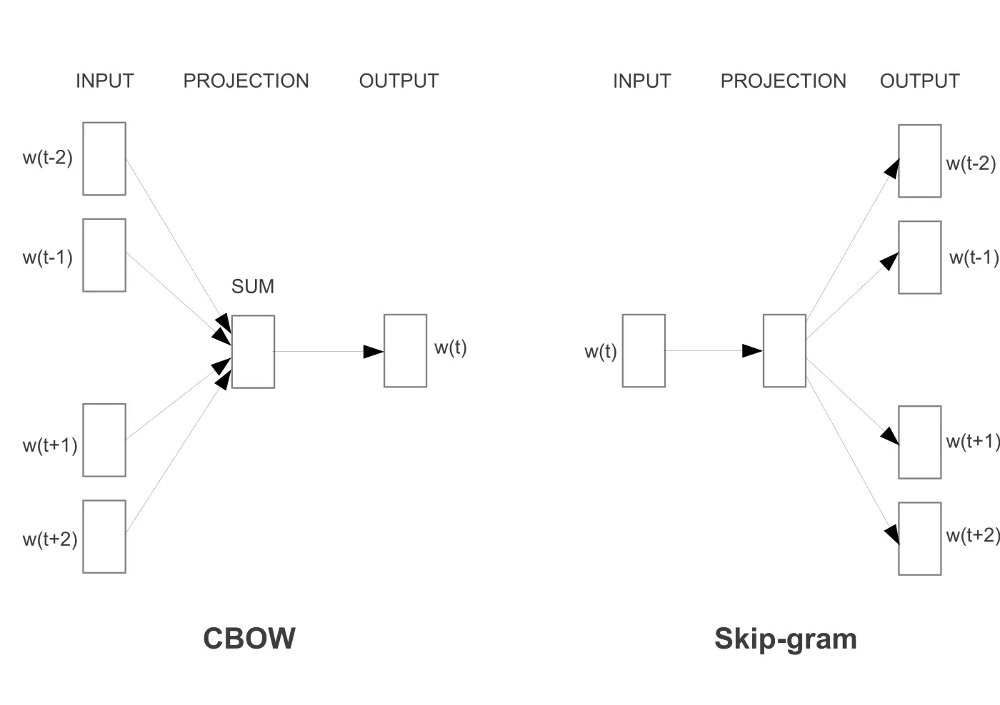

# 03주차 · 분포 가설과 단어 임베딩
- 원본 연계: *Hands-On Large Language Models*, Chapter 2, “Word Embeddings Beyond LLMs”
- 연결 슬라이드: [`week03_word_embeddings.md`](../slides/week03_word_embeddings.md)
- 실습 노트북: [`week03.ipynb`](../notebooks/week03.ipynb)
- 권장 학습시간: 개념 50분 · 수학 40분 · 노트북 60분 · 토론과 정리 25분

## 이번 주에 답할 질문
사람은 사전 정의와 경험으로 단어의 의미를 배운다. 컴퓨터는 대규모 텍스트에서 단어가 어떤 이웃과 얼마나 자주 나타나는지를 관측할 수 있다. 분포 가설(distributional hypothesis)은 비슷한 문맥에 등장하는 단어가 비슷한 의미나 기능을 갖는 경향이 있다는 생각이다.

> 단어의 주변 분포를 세고 압축하면 어느 정도까지 의미를 복원할 수 있는가?

“학생이 ___을 신청했다”의 빈칸에는 장학금, 수강, 기숙사 등이 반복될 수 있다. 이 단어들은 동의어는 아니지만 신청의 대상이라는 유사한 기능과 대학 행정이라는 주제를 공유한다. 분포 기반 임베딩은 이런 통계적 규칙을 벡터 공간에 나타낸다.

그러나 분포가 의미 전체는 아니다. 말뭉치에 쓰인 사실이 참인지, 두 사건에 인과관계가 있는지, 특정 표현이 공정한지를 자동으로 보장하지 않는다. 이번 주에는 단어 동시 출현 행렬부터 PPMI–SVD, Word2Vec, GloVe와 fastText까지 하나의 흐름으로 연결한다.

## 학습목표
학습을 마치면 다음을 할 수 있어야 한다.

1. 분포 가설과 문맥 창이 단어 관계를 정의하는 방식을 설명한다.
2. 작은 말뭉치에서 단어 동시 출현 행렬을 손으로 구성한다.
3. PMI와 PPMI가 단순 빈도와 다른 이유를 수식과 수치로 설명한다.
4. 특이값 분해(SVD)로 희소 행렬을 저차원 밀집 표현으로 바꾸는 과정을 설명한다.
5. CBOW와 Skip-gram의 입력·정답 방향을 구분한다.
6. 전체 소프트맥스와 비관련 표본 추출의 계산 차이를 설명한다.
7. Word2Vec, GloVe, fastText의 학습 신호와 구조적 한계를 비교한다.
8. 단어 벡터의 이웃·유추 결과를 과장하지 않고 평가 가능한 실험으로 바꾼다.

## 1. 분포 가설
분포 가설은 Harris의 분포언어학과 Firth의 “함께 나타나는 단어로 단어를 안다”는 관점에서 발전했다. 현대의 통계적 언어 모형과 임베딩도 구체적 목적함수는 다르지만 주변 문맥이 단어 표현을 학습하는 신호가 된다는 점을 공유한다.

여기서 “비슷하다”는 적어도 두 의미를 가질 수 있다.

- **기능적 유사성**: 같은 문장 위치에 대체 가능하다. 예: “학생/교직원이 신청했다.”
- **주제적 관련성**: 같은 주제 안에 자주 등장한다. 예: “장학금/등록금/학자금.”

문맥 창이 작으면 인접한 문법 관계와 기능적 유사성을 더 많이 반영하는 경향이 있다. 창이 크면 문서의 주제적 관련성을 더 많이 반영할 수 있다. 이는 절대 법칙이 아니라 말뭉치, 가중치와 학습 방법에 따라 검증해야 하는 경험적 경향이다.

## 2. 단어 동시 출현 행렬
단어 동시 출현 행렬(word co-occurrence matrix)은 중심 단어 주변의 정해진 문맥 범위에서 문맥 단어가 함께 나타난 횟수를 센 행렬이다.

$$
C_{w,c}=\#\{\text{문맥 창 안에서 }w\text{와 }c\text{가 함께 나타난 경우}\}
$$

행은 중심 단어 $w$, 열은 문맥 단어 $c$다. 좌우 문맥을 같은 열에 합치면 대칭 행렬이 될 수 있고, 왼쪽·오른쪽을 구분하면 비대칭 표현을 만들 수 있다. 가까운 문맥에 더 큰 가중치를 주는 방식도 가능하다.

### 2.1 손계산 예제
문장 `학생 장학금 신청`에 창 크기 1을 적용하자. 각 중심 위치의 바로 왼쪽과 오른쪽만 센다.

- 중심 `학생`: 문맥 `장학금` 1회
- 중심 `장학금`: 문맥 `학생` 1회, `신청` 1회
- 중심 `신청`: 문맥 `장학금` 1회

| 중심＼문맥 | 학생 | 장학금 | 신청 |
|---|---:|---:|---:|
| 학생 | 0 | 1 | 0 |
| 장학금 | 1 | 0 | 1 |
| 신청 | 0 | 1 | 0 |

창 크기를 2로 늘리면 `학생`과 `신청`도 서로의 문맥이 된다. 한 개의 하이퍼파라미터가 관측 관계 자체를 바꾸는 것이다. 문장 경계를 넘어 세지 않는지, 중심 단어 자신을 제외하는지, 방향별 횟수를 어떻게 더하는지도 구현에 명시한다.

### 2.2 단순 빈도의 문제
대규모 말뭉치에서는 “하다”, “있다”와 같은 고빈도 단어가 거의 모든 중심 단어 주변에 나타난다. 동시 출현 횟수만 비교하면 이런 공통어가 벡터를 지배할 수 있다. 중요한 질문은 “몇 번 같이 나왔는가?”뿐 아니라 “각 단어의 전체 빈도를 고려할 때 기대보다 얼마나 더 자주 같이 나왔는가?”다.

## 3. PMI와 PPMI
점별 상호정보량(Pointwise Mutual Information, PMI)은 두 사건이 독립일 때 예상되는 빈도와 실제 공동 빈도의 비를 로그로 측정한다.

$$
\operatorname{PMI}(w,c)= \log\frac{P(w,c)}{P(w)P(c)}
$$

- $P(w,c)$: 중심 단어 $w$와 문맥 단어 $c$가 함께 관측될 확률
- $P(w)$: 모든 문맥을 합친 중심 단어의 주변확률
- $P(c)$: 모든 중심 단어를 합친 문맥 단어의 주변확률

두 사건이 독립이면 $P(w,c)=P(w)P(c)$이므로 PMI는 0이다. 기대보다 자주 함께 나오면 양수, 덜 나오면 음수다.

### 3.1 수치 예제
전체 동시 출현 사건이 20회이고 어떤 쌍 $(w,c)$가 4회 나타났다고 하자. 중심 단어 $w$의 전체 횟수는 5, 문맥 단어 $c$의 전체 횟수는 8이라면

$$
P(w,c)=\frac4{20}=0.2,\quad P(w)=\frac5{20}=0.25,\quad P(c)=\frac8{20}=0.4.
$$

로그 밑을 2로 하면

$$
\operatorname{PMI}(w,c) =\log_2\frac{0.2}{0.25\times0.4} =\log_2 2=1.
$$

독립일 때 기대되는 공동확률 0.1보다 실제 확률 0.2가 두 배이므로 1비트의 양의 연관을 얻는다.

양의 점별 상호정보량(Positive PMI, PPMI)은 음수를 0으로 바꾼다.

$$
\operatorname{PPMI}(w,c)=\max(\operatorname{PMI}(w,c),0)
$$

문맥 특징으로 “기대보다 덜 만난 관계”보다 “기대보다 더 만난 관계”를 강조하기 위한 선택이다. 그러나 매우 희귀한 쌍은 분모가 작아 PMI가 과도하게 커질 수 있다. 최소 빈도, 문맥 분포 평활화, 이동 PMI(shifted PMI) 등을 함께 검토한다.

## 4. SVD로 희소 통계를 압축하기
PPMI 행렬은 어휘 크기만큼 행과 열을 가지며 대부분의 값이 0이다. 특이값 분해(singular value decomposition, SVD)는 행렬을 직교 방향과 그 중요도로 분해한다.

$$
X=U\Sigma V^\top
$$

- $U$: 중심 단어 공간의 왼쪽 특이벡터
- $\Sigma$: 각 방향의 크기를 담은 대각 특이값 행렬
- $V$: 문맥 공간의 오른쪽 특이벡터

상위 $k$개 특이값과 벡터만 남기면 저랭크 근사를 얻는다.

$$
X\approx U_k\Sigma_kV_k^\top
$$

행렬의 크기(Frobenius 노름, Frobenius norm) 기준으로 잘린 SVD는 가능한 랭크 $k$ 근사 중 재구성 오차가 가장 작다. 여러 문맥 열이 함께 변하는 패턴을 소수의 잠재 방향으로 압축하므로, 직접 함께 나타나지 않은 단어도 유사한 문맥 패턴을 통해 가까워질 수 있다.

단어 임베딩을 $U_k\Sigma_k$, $U_k\Sigma_k^{1/2}$ 또는 $U_k$ 중 무엇으로 정의할지는 설계 선택이다. 3주차 노트북은 중심·문맥 표현을 대칭적으로 배분한다는 직관으로 $U_k\Sigma_k^{1/2}$를 사용한다.

SVD는 잡음을 줄이고 동의어 연결을 도울 수 있지만 선형 근사이며, $k$를 너무 작게 하면 필요한 차이를 잃고 너무 크게 하면 희귀 통계의 잡음을 보존한다. $k$는 그림이 예쁜지가 아니라 이후 검색·분류 지표로 선택한다.

## 5. Word2Vec의 두 학습 과제
Word2Vec은 작은 신경망으로 단어 예측 과제를 학습하고 은닉 가중치를 단어 벡터로 사용한다. 대표 구조는 CBOW와 Skip-gram이다.

- **CBOW**: 여러 주변 단어를 입력으로 받아 중심 단어를 예측한다.
- **Skip-gram**: 중심 단어를 입력으로 받아 주변 단어를 예측한다.

예를 들어 “학생이 장학금을 신청했다”에서 중심 단어가 `장학금`이면 CBOW는 `학생이`, `신청했다`로 `장학금`을 맞힌다. Skip-gram은 `장학금`으로 `학생이`, `신청했다`를 맞힌다.

정적 단어 임베딩(static word embedding)은 어휘 항목마다 하나의 벡터를 저장한다. 따라서 “배를 먹다”와 “배를 타다”의 `배`가 같은 벡터다. 다의성을 문맥에 따라 분리하지 못하는 것은 구현 실수가 아니라 표현 구조의 한계다.

## 6. Word2Vec 논문 그림 읽기

*그림 1. 왼쪽 CBOW는 여러 문맥 단어에서 중심 단어를 예측하고, 오른쪽 Skip-gram은 중심 단어에서 여러 문맥 단어를 예측한다.
출처: Mikolov et al. (2013), “Efficient Estimation of Word Representations in Vector Space,” Figure 1, [원 논문](https://arxiv.org/abs/1301.3781).*

그림은 아래에서 위로 정보 흐름을 읽는다. CBOW 쪽에서는 여러 입력 단어의 표현을 투영층에서 합쳐 하나의 출력 단어 분포를 만든다. Skip-gram 쪽에서는 중심 단어 하나의 표현을 여러 주변 위치의 예측에 재사용한다. 입력과 출력의 개수가 서로 반대다.

그림의 투영층에는 비선형 활성함수가 없다. Word2Vec의 목적은 복잡한 분류기를 만드는 것이 아니라 예측에 유용한 저차원 가중치 행렬을 학습하는 것이다. 그림만으로는 전체 소프트맥스를 어떻게 근사하는지 보이지 않으므로 후속 논문의 계층적 소프트맥스와 비관련 표본 추출을 함께 읽어야 한다.

## 7. Skip-gram 목적함수
중심 위치 $t$의 단어 $w_t$로 창 안의 주변 단어를 예측한다.

$$
\max_\theta\sum_t \sum_{\substack{-m\le j\le m\\j\ne0}} \log P(w_{t+j}\mid w_t)
$$

여기서 $m$은 문맥 창 반경이다. 입력 단어 벡터 $\mathbf v_i$와 출력 단어 벡터 $\mathbf v'_o$를 사용한 전체 소프트맥스는 다음과 같다.

$$
P(o\mid i)= \frac{\exp({\mathbf v'_o}^{\top}\mathbf v_i)} {\sum_{w\in V}\exp({\mathbf v'_w}^{\top}\mathbf v_i)}
$$

분모는 어휘의 모든 단어를 더한다. 어휘가 100만 개라면 한 학습 쌍을 갱신할 때도 매우 비싸다. Word2Vec은 계층적 소프트맥스 또는 비관련 표본 추출 같은 근사를 사용해 계산을 줄인다.

## 8. 비관련 표본 추출
비관련 표본 추출(negative sampling)은 관측된 중심–문맥 쌍을 양성으로 분류하고, 잡음 분포에서 뽑은 소수의 단어를 비관련 표본으로 분류한다.

$$
\log\sigma({\mathbf v'_c}^{\top}\mathbf v_w) +\sum_{i=1}^{k} \log\sigma(-{\mathbf v'_{n_i}}^{\top}\mathbf v_w)
$$

- 첫 항: 관측된 관련 쌍 $(w,c)$의 내적을 크게 만든다.
- 둘째 항: $k$개의 비관련 표본 $(w,n_i)$의 내적을 작게 만든다.
- $\sigma(x)=1/(1+e^{-x})$: 로짓을 0과 1 사이 값으로 바꾸는 시그모이드 함수다.

전체 어휘 확률을 계산하지 않고 선택된 $k+1$개 쌍만 갱신하므로 계산량이 크게 줄어든다. 비관련 표본은 보통 단어 빈도의 $3/4$제곱에 비례하는 분포에서 뽑는다. 지나치게 흔한 단어만 선택하지 않으면서 충분히 학습되는 절충이다.

실제로 관련된 단어를 비관련 표본으로 뽑으면 잘못된 비관련 판정(false negative)이 된다. 모델은 관련된 두 단어를 멀리하도록 학습하므로 표본 추출 전략이 임베딩의 기하를 바꾼다. 고빈도 단어를 확률적으로 버리는 하위 표본 추출은 계산량과 공통어 지배를 줄인다.

Levy와 Goldberg는 Skip-gram with Negative Sampling(SGNS)이 특정 조건에서 이동된 PMI 행렬을 암묵적으로 분해하는 것과 연결됨을 보였다. 이 결과는 PPMI–SVD와 Word2Vec이 완전히 무관한 방법이 아니라 분포 통계를 서로 다른 목적함수로 압축한다는 점을 보여준다.

## 9. GloVe
GloVe(Global Vectors)는 전체 말뭉치의 단어 동시 출현 횟수를 명시적으로 사용한다.

$$
J=\sum_{i,j} f(X_{ij}) \left( \mathbf w_i^\top\tilde{\mathbf w}_j+b_i+\tilde b_j-\log X_{ij} \right)^2
$$

- $X_{ij}$: 단어 $i$와 문맥 $j$의 전체 동시 출현 횟수
- $\mathbf w_i$, $\tilde{\mathbf w}_j$: 중심·문맥 벡터
- $b_i$, $\tilde b_j$: 편향 항
- $f(X_{ij})$: 지나치게 희귀하거나 빈번한 쌍의 영향을 조절하는 가중함수

내적과 편향의 합이 로그 동시 출현 횟수를 근사하도록 회귀한다. Word2Vec이 이동 문맥의 국소 예측 쌍을 순차적으로 처리한다면 GloVe는 미리 집계한 전역 행렬 통계를 명시적으로 사용한다. 둘 다 분포에서 단어 관계를 저차원 기하로 압축한다.

## 10. fastText
fastText는 단어 벡터를 문자 n-그램 벡터의 합으로 구성한다.

$$
\mathbf v_{\text{word}}= \sum_{g\in\mathcal G(\text{word})}\mathbf z_g
$$

단어 경계를 나타내는 기호를 포함해 `장학금`의 여러 문자 3–6그램을 만들 수 있다. 학습 때 보지 못한 단어도 이미 학습된 n-그램 벡터를 더해 근사할 수 있다. 활용과 철자 변이가 많고 희귀어가 중요한 자료에서 도움이 될 수 있다.

그러나 철자가 비슷하다는 이유만으로 의미가 다른 단어가 과도하게 가까워질 수 있다. 한국어에서 문자 정보의 이점은 형태소 분절, 말뭉치 크기와 과업에 따라 달라지므로 미등록어 이웃뿐 아니라 실제 분류·검색 성능으로 검증한다.

## 11. 벡터 유추와 해석의 한계
고전적인 단어 벡터 유추는 다음 형태로 알려져 있다.

$$
\mathbf v(\text{king})-\mathbf v(\text{man}) +\mathbf v(\text{woman}) \approx\mathbf v(\text{queen})
$$

반복되는 관계가 비슷한 방향으로 정렬될 수 있음을 보여주는 탐색 도구다. 그러나 모든 개념 관계가 선형이라는 뜻은 아니다. 하나의 성공 예시를 일반 지능의 증거로 확대해서도 안 된다. 어떤 유사도 함수와 후보 제외 규칙을 썼는지도 결과에 영향을 준다.

단어 벡터는 말뭉치의 사회적 연관성과 편향도 압축한다. 직업–성별, 지역–계층 같은 유해한 연관이 이웃과 방향에 나타날 수 있다. 편향을 제거하는 변환도 다른 의미 관계와 과업 성능을 바꿀 수 있다. 사람이나 집단을 정적 단어 유사도로 분류하는 것은 특히 위험하다.

평가에서는 전체 평균뿐 아니라 집단별 오류, 사용 맥락, 피해의 비대칭을 기록한다. 임베딩이 관찰한 통계와 사회적으로 바람직한 판단을 구분해야 한다.

## 12. *Hands-On LLM* 2장과의 연결
교재는 `gensim.downloader`로 사전학습 GloVe 벡터를 내려받고 `most_similar`로 `king`의 이웃을 확인한다. 이 코드는 정적 단어 임베딩의 사용법을 보여주지만, 이웃이 왜 나왔는지 이해하려면 학습 말뭉치, 차원, 전처리와 유사도 함수를 확인해야 한다.

교재의 노래 추천 예제는 재생목록을 문장처럼, 곡 ID를 단어처럼 취급한다. 같은 재생목록에서 함께 등장한 곡이 Word2Vec의 문맥 쌍이 된다.

~~~python
model = Word2Vec( playlists, vector_size=32, window=20, negative=50, min_count=1, )
~~~

이때 벡터가 학습하는 것은 가사 의미가 아니라 공동 청취 패턴이다. `비슷한 곡`은 “같은 재생목록에 함께 들어갈 가능성이 높은 곡”이라는 운영적 정의를 갖는다. 추천 결과가 그럴듯해 보여도 다음 요소를 평가해야 한다.

| 단계 | 단순 데모 | 평가 가능한 실험 |
|---|---|---|
| 자료 | 재생목록 일부 | 시간 기준 학습/최종 평가 분할과 메타데이터 명시 |
| 표현 | Word2Vec 한 모델 | 인기 기준선, 공동 출현, 다른 차원과 창 비교 |
| 출력 | 이웃 5개 관찰 | 상위 $k$개 재현율, nDCG, 사용자 선택률 |
| 오류 | 주관적 인상 | 인기·아티스트 편향, 다양성, 신규 곡 분석 |

한 줄의 `most_similar`는 추천 시스템의 완성이 아니라 표현 선택이 결과로 전파되는 과정을 관찰하는 출발점이다.

## 13. 평균 단어 벡터로 문서 표현하기
문서의 단어 벡터를 평균하면 간단한 문서 임베딩 기준선을 만들 수 있다.

$$
\mathbf d=\frac{1}{|\mathcal T_d|} \sum_{w\in\mathcal T_d}\mathbf v_w
$$

이 기준선은 빠르고 구현이 쉽지만 다음 정보를 잃는다.

- 어순: “학생이 교수를 평가”와 “교수가 학생을 평가”
- 부정: “신청 가능”과 “신청 불가”
- 중요도: 모든 단어를 같은 비중으로 처리
- 다의성: 문맥과 관계없이 단어마다 하나의 벡터
- 미등록어: 어휘집에 없는 단어를 버리거나 영벡터로 처리

TF–IDF 가중 평균, Smooth Inverse Frequency(SIF), 문장 Transformer를 같은 최종 평가 질의에서 비교할 수 있다. 복잡한 모델이 단순 평균보다 실제로 좋아졌는지 기준선으로 확인한다.

## 14. 정적 단어 임베딩의 현재 역할
범용 의미 검색의 중심은 문맥적 문장 임베딩으로 이동했지만 정적 단어 벡터가 쓸모없어진 것은 아니다.

- CPU·엣지 환경에서 매우 낮은 지연시간과 작은 메모리가 필요할 때
- 토큰 수준 특징을 해석해야 하는 고전 기계학습 파이프라인
- 작은 도메인 말뭉치에 빠르게 맞춘 기준선이 필요할 때
- 형태와 철자 정보가 중요한 희귀어 처리

정적 임베딩은 비용–해석성 기준선이자 더 큰 시스템의 구성요소다. 목적에 맞지 않는 한계와 비용을 알고 선택하는 것이 중요하다.

## 15. 노트북 실습 안내
[`week03.ipynb`](../notebooks/week03.ipynb)은 외부 모델을 내려받지 않고 작은 한국어 말뭉치에서 PPMI–SVD 단어 임베딩을 직접 만든다.

### 실행 점검 1 · 말뭉치와 어휘
말뭉치 여섯 문장을 읽고 `목포`, `바다`, `관광`, `해양`, `산업`의 이웃을 예상한다. `vocab`과 `index`가 정렬된 어휘와 행 번호의 대응표인지 확인한다. 띄어쓰기 토큰화의 한계도 기록한다.

### 실행 점검 2 · 동시 출현 행렬
`window = 2` 셀을 실행하기 전에 첫 문장 `목포 바다 관광 여행`에서 `바다` 행에 증가할 열을 손으로 표시한다. 출력 행렬이 대칭인지 확인하고, 문장 경계를 넘어 센 값이 없는지 검사한다.

### 실행 점검 3 · PPMI
`C.sum()`, 행 합, 열 합으로 $P(w,c)$, $P(w)$, $P(c)$가 만들어지는 텐서 모양을 확인한다. 동시 출현이 0인 셀은 로그가 음의 무한대가 되므로 `np.errstate`와 유한값 처리 뒤 0이 된다. 0확률 처리 규칙이 수식과 코드에서 일치하는지 본다.

### 실행 점검 4 · SVD
`np.linalg.svd`가 반환하는 $U$, $S$, $V^\top$의 모양을 출력한다. 노트북은 상위 두 차원에 $\sqrt{S}$를 곱해 시각화한다. 2차원은 학습용 시각화 선택이며 충분한 의미 표현 차원이라는 뜻이 아니다.

### 실행 점검 5 · 이웃과 그림
`목포`의 코사인 이웃을 확인하고 예상과 다른 결과를 동시 출현 행에서 추적한다. 산점도 축에 의미 이름을 붙이지 않는다. 말뭉치에 문장 10개를 추가하고 창 크기 1과 3에서 이웃 순위가 얼마나 바뀌는지 비교한다.

### 실행 점검 6 · 재현성과 기록
말뭉치, 토큰화 규칙, 창 크기, 차원, 난수 시드와 미등록어 처리 규칙을 함께 기록한다. 작은 말뭉치에서는 문장 몇 개만 추가해도 확률과 SVD 방향이 크게 바뀔 수 있으므로 성공 사례뿐 아니라 불안정한 이웃도 보고한다.

## 16. 실험 설계 예시
동일한 말뭉치에서 `window=2`와 `window=10` 모델을 비교한다고 하자.

1. 구문적 관계를 기대하는 단어 5개와 주제적 관계를 기대하는 단어 5개를 미리 정한다.
2. 각 단어의 상위 10개 이웃을 저장하고 두 모델의 이웃 겹침률을 계산한다.
3. 동일한 문서 분류 또는 검색 과업에서 지표를 측정한다.
4. 차원, 최소 빈도와 난수 시드는 고정한다.
5. “큰 창이 더 좋다”가 아니라 어떤 관계와 과업에서 어떻게 달라졌는지 결론을 쓴다.

유사도 예시만 선택적으로 보고하면 확증 편향이 생긴다. 평가 단어 목록과 지표를 결과를 보기 전에 정하고, 실패한 단어도 포함한다.

## 17. 흔한 오해와 교정
1. **“같은 문맥이면 동의어다.”** 같은 문맥은 기능적 유사성이나 주제적 관련성일 수 있으며 반의어도 비슷한 문맥에 나타난다.
2. **“동시 출현 횟수가 크면 의미가 가깝다.”** 공통어의 주변 빈도를 고려하려면 PMI·가중치가 필요하다.
3. **“PMI는 희귀어 문제를 해결한다.”** 오히려 매우 희귀한 쌍의 PMI가 과도하게 커질 수 있다.
4. **“SVD의 각 축에는 사람이 읽을 수 있는 의미가 하나씩 있다.”** 잠재 의미는 여러 축에 분산되고 회전될 수 있다.
5. **“CBOW와 Skip-gram은 같은 입력을 쓴다.”** 주변→중심과 중심→주변으로 예측 방향이 반대다.
6. **“비관련 표본은 실제로 무관하다고 보장된다.”** 표본 분포에서 뽑을 뿐이며 잘못된 비관련 판정이 생길 수 있다.
7. **“벡터 유추가 성공하면 언어를 이해한 것이다.”** 특정 선형 관계와 후보 집합에서 나타난 통계적 규칙이다.
8. **“정적 임베딩은 오래되어 사용할 이유가 없다.”** 비용·해석성·도메인 적응 측면에서 여전히 유용한 기준선이다.

## 18. 핵심 정리
- 분포 가설은 단어의 주변 문맥을 의미·기능을 학습하는 관측 신호로 사용한다.
- 문맥 창의 크기와 방향은 어떤 관계를 셀지 결정한다.
- PPMI는 독립 기대치보다 자주 나타난 쌍을 강조하고 SVD는 이를 저차원 밀집 공간으로 압축한다.
- CBOW는 주변에서 중심을, Skip-gram은 중심에서 주변을 예측한다.
- 비관련 표본 추출은 전체 어휘 소프트맥스를 소수의 이진 분류 문제로 근사한다.
- Word2Vec, GloVe와 PPMI–SVD는 서로 다른 계산으로 분포 통계를 압축한다.
- fastText는 문자 n-그램을 더해 희귀어와 형태 변이를 다루지만 철자 유사성 편향이 생길 수 있다.
- 정적 단어 벡터는 다의성, 어순, 부정과 사회적 편향의 한계가 있으므로 과업 지표와 오류 분석이 필요하다.

## 19. 복습문제
1. 분포 가설을 대학 행정 문장 예제로 설명하라.
2. `학생 장학금 신청`에서 창 크기 1과 2의 동시 출현 행렬이 어떻게 달라지는가?
3. $P(w,c)=0.06$, $P(w)=0.2$, $P(c)=0.1$일 때 밑 2의 PMI를 계산하고 해석하라.
4. PPMI가 음의 PMI를 0으로 만드는 이유와 잃는 정보를 설명하라.
5. 잘린 SVD에서 $k$가 너무 작거나 클 때 각각 어떤 문제가 생기는가?
6. CBOW와 Skip-gram의 입력·정답을 같은 문장으로 비교하라.
7. 전체 소프트맥스의 계산량이 어휘 크기에 따라 증가하는 이유는 무엇인가?
8. 비관련 표본에 실제 관련 단어가 포함되면 벡터가 어떤 방향으로 갱신되는가?
9. SGNS와 이동 PMI 행렬 분해의 연결이 왜 중요한가?
10. 평균 단어 벡터 문서 표현의 한계 세 가지와 개선 방법 하나를 제시하라.

## 20. 참고문헌
1. Alammar, J., & Grootendorst, M. (2024). *Hands-On Large Language Models*, Chapter 2. [공개 실습 저장소](https://github.com/HandsOnLLM/Hands-On-Large-Language-Models/tree/main/chapter02)
2. Harris, Z. S. (1954). “Distributional Structure.” [Word](https://doi.org/10.1080/00437956.1954.11659520)
3. Mikolov, T. et al. (2013). “Efficient Estimation of Word Representations in Vector Space.” [arXiv](https://arxiv.org/abs/1301.3781)
4. Mikolov, T. et al. (2013). “Distributed Representations of Words and Phrases and their Compositionality.” [NeurIPS](https://proceedings.neurips.cc/paper/2013/hash/9aa42b31882ec039965f3c4923ce901b-Abstract.html)
5. Levy, O., & Goldberg, Y. (2014). “Neural Word Embedding as Implicit Matrix Factorization.” [NeurIPS](https://proceedings.neurips.cc/paper/2014/hash/feab05aa91085b7a8012516bc3533958-Abstract.html)
6. Pennington, J., Socher, R., & Manning, C. D. (2014). “GloVe: Global Vectors for Word Representation.” [ACL Anthology](https://aclanthology.org/D14-1162/)
7. Bojanowski, P. et al. (2017). “Enriching Word Vectors with Subword Information.” [TACL](https://aclanthology.org/Q17-1010/)
8. Levy, O., Goldberg, Y., & Dagan, I. (2015). “Improving Distributional Similarity with Lessons Learned from Word Embeddings.” [TACL](https://aclanthology.org/Q15-1016/)
9. Bolukbasi, T. et al. (2016). “Man is to Computer Programmer as Woman is to Homemaker? Debiasing Word Embeddings.” [NeurIPS](https://proceedings.neurips.cc/paper/2016/hash/a486cd07e4ac3d270571622f4f316ec5-Abstract.html)
