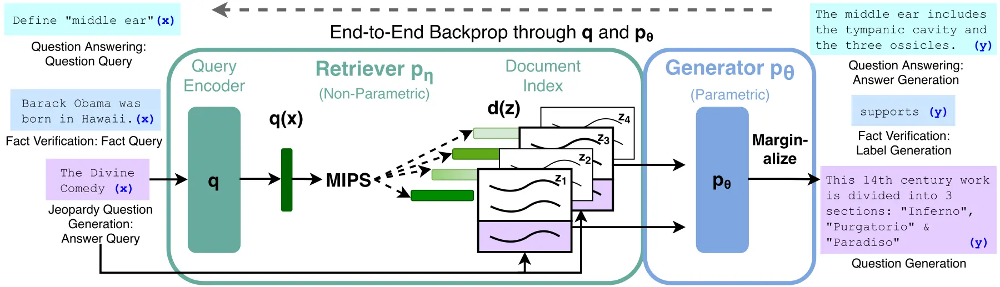

# 08주차 · 벡터 검색과 검색 증강 생성

- 연계 슬라이드: [`../slides/week08_vector_search_rag.md`](../slides/week08_vector_search_rag.md)
- 실습 노트북: [`../notebooks/week08.ipynb`](../notebooks/week08.ipynb)
- 교재 연계: *Hands-On Large Language Models*, Chapter 8의 의미 검색·재순위화·RAG
- 권장 수업: 개념 50분 · 수학 30분 · 실습 80분 · 실패 분석과 토론 30분

## 1. 이번 주의 중심 생각

검색 증강 생성(Retrieval-Augmented Generation, RAG)의 출발점은 생성 모델이 아니라
**검색 가능한 근거를 만드는 계약**이다. 정답 문서가 말뭉치에 없거나, 조건과 결론을 서로
다른 문서 조각(청크)으로 잘라 놓거나, 관련 청크가 상위 $k$개에 들어오지 않으면 생성
프롬프트만 바꾸어 복구하기 어렵다.

전체 흐름은 다음처럼 분해한다.

> 문서 수집 → 파싱 → 청크 → 임베딩 → 색인 → 후보 검색 → 재순위화 → 문맥 구성 → 생성 → 평가

각 단계의 입력과 출력을 저장하면 “RAG가 틀렸다”가 아니라 “어느 단계에서 정답 근거가
사라졌는가?”라고 질문할 수 있다. 이번 주는 이 관찰 가능한 파이프라인을 설계한다.

## 2. 학습목표

1. 정확 최근접 이웃 탐색과 근사 최근접 이웃 탐색(ANN)의 상충 관계를 설명한다.
2. HNSW, IVF, 곱 양자화(PQ)의 핵심 아이디어와 파라미터를 구분한다.
3. 청크 크기·겹침·메타데이터가 검색 가능성을 어떻게 바꾸는지 설명한다.
4. DPR, ColBERT, 교차 인코더의 표현력과 계산 비용을 비교한다.
5. 희소·밀집 혼합 검색과 재순위화의 역할을 분리한다.
6. RAG의 확률식을 읽고 검색·근거 일치성·답변 정확성을 따로 평가한다.
7. 권한 누출과 문서 내 프롬프트 주입을 포함한 보안 위험을 점검한다.

## 3. 원문 공간과 벡터 공간

원문 공간에는 텍스트, 표의 열 제목, 페이지 번호, 시행일, 작성 기관, 접근 권한과 출처가
있다. 사람이 결과를 검증할 수 있는 근거도 이 공간에 있다. 벡터 공간은 원문에서 과업에
유용하다고 학습한 관계를 제한된 차원으로 압축한 공간이다. 따라서 벡터는 원문의 모든
조건을 보존하지 않는다.

색인(index)은 질의마다 말뭉치의 모든 벡터를 처음부터 비교하지 않고 가까운 후보를 빠르게
찾기 위한 자료구조다. 색인의 반환 ID는 반드시 원문·청크·메타데이터로 되돌아갈 수 있어야
한다. 벡터만 저장하고 ID 대응 관계를 잃으면 검색 점수가 높아도 인용과 권한 검사를 할 수 없다.

## 4. 정확 탐색과 ANN

질의 벡터 $q$와 문서 벡터 $x_i$가 단위 벡터라면 코사인 유사도는 내적과 같다.

$$
\cos(q,x_i)=\frac{q^\top x_i}{\|q\|_2\|x_i\|_2}=q^\top x_i
$$

정확 탐색은 모든 $x_i$와 점수를 계산해 상위 $k$개를 정한다. 문서가 $N$개이고 차원이
$d$이면 단순 구현의 질의당 계산량은 대략 $O(Nd)$다. 정확 탐색 결과는 ANN 품질을 비교할
때 기준이 된다.

ANN은 전체 후보를 확인하지 않고 높은 확률로 가까운 후보를 찾는다. 속도를 얻는 대신 정확
탐색의 일부 이웃을 놓칠 수 있다. 두 색인을 비교할 때는 과업 지표와 다음 ANN 재현율을
모두 측정한다.

$$
\operatorname{ANNRecall}@k=
\frac{|NN_k^{approx}\cap NN_k^{exact}|}{k}
$$

정확 탐색 상위 3개가 `[A,B,C]`이고 ANN이 `[A,C,D]`를 반환하면 ANNRecall@3은
$2/3$이다. 그러나 A와 C가 실제 관련 문서인지 여부는 별도 qrels로 판단한다.

## 5. HNSW: 그래프에서 가까운 길 찾기

HNSW(Hierarchical Navigable Small World)는 벡터를 근접 그래프에 연결한다. 희소한
상위 층에서는 긴 거리를 빠르게 이동하고, 조밀한 하위 층에서는 질의 주변을 자세히 탐색한다.
지도에서 고속도로로 지역까지 간 뒤 골목길을 찾는 과정과 비슷하다.

- `M`: 한 노드가 유지하는 연결 수. 커지면 경로가 풍부해지지만 메모리와 구축비용이 늘어난다.
- `efConstruction`: 색인을 만들 때 살펴보는 후보 폭. 크면 보통 색인 품질과 구축시간이 늘어난다.
- `efSearch`: 질의 때 유지하는 후보 폭. 크면 보통 재현율과 지연시간이 함께 늘어난다.

파라미터의 효과는 데이터 분포에 따라 달라지므로 하나의 권장값을 외우지 않는다. 같은 모델과
말뭉치에서 `efSearch`만 바꾸며 ANNRecall@k–p95 지연시간 곡선을 그리고 파레토 경계를
찾는다. 이 과정을 거치지 않고 모델을 교체하면 색인 오차와 모델 오차를 혼동할 수 있다.

## 6. IVF와 곱 양자화

역파일 색인(IVF)은 문서 벡터를 거친 군집 중심에 할당한다. 질의와 가까운 `nprobe`개
목록만 열어 그 안의 후보를 비교한다. `nlist`가 목록 수, `nprobe`가 질의 때 확인할 목록
수다. `nprobe`를 늘리면 보통 재현율과 계산량이 함께 증가한다.

곱 양자화(Product Quantization, PQ)는 $d$차원 벡터를 $m$개의 부분 벡터로 나누고,
각 부분 벡터를 가장 가까운 코드북 중심의 짧은 번호로 바꾼다. 예를 들어 128차원 벡터를
8개의 16차원 부분으로 나누고 각 부분을 1바이트 코드로 표현하면 원래 512바이트의
`float32` 벡터를 짧은 코드로 근사할 수 있다. 메모리와 거리 계산은 줄지만 양자화 왜곡이
생긴다. FAISS의 `IndexIVFPQ`는 후보 목록 축소와 압축을 결합한다.

## 7. 문서 분할은 검색 단위 설계다

문서 전체가 너무 길면 하나의 벡터에 여러 주제가 섞이고 생성 모델의 문맥 예산도 낭비된다.
반대로 청크가 너무 짧으면 주어, 조건, 날짜와 결론이 분리된다.

- 고정 길이 분할: 단순하고 재현 가능하지만 문장·표 경계를 자를 수 있다.
- 구조 기반 분할: 제목, 문단, 목록, 페이지, 표 경계를 보존한다.
- 의미 기반 분할: 문장 임베딩의 변화로 주제 경계를 찾지만 계산비용과 변동성이 커진다.

겹침은 경계에서 잘린 정보를 양쪽 청크에 넣어 회수 가능성을 높인다. 동시에 중복 결과,
저장비용, 같은 근거의 반복 인용을 늘린다. 따라서 크기와 겹침은 관습이 아니라 개발 데이터의
정답 포함 재현율, 검색 지표, 전체 지연시간으로 선택한다.

좋은 청크는 독립적으로 읽어도 주체·조건·날짜를 알 수 있고, 문서명·시행일·권한 같은
메타데이터가 붙으며, 안정적인 `chunk_id`로 원문 위치에 돌아갈 수 있다. 표의 한 행만 떼어
낼 때는 열 제목과 단위를 함께 직렬화해야 한다.

## 8. 밀집 검색: DPR의 이중 인코더

DPR(Dense Passage Retrieval)은 질의와 문서 구절을 각각 인코딩하고 내적으로 점수를 낸다.

$$
s(q,p)=E_Q(q)^\top E_P(p)
$$

문서 벡터 $E_P(p)$는 미리 계산할 수 있어 대규모 색인에 적합하다. 학습에서는 관련 질의–문서
쌍의 점수를 높이고, 배치 안 다른 문서나 어려운 비관련 예시의 점수를 낮춘다. 밀집 표현은
“창업 지원 나이”와 “예비 창업자 연령 기준” 같은 어휘 불일치를 연결할 수 있다. 반면 정확한
고유명사, 품번, 수치와 부정 조건은 희소 검색보다 약할 수 있다.

## 9. ColBERT의 후기 상호작용

문서 하나를 벡터 하나로 압축하면 토큰별 의미가 사라질 수 있다. ColBERT는 질의 토큰 벡터
$Q_i$와 문서 토큰 벡터 $D_j$를 유지하고 다음 MaxSim 점수를 사용한다.

$$
s(q,d)=\sum_i\max_j Q_i^\top D_j
$$

예를 들어 질의 토큰이 세 개이고 각 토큰이 문서에서 얻은 최대 유사도가 0.9, 0.7, 0.2라면
점수는 1.8이다. 각 질의 토큰이 문서의 가장 잘 맞는 부분을 찾으므로 단일 벡터보다 세밀하다.
문서 토큰 벡터를 미리 계산할 수 있어 교차 인코더보다 빠르지만, 문서마다 여러 벡터를 저장해
단일 벡터 이중 인코더보다 메모리와 검색비용이 크다.

세 구조를 다음처럼 이해한다.

| 구조 | 문서 사전 계산 | 질의–문서 상호작용 | 주된 용도 |
|---|---|---|---|
| 이중 인코더 | 문서당 단일 벡터 | 내적 한 번 | 넓은 후보 생성 |
| ColBERT | 문서당 토큰 벡터 | MaxSim | 정밀 검색 |
| 교차 인코더 | 독립 문서 벡터 없음 | 결합 어텐션 | 소수 후보 재순위화 |

## 10. 희소·밀집 혼합 검색과 재순위화

BM25는 희소 어휘 일치를 잘 보존하고, 밀집 검색은 표현이 달라도 의미가 가까운 항목을 찾는다.
두 순위의 점수 척도가 다르면 원점수를 바로 더하기보다 역순위 융합(RRF)을 사용할 수 있다.

$$
\operatorname{RRF}(d)=\sum_{r\in\mathcal R}\frac{1}{c+\operatorname{rank}_r(d)}
$$

$c=60$이고 문서 A가 BM25에서 1위, 밀집 검색에서 4위라면 점수는
$1/61+1/64\approx0.0320$이다. 문서 B가 두 검색기에서 모두 2위라면 $2/62\approx0.0323$으로
일관되게 높은 B가 조금 앞선다.

실제 파이프라인은 BM25와 밀집 검색에서 넓은 후보를 모아 후보 재현율을 높인 뒤, 교차
인코더로 상위 후보의 순서를 정밀하게 바꾼다. 재순위화 모델은 후보 집합에 없는 문서를 만들 수
없다. 따라서 후보 R@100과 재순위화 후 nDCG@10을 따로 보고한다.

## 11. RAG의 확률적 정의

RAG는 입력 $x$에 대해 검색기 $p_\eta(z\mid x)$가 상위 문서 $z$를 고르고, 생성기
$p_\theta(y\mid x,z)$가 각 문서를 조건으로 출력 $y$의 확률을 계산하는 구조다.

$$
p(y\mid x)=\sum_{z\in\operatorname{TopK}(x)}
p_\eta(z\mid x)p_\theta(y\mid x,z)
$$

간단히 문서 A와 B의 검색 확률이 0.7, 0.3이고 원하는 답변에 대한 생성 확률이 0.8, 0.2라면
결합 확률은 $0.7\times0.8+0.3\times0.2=0.62$다. 검색기가 잘못된 문서에 높은 확률을
주면 좋은 생성기라도 전체 확률이 낮아진다.

원 논문의 RAG-Sequence는 전체 출력 시퀀스에 같은 잠재 문서를 사용하고, RAG-Token은
출력 토큰마다 다른 문서 조합을 허용한다. 오늘날 흔히 부르는 “검색 후 프롬프트에 붙이는
RAG”는 원 논문의 공동 학습 구조와 완전히 같지 않을 수 있으므로 구현을 구체적으로 설명한다.

## 12. 논문 도판 읽기: RAG의 정보 흐름

*그림 1. 질의 인코더가 문서 색인에서 상위 $k$개를 찾고, 생성기가 각 문서를 조건으로
출력 확률을 계산하는 RAG 구조. 출처: Lewis et al. (2020), Figure 1,
[원 논문](https://arxiv.org/abs/2005.11401).*

그림은 왼쪽에서 오른쪽으로 읽는다. 먼저 입력이 질의 인코더를 거쳐 문서 벡터 색인과
비교된다. 검색기가 반환한 문서마다 생성 경로가 만들어지고, 마지막에 문서 확률을 가중해
출력 확률을 합친다. 따라서 문서 색인은 단순 참고 자료가 아니라 예측 확률에 관여하는
비매개변수형 기억이다. 그림의 여러 문서 경로는 “상위 한 문서만 무조건 신뢰한다”는 뜻이
아님을 보여 준다.

원 연구의 한 설정은 위키백과를 100단어 구절 약 2,100만 개로 나누고 DPR 계열 검색기와
MIPS/FAISS 색인을 결합했다. 100단어는 오늘날 모든 데이터에 적용할 권장 청크 크기가
아니다. 핵심은 지식 원문을 검색 가능한 단위로 만들고 검색기와 생성기를 연결해 학습·평가한
설계에 있다.

## 13. RAG 실패를 단계별로 진단한다

| 단계 | 대표 실패 | 확인할 증거 |
|---|---|---|
| 수집·적재 | 최신 문서 부재, OCR 오류 | 말뭉치 포함 여부, 버전 |
| 청크 | 조건과 결론 분리 | 정답 포함 청크와 경계 |
| 검색 | 근거가 상위 $k$개 밖 | R@k, 원점수, 순위 |
| 재순위화 | 정답 후보 순위 하락 | 전후 MRR·nDCG |
| 문맥 구성 | 중복·잘림·토큰 초과 | 최종 프롬프트 원문 |
| 생성 | 근거 왜곡·누락 | 주장–근거 대응, 인용 정확성 |

RAG 평가는 세 질문으로 분리한다.

1. 검색: 정답 근거가 상위 $k$개 안에 있는가?
2. 근거 일치성(groundedness): 답의 각 주장이 제시된 근거로 뒷받침되는가?
3. 답변 정확성: 질문을 정확하고 충분하게 해결했는가?

인용 표시가 있다는 사실과 인용 내용이 실제 주장을 지지한다는 사실은 다르다. LLM 평가자를
쓰면 평가 프롬프트·모델·버전을 고정하고 일부 표본은 사람이 이중 판정한다. 근거가 부족할 때
응답을 보류하는 임곗값도 개발 데이터에서 고정하고 최종 평가 데이터에서 평가한다.

## 14. FAISS 구현에서 확인할 사항

- 코사인 유사도를 원하면 문서와 질의 벡터를 모두 정규화한 뒤 내적 색인을 사용한다.
- FAISS 입력의 자료형과 모양을 확인한다. 일반적으로 연속적인 `float32` 행렬을 사용한다.
- 새 임베딩 모델의 출력 차원과 색인 차원이 같은지 검사한다.
- 모델·풀링·정규화·차원을 바꾸면 기존 색인을 다시 만든다.
- 모델이 요구하는 질의/문서 접두문을 구분한다.
- 반환된 정수 ID를 안정적인 청크 ID와 원문 메타데이터에 연결한다.

최소 단위 테스트는 자기 자신 검색, NumPy 정확 탐색과 색인의 상위 $k$개 비교, 색인 저장 후
재로딩 결과 비교다. 모든 단계에서 청크 ID, 출처, 벡터의 크기(L2 노름)와 차원, 검색 원점수,
재순위화 점수, 최종 문맥, 인용, 지연시간을 기록한다.

## 15. 보안과 권한은 검색 전에 적용한다

검색 문서는 신뢰할 수 없는 입력이다. 문서 안의 “이전 지시를 무시하라”는 문장은 데이터이지
시스템 명령이 아니다. 악성 문서가 색인에 들어가거나 오래된 규정이 최신 규정보다 상단에
오를 수도 있다. 임베딩과 로그에는 개인정보가 남을 수 있다.

- 사용자의 접근 권한을 후보 검색 전에 강제한다.
- 문서 출처 허용 목록과 말뭉치 버전을 관리한다.
- 시스템 지시와 검색 문맥을 명확히 구분한다.
- 인용의 존재와 정확성을 검증한다.
- 삭제·정정 요청이 색인과 캐시까지 전파되게 한다.
- 프롬프트 주입과 권한 우회 질의를 포함한 적대적 평가를 수행한다.

검색 후 권한 없는 결과를 화면에서만 숨기면 점수·생성 문맥·로그를 통해 정보가 이미 노출될
수 있다. 권한 필터는 가능한 한 후보 생성 전에 적용해야 한다.

## 16. 최신 흐름을 해석하는 기준

BGE-M3처럼 한 모델이 밀집·희소·다중 벡터 표현을 함께 학습하거나, ColPali처럼 PDF 페이지
이미지를 직접 다중 벡터로 검색하는 접근이 등장했다. 질문 난도에 따라 검색을 생략하거나
재검색하는 적응형 접근도 연구된다. 긴 문맥 모델이 발전해도 다음 이유로 외부 검색은 남는다.

- 최신 문서만 선택하고 버전을 추적해야 한다.
- 사용자별 권한을 강제해야 한다.
- 답변의 근거를 인용하고 정정·삭제를 반영해야 한다.
- 모든 문서를 매번 긴 문맥에 넣는 비용을 줄여야 한다.

새 기술의 이름보다 어떤 오류를 줄이고 어떤 비용을 추가하는지 평가한다.

## 17. 노트북 실습 안내와 점검 지점

[`week08.ipynb`](../notebooks/week08.ipynb)는 작은 정책 문서 네 개로 파이프라인을
단계별로 관찰한다.

### 점검 1 · 문서와 청크 생성 후

`CHUNK_CONDITIONS`의 200자와 500자 조건에서 청크 수와 경계를 비교한다. “신청 대상”과
“제출 서류”가 같은 청크에 남는지 확인하고, 문자 수와 토큰 수가 같지 않다는 점을 기록한다.

### 점검 2 · TF–IDF 검색 후

노트북은 한국어 예제를 위해 문자 2~4-그램 TF–IDF를 사용한다. 네 질의의 상위 3개를 보고
정답 문서 ID, RR, 청크 크기의 영향을 비교한다. 단순하지만 강한 기준선으로 취급한다.

### 점검 3 · 밀집 검색 선택 셀

인터넷 가능한 환경에서만 `RUN_SENTENCE_MODEL=True`로 바꾼다. 같은 청크와 질의를 사용해
TF–IDF와 밀집 검색을 비교한다. 모델 다운로드가 안 되면 기준선 실습을 완료하고 저장된
임베딩을 사용하는 과제 경로를 따른다. 두 시스템이 서로 다르게 실패한 질의를 찾는다.

### 점검 4 · 근거 프롬프트와 응답 보류

`build_grounded_prompt`가 근거에 청크 ID를 붙이는지 확인한다. 노트북의 네 개발 질의로
상위 1개 점수의 임곗값을 고정한 뒤, 새로운 최종 평가 질의에서 바꾸지 않는다. 답할 수 없는
주차요금 질문이 “제공된 문서로 확인할 수 없습니다”로 처리되는지 본다.

### 점검 5 · 결과 기록

검색 실패와 생성·인용 실패를 다른 열로 기록한다. API 키는 노트북에 쓰지 말고 환경변수나
비밀 저장 기능을 사용한다. 실행 전 예상, 실제 결과, 원인 가설을 차례로 남긴다.

## 18. 자주 하는 오해

- **오해:** 벡터 데이터베이스를 쓰면 검색 품질이 자동으로 좋아진다.

  **교정:** 색인은 주어진 벡터의 이웃을 빠르게 찾을 뿐 표현의 의미를 개선하지 않는다.
- **오해:** 청크가 작을수록 항상 정밀하다.

  **교정:** 조건과 결론이 분리되면 정답 포함 재현율과 답변 완전성이 낮아질 수 있다.
- **오해:** 재순위화 모델이 모든 검색 실패를 고친다.

  **교정:** 후보에 없는 문서는 재순위화할 수 없다.
- **오해:** 높은 코사인 점수에는 보편적인 응답 기준이 있다.

  **교정:** 점수 분포는 모델·말뭉치·정규화에 따라 달라 개발 데이터에서 정해야 한다.
- **오해:** 인용 ID를 출력하면 근거 기반 답변이다.

  **교정:** 인용 문서가 실제 주장을 지지하는지 별도로 판정해야 한다.
- **오해:** 긴 문맥 모델이면 RAG와 권한 관리가 필요 없다.

  **교정:** 최신성·비용·권한·출처 추적 문제는 그대로 남는다.

## 19. 핵심 정리

1. 벡터 검색은 표현 모델과 색인의 결합이며 두 오류를 분리해야 한다.
2. 청크와 메타데이터가 검색 가능한 근거의 경계를 결정한다.
3. 이중 인코더, 후기 상호작용, 교차 인코더는 표현력–비용의 서로 다른 지점이다.
4. 혼합 검색은 후보 재현율을, 재순위화는 제한된 후보의 순서를 개선한다.
5. RAG는 검색·문맥·생성의 연쇄이며 단계별 평가가 필요하다.
6. 권한·출처·최신성·보안은 정확도와 같은 수준의 요구사항이다.

## 20. 복습 문제

1. 정확 탐색과 ANN의 정답 기준과 계산 비용 차이를 설명하라.
2. `efSearch`를 늘릴 때 일반적으로 변하는 두 지표는 무엇인가?
3. IVF의 `nprobe`와 PQ의 코드 크기가 각각 어떤 상충 관계를 조절하는가?
4. 200자 청크와 500자 청크가 각각 유리할 수 있는 사례를 들어라.
5. DPR과 ColBERT의 문서당 벡터 수와 점수 계산 방식을 비교하라.
6. 후보 R@100이 낮을 때 교차 인코더를 개선해도 해결되지 않는 이유는 무엇인가?
7. RAG 확률식에서 검색 확률과 생성 확률이 전체 결과에 미치는 영향을 수치로 설명하라.
8. 검색·근거 일치성·답변 정확성 평가가 각각 답하는 질문을 쓰라.
9. 권한 필터를 검색 후가 아니라 검색 전에 적용해야 하는 이유를 설명하라.

## 21. 참고문헌

1. Lewis, P. et al. (2020). “Retrieval-Augmented Generation for Knowledge-Intensive NLP Tasks.” [arXiv](https://arxiv.org/abs/2005.11401)
2. Karpukhin, V. et al. (2020). “Dense Passage Retrieval for Open-Domain Question Answering.” [EMNLP](https://aclanthology.org/2020.emnlp-main.550/)
3. Khattab, O., & Zaharia, M. (2020). “ColBERT: Efficient and Effective Passage Search via Contextualized Late Interaction over BERT.” [SIGIR](https://doi.org/10.1145/3397271.3401075)
4. Malkov, Y. A., & Yashunin, D. A. (2018). “Efficient and Robust Approximate Nearest Neighbor Search Using HNSW Graphs.” [IEEE TPAMI](https://doi.org/10.1109/TPAMI.2018.2889473)
5. Johnson, J., Douze, M., & Jégou, H. (2017). “Billion-scale Similarity Search with GPUs.” [arXiv](https://arxiv.org/abs/1702.08734)
6. Chen, J. et al. (2024). “BGE M3-Embedding: Multi-Lingual, Multi-Functionality, Multi-Granularity Text Embeddings.” [ACL Anthology](https://aclanthology.org/2024.findings-acl.137/)
7. Faysse, M. et al. (2024). “ColPali: Efficient Document Retrieval with Vision Language Models.” [arXiv](https://arxiv.org/abs/2407.01449)
8. Alammar, J., & Grootendorst, M. (2024). *Hands-On Large Language Models*, Chapter 8. [공개 코드](https://github.com/HandsOnLLM/Hands-On-Large-Language-Models/tree/main/chapter08)
