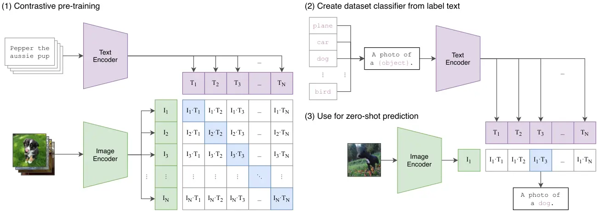
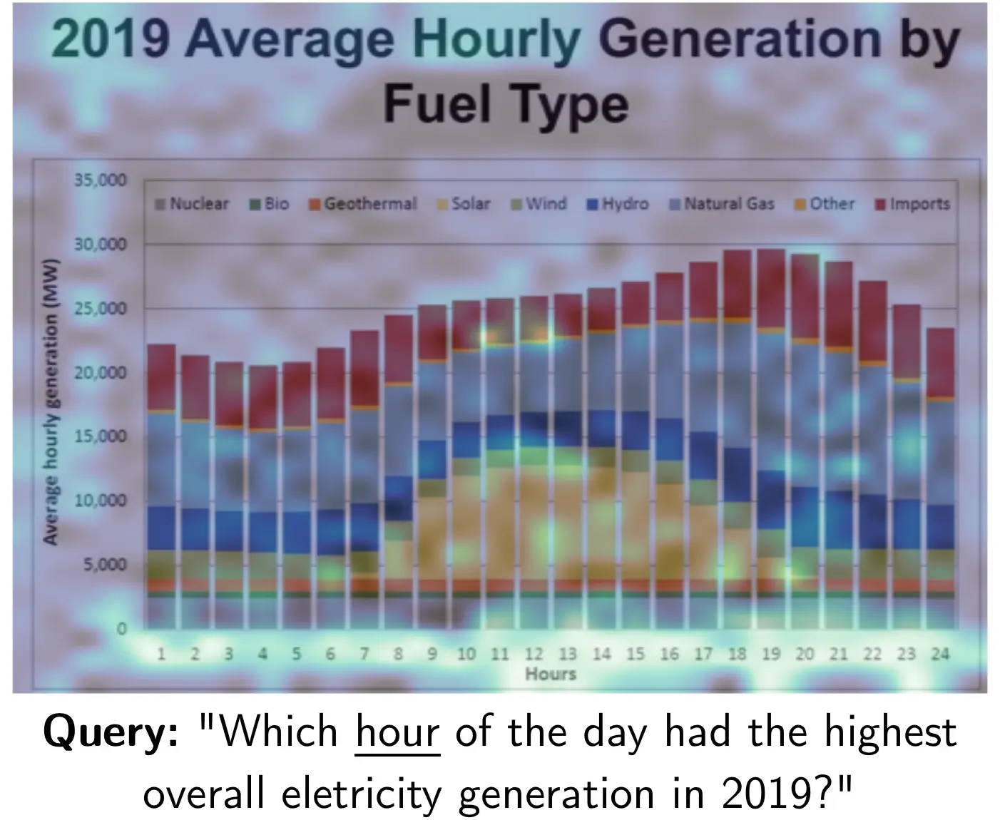

# 09주차 · 멀티모달 임베딩

- 연계 슬라이드: [`../slides/week09_multimodal.md`](../slides/week09_multimodal.md)
- 실습 노트북: [`../notebooks/week09.ipynb`](../notebooks/week09.ipynb)
- 교재 연계: *Hands-On Large Language Models*, Chapter 9의 멀티모달 모델
- 권장 수업: 개념 50분 · 수학 35분 · 실습 70분 · 편향·오류 분석 30분

## 1. 서로 다른 입력을 어떻게 비교할까

텍스트 “푸른 바다 위를 항해하는 흰 배”와 그 장면을 담은 사진은 원시 입력이 전혀 다르다.
텍스트는 토큰의 열이고 이미지는 픽셀 격자다. 멀티모달 임베딩(multimodal embedding)은
텍스트·이미지·오디오·비디오 같은 서로 다른 입력 양식(modality)을 비교 가능한 공동 공간
또는 서로 정렬된 표현으로 바꾼다.

핵심 학습 목표는 대응하는 이미지–텍스트 쌍을 가깝게, 대응하지 않는 쌍을 멀게 만드는 것이다.
공동 공간이 만들어지면 텍스트로 이미지를 찾고, 이미지로 설명을 찾고, 자연어 범주 설명으로
이미지를 분류할 수 있다. 그러나 “공동”이라는 말이 모든 양식의 정보가 완전히 같아진다는
뜻은 아니다. 텍스트는 이름과 추상 개념에 강하고, 이미지는 색·위치·형태를 직접 담는다.

## 2. 학습목표

1. 입력 양식, 정렬, 융합, 공동 임베딩 공간을 구분해 설명한다.
2. 이중 인코더, 융합 인코더, 후기 상호작용의 계산 구조를 비교한다.
3. Vision Transformer의 패치 표현과 해상도 제약을 설명한다.
4. CLIP의 대칭 대조 손실과 온도 매개변수의 역할을 계산한다.
5. 무예시 분류와 교차 양식 검색에서 프롬프트가 하는 역할을 분석한다.
6. OCR 우선 문서 검색과 시각 문서 검색의 정보 손실·비용을 비교한다.
7. 멀티모달 모델의 편향·개인정보·권한 위험을 평가한다.

## 3. 멀티모달 시스템의 세 구조

### 3.1 이중 인코더

이중 인코더(dual encoder)는 이미지와 텍스트를 독립적으로 인코딩한 뒤 공동 공간에서
유사도를 계산한다.

$$
z_I=f_I(I),\qquad z_T=f_T(T),\qquad s(I,T)=\hat z_I^\top\hat z_T
$$

말뭉치의 이미지 벡터를 미리 계산할 수 있어 대규모 검색에 유리하다. 대신 두 입력이
임베딩을 만든 뒤에야 만나므로 세밀한 토큰–영역 상호작용이 제한된다.

### 3.2 융합 인코더

융합 인코더(fusion encoder)는 이미지 패치와 텍스트 토큰을 한 모델에 넣어 어텐션으로
함께 처리한다. “표의 두 번째 행에 있는 값”처럼 세밀한 관계를 모델링하기 쉽지만, 질의–문서
쌍마다 모델을 다시 실행해야 하므로 대규모 전수 검색에는 비싸다. 보통 후보 재순위화나
시각적 질의응답에 적합하다.

### 3.3 후기 상호작용

후기 상호작용(late interaction)은 이미지 패치 벡터와 질의 토큰 벡터를 미리 또는 독립적으로
계산해 두고, 검색 시점에 여러 벡터 사이의 세밀한 대응을 계산한다. 단일 벡터보다 정보가
풍부하고 융합 인코더보다 재사용성이 높지만 저장공간과 검색비용이 증가한다. 8주차의
이중 인코더–ColBERT–교차 인코더 구분과 구조적으로 대응한다.

## 4. 이미지를 토큰처럼 표현하기

Vision Transformer(ViT)는 이미지를 $P\times P$ 크기의 패치로 나눈다. 높이 $H$, 너비
$W$인 이미지에서 패치 수는 다음과 같다.

$$
N=\frac{HW}{P^2}
$$

224×224 이미지를 16×16 패치로 나누면 한 변에 14개씩, 총 $14^2=196$개 패치가 생긴다.
각 패치의 RGB 픽셀을 펼치면 길이 $16\times16\times3=768$인 벡터다. 이 벡터를 학습된
선형층으로 $d$차원에 투영하고 위치 정보를 더한 뒤 트랜스포머에 입력한다.

$$
X_{patch}\in\mathbb R^{N\times d}
$$

패치가 커지면 토큰 수와 계산량은 줄지만 작은 글자와 세밀한 표 선을 잃을 수 있다. 224×224
문서 페이지를 32×32 패치로 처리하면 작은 한글 글자가 패치 안에서 충분히 구별되지 않을 수
있다. 따라서 이미지 해상도, 크기 조정, 자르기, 패치 크기는 단순 전처리가 아니라 정보 보존
설정이다.

## 5. CLIP의 대조적 언어–이미지 사전학습

CLIP(Contrastive Language–Image Pre-training)은 배치의 $N$개 이미지–텍스트 쌍을
이중 인코더로 처리한다. 정규화한 이미지 벡터 $\hat I_i$와 텍스트 벡터 $\hat T_j$로
$N\times N$ 유사도 행렬을 만든다.

$$
S_{ij}=\frac{\hat I_i^\top\hat T_j}{\tau}
$$

$\tau$는 온도(temperature)다. 값이 작으면 같은 코사인 차이도 더 큰 로짓 차이가 되어
확률 분포가 날카로워진다. 학습 배치에서 $i$번째 이미지와 $i$번째 텍스트가 대응하므로 행렬의
대각선이 정답이다.

이미지→텍스트 손실은 각 행에서 대각선 열을 맞히는 교차 엔트로피다.

$$
\mathcal L_{I\rightarrow T}
=-\frac{1}{N}\sum_i
\log\frac{\exp(S_{ii})}{\sum_j\exp(S_{ij})}
$$

텍스트→이미지는 각 열에서 대각선 행을 맞히며, 최종 손실은 두 방향의 평균이다.

$$
\mathcal L=\frac{1}{2}
(\mathcal L_{I\rightarrow T}+\mathcal L_{T\rightarrow I})
$$

### 5.1 작은 수치 예제

두 쌍의 온도 적용 후 유사도 행렬이 다음과 같다고 하자.

$$
S=\begin{bmatrix}2&0\\0.5&1.5\end{bmatrix}
$$

첫 이미지가 첫 텍스트일 확률은 $e^2/(e^2+e^0)\approx0.881$이고 손실은
$-\log 0.881\approx0.127$이다. 둘째 이미지가 둘째 텍스트일 확률은
$e^{1.5}/(e^{0.5}+e^{1.5})\approx0.731$이고 손실은 약 0.313이다. 이미지→텍스트 평균
손실은 약 0.220이다. 두 번째 쌍의 대각선과 비대각선 간격이 더 작기 때문에 손실이 크다.

배치의 비대응 쌍은 자동으로 비관련 예시가 된다. 배치가 크면 비교 대상이 풍부해지지만,
실제로는 의미가 맞는 쌍을 비관련 예시로 취급하는 거짓 비관련 예시(false negative) 문제도 생긴다.

## 6. 논문 도판 읽기: CLIP의 세 단계



*그림 1. (1) 이미지–텍스트 대조 사전학습, (2) 자연어 범주 설명으로 분류기 구성,
(3) 새 이미지의 무예시 예측. 출처: Radford et al. (2021), Figure 1,
[원 논문](https://arxiv.org/abs/2103.00020).*

왼쪽 패널은 $N\times N$ 행렬의 대각선 쌍을 가깝게 학습하는 과정이다. 가운데 패널에서는
고정된 수치 범주 ID 대신 `A photo of a {label}` 같은 문장을 텍스트 인코더에 넣어 범주별
벡터를 만든다. 오른쪽 패널에서는 새 이미지 벡터와 이 범주 벡터들의 코사인 유사도를 비교한다.

도판에서 주의할 점은 분류 가중치가 자연어 문장으로 동적으로 만들어진다는 것이다. 별도의
레이블 이미지로 분류 헤드를 다시 학습하지 않으므로 무예시 전이(zero-shot transfer)라고 부른다.
그러나 학습 데이터에 유사 이미지와 문장이 이미 있었을 수 있으며, 새로운 문화·언어·도메인에
대한 완전한 무지 상태를 뜻하지는 않는다.

원 CLIP 연구는 웹에서 수집한 약 4억 이미지–텍스트 쌍으로 학습하고 30개가 넘는 시각
데이터셋에서 전이 성능을 조사했다. 규모는 결과를 이해하는 배경이지, 웹 데이터의 편향과
저작권·개인정보 문제를 해소하는 근거가 아니다.

## 7. 프롬프트가 곧 범주 정의다

레이블 `배`만 쓰면 선박, 과일, 신체 부위를 구분하기 어렵다. 다음 문장은 서로 다른 결정
경계를 만든다.

```text
바다 위를 항해하는 배의 사진
먹을 수 있는 한국 배 과일의 사진
사람의 복부를 보여 주는 의학 그림
```

텍스트 임베딩이 범주의 기준 벡터가 되므로 프롬프트의 언어와 문맥이 분류 결과를 바꾼다.
여러 문구의 임베딩을 평균하는 프롬프트 앙상블은 표현 하나의 우연한 편향을 줄일 수 있다.
한국어 프롬프트와 영어 프롬프트의 성능 차이는 모델의 사전학습 분포를 반영할 수 있으므로
동일한 이미지에서 따로 평가한다.

무예시 분류는 일반적으로 주어진 범주 중 하나를 고르는 폐쇄집합 분류다. 입력이 어느 범주에도
속하지 않을 때를 다루려면 “해당 없음” 정책, 최대 확률 또는 점수 간격 임곗값, 미지 범주
평가 데이터가 필요하다. 소프트맥스 최고 확률이 높다는 사실만으로 실제 신뢰도가 보장되지는 않는다.

## 8. 교차 양식 검색

공동 공간에서는 질의와 말뭉치의 양식을 바꿀 수 있다.

| 방향 | 질의 | 말뭉치 | 사례 |
|---|---|---|---|
| 텍스트→이미지 | 문장 | 이미지 | “빨간 안전모를 쓴 작업자” |
| 이미지→텍스트 | 이미지 | 설명문 | 상품명·캡션 찾기 |
| 이미지→이미지 | 이미지 | 이미지 | 유사 제품·디자인 찾기 |
| 텍스트→페이지 | 질문 | PDF 페이지 이미지 | 표가 있는 규정 페이지 찾기 |

평가는 R@k, nDCG, 첫 정답 순위와 함께 언어, 객체 크기, 이미지 안 글자, 도표 유형별
부분집합으로 수행한다. 같은 쌍을 양방향으로 검색해도 난도는 같지 않다. 한 이미지에는 여러
적절한 설명이 있을 수 있고, 짧은 설명에는 여러 적절한 이미지가 있을 수 있기 때문이다.

## 9. OCR 우선 문서 검색

OCR 우선 방식은 PDF 페이지를 광학 문자 인식과 레이아웃 분석으로 텍스트로 바꾼 뒤, 텍스트
청크를 임베딩한다.

> PDF 페이지 → OCR·레이아웃 분석 → 텍스트 청크 → 텍스트 임베딩 → 검색

장점은 정확한 문구를 인용·검색·필터링하기 쉽고 기존 텍스트 RAG 인프라를 재사용할 수 있다는
점이다. 약점은 표 셀의 행·열 관계, 그림과 캡션의 연결, 글자의 위치와 크기가 선형 텍스트에서
사라질 수 있다는 점이다. OCR이 `1,000만원`을 `100만원`으로 읽으면 이후 검색과 생성이 모두
잘못된 입력을 받는다.

## 10. 시각 문서 검색과 ColPali

시각 문서 검색은 페이지 이미지를 직접 인코딩해 레이아웃·표·그림·글꼴 단서를 보존한다.
ColPali는 PaliGemma 계열 시각 언어 모델로 페이지의 패치 수준 다중 벡터를 만들고,
ColBERT식 후기 상호작용으로 질의 토큰과 페이지 패치를 대응시킨다.

$$
s(q,p)=\sum_i\max_j q_i^\top v_j
$$

$q_i$는 질의 토큰, $v_j$는 페이지 패치 표현이다. 각 질의 토큰이 가장 잘 맞는 시각 영역을
찾기 때문에 “2026년 예산”의 서로 다른 토큰이 표 제목과 특정 숫자 셀에 각각 대응할 수 있다.
단점은 페이지마다 여러 벡터를 저장해 비용이 크고, 검색한 페이지에서 정확한 답이나 셀을
추출하는 단계가 여전히 필요하다는 점이다.



*그림 2. 질의 토큰과 문서 페이지 영역 사이의 후기 상호작용 점수를 시각화한 지도.
출처: Faysse et al. (2024), ColPali similarity map,
[원 논문](https://arxiv.org/abs/2407.01449).*

이 그림은 질의 토큰별로 밝게 반응하는 페이지 영역을 본다. 모델이 표·제목·그림 중 어디에
높은 점수를 주었는지 오류 분석에 유용하다. 그러나 밝은 영역은 모델 내부 유사도의 시각화이지
정답 근거에 대한 인과적 증명은 아니다. OCR 정확도나 사람이 판정한 관련성을 대신할 수 없다.

## 11. 멀티모달 생성과 검색을 구분한다

시각 언어 모델(VLM)은 일반적으로 이미지 인코더가 만든 시각 토큰을 투영층으로 언어 모델의
표현 공간에 맞추고 텍스트 토큰과 함께 처리한다.

> 이미지 → 시각 인코더 → 시각 토큰 → 투영층 → 텍스트 토큰과 결합 → LLM 생성

한 장의 이미지를 설명하는 능력과 수백만 페이지에서 관련 페이지를 빠르게 찾는 능력은 다른
평가 문제다. 전자는 생성 정확도·근거 일치성·OCR·근거 없는 생성(환각)을 보고, 후자는 색인
가능성·R@k·지연시간·저장공간을 본다.

실험 기록에는 입력 해상도, 크기 조정과 자르기, 이미지 토큰 수, 최대 문맥 길이, 여러 이미지
처리 방식, 대화 서식과 특수 토큰을 남긴다. 같은 모델명이라도 이 설정이 다르면 결과를 직접
비교하기 어렵다.

## 12. 생성 데모를 평가로 바꾸기

“그럴듯한 설명 한 번”은 평가가 아니다. 표 이미지에 대해 다음을 측정한다.

- OCR 정확도: 숫자, 단위, 한글을 정확히 읽었는가?
- 근거 일치성: 답의 각 주장이 실제 셀이나 영역으로 지지되는가?
- 답변 정확성: 질문이 요구한 값을 완전하게 답했는가?
- 견고성: 크기 조정, 자르기, 회전, 압축 뒤에도 결과가 유지되는가?
- 비용: 텍스트 전용 방식 대비 지연시간과 메모리 사용량은 얼마인가?

예를 들어 원본, 75% 축소, JPEG 압축본에서 “총예산” 값을 질의한다. 세 조건의 정확도와
근거 영역을 비교하고 실패가 OCR, 시각 인코딩, 프롬프트, 생성 중 어디서 생겼는지 분류한다.

## 13. 2025–2026 공개 연구의 흐름

다음은 논문 공개 시점 기준의 연구 방향이며, 사전 공개 논문의 상태와 모델 제공 조건은 바뀔
수 있으므로 강의 시점에 다시 확인한다.

| 연구 | 공개 시점·상태 | 제안 방향 |
|---|---|---|
| jina-embeddings-v4 | 2025년 사전 공개 | 텍스트·이미지, 단일/다중 벡터, 과업 LoRA |
| Qwen3-VL-Embedding | 2026년 사전 공개 | 텍스트·이미지·혼합 입력, 긴 문맥, Matryoshka |
| Gemini Embedding 2 | 2026년 사전 공개 | 텍스트·이미지·오디오·비디오 공동 공간 |
| jina-embeddings-v5-omni | 2026년 사전 공개 | 여러 양식과 GELATO 학습 방식 |

흐름은 한 모델이 여러 입력 양식과 단일·다중 벡터, 가변 차원을 지원하는 방향이다. 그러나
통합 모델은 검증 항목도 늘린다. 양식별 전처리, 과업 어댑터, 색인 구조, 언어별 성능과 비용을
따로 확인해야 한다. 최신 모델이라는 이유로 자체 평가를 생략하지 않는다.

## 14. 편향·개인정보·안전

웹 이미지–텍스트 쌍에는 문화·언어·성별·직업의 고정관념과 불균형이 들어 있다. 프롬프트가
범주 정의 역할을 하므로 문구 하나가 집단별 오류를 바꿀 수 있다. 얼굴 검색의 오인식은 단순
추천 오류보다 큰 피해를 만들며, 문서 OCR에는 주민번호·연락처 같은 개인정보가 포함될 수 있다.

배포 전에는 다음을 요구사항으로 둔다.

- 얼굴·민감 속성에 대한 허용·금지 용도를 명시한다.
- 관련 집단과 언어별로 정밀도·재현율과 실패 사례를 평가한다.
- 데이터 수집 동의, 보존 기간, 삭제 절차를 기록한다.
- 사용자 권한을 검색 전에 적용하고 로그를 최소화한다.
- 적대적 이미지·텍스트와 프롬프트 변화에 대한 견고성을 평가한다.
- 고위험 판단에는 사람 검토와 이의제기 경로를 둔다.

## 15. 노트북 실습 안내와 점검 지점

[`week09.ipynb`](../notebooks/week09.ipynb)는 외부 모델이 없어도 공동 공간의 원리를
확인하고, 선택적으로 실제 CLIP을 실행하도록 구성되어 있다.

### 점검 1 · 도형 이미지 생성 후

세 가지 색과 세 가지 모양의 9개 이미지가 올바르게 생성됐는지 확인한다. 이 합성 데이터는 실제
성능을 주장하기 위한 벤치마크가 아니라 변수 하나를 통제해 원리를 보는 실험임을 기록한다.

### 점검 2 · 장난감 공동 공간 실행 전

색 3차원과 모양 3차원을 합친 6차원 벡터를 손으로 작성한다. `파란 원`은 두 좌표가 1이고
L2 정규화 뒤 각 활성 좌표가 $1/\sqrt2$다. `빨간 도형`처럼 색만 있는 질의와 정확히 맞는
빨간 이미지의 코사인 유사도는 $1/\sqrt2\approx0.707$이 된다. 코드 출력과 비교한다.

### 점검 3 · 유사도 행렬 확인

행은 9개 이미지, 열은 세 텍스트 질의다. 각 열의 상위 순위가 예상과 맞는지 확인한다.
동점이 생기면 공동 공간이 어떤 속성을 표현하지 못해서인지 설명한다.

### 점검 4 · 실제 CLIP 선택 실습

인터넷 가능한 환경에서만 `RUN_CLIP=True`로 바꾼다. `openai/clip-vit-base-patch32`의
한국어와 영어 프롬프트 정확도를 비교한다. 결과 차이를 “한국어가 본질적으로 어렵다”가 아니라
해당 모델·사전학습 분포·프롬프트의 상호작용으로 해석한다.

### 점검 5 · 프롬프트 요소 제거 실험

범주명만 사용, `a {color} {shape}`, `a photo of a {color} {shape}`처럼 문맥을 단계적으로
바꾼다. 한 번에 한 요소만 바꾸고 상위 1개 정확도와 이미지별 확률 변화를 표로 남긴다.
색이나 모양 하나를 바꾼 이미지에서 순위가 어떻게 이동하는지도 기록한다.

## 16. 수업 활동: OCR과 시각 검색 비교

동일한 PDF 페이지 20장과 질문 10개를 준비해 세 방식을 비교한다.

1. OCR 텍스트 + 텍스트 임베딩
2. 페이지 이미지 + 시각 임베딩
3. 두 검색 결과의 혼합

R@5, 지연시간, 저장공간, OCR 오류를 측정하고 본문·표·차트·스캔·2단 편집별 부분집합을
만든다. 평균만 보고 승자를 정하지 말고 어떤 레이아웃에서 어느 방식이 이기는지 오류 지도를
작성한다. 시각 검색이 페이지를 찾은 뒤 정확한 셀을 추출하는 비용도 포함한다.

## 17. 자주 하는 오해

- **오해:** 공동 공간에서는 이미지와 텍스트의 모든 정보가 같아진다.

  **교정:** 학습 목표에 유용한 일부 관계가 정렬될 뿐 양식 고유 정보는 남거나 손실된다.
- **오해:** CLIP 확률은 객관적인 범주 확률이다.

  **교정:** 선택한 프롬프트와 후보 범주 안에서 정규화된 모델 점수다.
- **오해:** 무예시는 모델이 해당 개념을 학습에서 본 적 없다는 뜻이다.

  **교정:** 해당 평가 데이터로 분류 헤드를 학습하지 않았다는 의미에 가깝다.
- **오해:** 이미지 해상도는 보기 좋게 만드는 설정일 뿐이다.

  **교정:** 패치가 담는 글자와 도형 정보가 달라져 모델 입력 자체가 변한다.
- **오해:** ColPali 유사도 지도가 곧 정답 근거다.

  **교정:** 내부 점수의 관찰 도구이며 사람 판정과 인과적 설명을 대신하지 않는다.
- **오해:** 시각 문서 검색은 OCR을 항상 대체한다.

  **교정:** 직접 인용·정확한 문자열 필터에는 OCR이 유리하며 두 방식의 혼합이 필요할 수 있다.

## 18. 핵심 정리

1. 멀티모달 임베딩은 서로 다른 입력을 비교 가능한 공간에 정렬한다.
2. 이중 인코더·융합 인코더·후기 상호작용은 비용과 세밀함의 다른 지점이다.
3. CLIP은 배치의 이미지–텍스트 쌍을 양방향 대조 손실로 학습한다.
4. 무예시 분류에서 자연어 프롬프트는 동적인 범주 정의다.
5. 문서 검색에서는 OCR 텍스트와 시각 레이아웃 중 어떤 정보를 보존할지 선택한다.
6. 최신 통합 모델도 언어·양식·비용·안전별 자체 평가가 필요하다.

## 19. 복습 문제

1. 이중 인코더와 융합 인코더가 대규모 검색에서 갖는 장단점을 설명하라.
2. 384×384 이미지를 16×16 패치로 나누면 패치는 몇 개인가?
3. CLIP 유사도 행렬에서 대각선이 정답이 되는 데이터 구성 조건은 무엇인가?
4. 온도 $\tau$를 작게 하면 같은 유사도 차이가 소프트맥스 분포에 어떤 영향을 주는가?
5. 레이블 `배` 대신 문맥 프롬프트가 필요한 이유를 공동 공간 관점에서 설명하라.
6. OCR 우선 검색과 시각 문서 검색이 각각 잃기 쉬운 정보를 두 가지씩 쓰라.
7. ColPali와 단일 벡터 CLIP 검색의 문서 표현과 점수 계산 차이를 설명하라.
8. 한국어 프롬프트 정확도가 낮았을 때 필요한 통제 실험 세 가지를 제안하라.
9. 얼굴 검색 시스템 배포 전에 필요한 평가와 운영 통제를 제시하라.

## 20. 참고문헌

1. Radford, A. et al. (2021). “Learning Transferable Visual Models From Natural Language Supervision.” [ICML](https://proceedings.mlr.press/v139/radford21a.html)
2. Dosovitskiy, A. et al. (2021). “An Image Is Worth 16×16 Words: Transformers for Image Recognition at Scale.” [ICLR](https://openreview.net/forum?id=YicbFdNTTy)
3. Faysse, M. et al. (2024). “ColPali: Efficient Document Retrieval with Vision Language Models.” [arXiv](https://arxiv.org/abs/2407.01449)
4. Günther, M. et al. (2025). “jina-embeddings-v4: Universal Embeddings for Multimodal Multilingual Retrieval.” 사전 공개 논문. [arXiv](https://arxiv.org/abs/2506.18902)
5. Li, M. et al. (2026). “Qwen3-VL-Embedding and Qwen3-VL-Reranker.” 사전 공개 논문. [arXiv](https://arxiv.org/abs/2601.04720)
6. Shanbhogue, M. et al. (2026). “Gemini Embedding 2: A Native Multimodal Embedding Model from Gemini.” 사전 공개 논문. [arXiv](https://arxiv.org/abs/2605.27295)
7. Hönicke, F. et al. (2026). “jina-embeddings-v5-omni: Geometry-preserving Embeddings via Locked Aligned Towers.” 사전 공개 논문. [arXiv](https://arxiv.org/abs/2605.08384)
8. Alammar, J., & Grootendorst, M. (2024). *Hands-On Large Language Models*, Chapter 9. [공개 코드](https://github.com/HandsOnLLM/Hands-On-Large-Language-Models/tree/main/chapter09)
