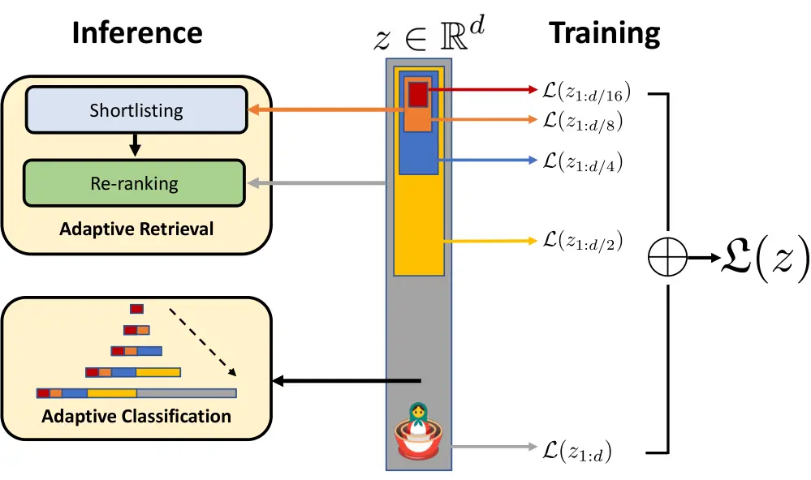

<!-- _class: lead -->

###### WEEK 01 · REPRESENTATION

# 임베딩의 언어: 데이터를 공간으로 바꾸기

**표현 → 거리 → 과업 → 평가**를 하나의 논리로 연결한다

이영호 · 컴퓨터학부

---

# 오늘의 중심 질문

> **핵심**
> “두 데이터가 가깝다”는 말은 **무엇을 보존하기로 약속했다**는 뜻인가?


- **표현** — 무엇을 숫자로 바꾸는가?
- **기하** — 가까움은 어떻게 측정하는가?
- **과업** — 그 가까움이 실제 성능과 연결되는가?


<!-- 임베딩을 “예쁜 점 그림”으로 설명하지 말고, 과업에 필요한 관계를 보존하는 함수로 정의한다. -->

---

# 학습목표

수업이 끝나면 다음을 할 수 있다.

1. **표현(representation)**, **임베딩(embedding)**, **잠재공간(latent space)**을 구분한다.
2. 내적·벡터의 크기(L2 노름)·코사인 유사도·유클리드 거리를 계산하고 해석한다.
3. 희소/밀집, 정적/문맥적, 단일/다중 벡터 표현을 분류한다.
4. Hands-On LLM 2장의 토큰·텍스트 임베딩 코드를 데이터 과학 관점에서 설명한다.
5. 임베딩의 실패를 “모델 오류”가 아니라 **표현–평가 불일치**로 진단한다.

---

# 용어 ① 표현과 임베딩


> **정의**
> **표현(representation)**: 분석 대상 $x$를 계산 가능한 형식으로 바꾼 결과.
> **임베딩(embedding)**: $f: \mathcal{X}\rightarrow\mathbb{R}^{d}$처럼 원래 대상의 관계를 유한 차원 벡터 공간에 보존하려는 함수 또는 그 출력.


- 입력 공간 $\mathcal{X}$: 단어, 문장, 이미지, 사용자, 그래프 노드 등
- 차원 $d$: 벡터의 좌표 수. “의미의 개수”와 동일하지 않다.
- **잠재공간(latent space)**: 관측값이 아니라 학습으로 얻은 내부 좌표계
- **표현학습(representation learning)**: 과업에 유용한 표현 함수를 데이터로부터 학습

> 모든 벡터가 좋은 임베딩은 아니다. “어떤 관계를 얼마나 보존했는가”가 핵심이다.

---

# 용어 ② 표현의 분류

| 축 | 선택지 | 핵심 차이 |
|---|---|---|
| 값의 밀도 | 희소(sparse) / 밀집(dense) | 대부분 0인가, 거의 모든 좌표가 실수인가 |
| 문맥 사용 | 정적(static) / 문맥적(contextual) | 같은 토큰의 벡터가 문맥에 따라 바뀌는가 |
| 출력 단위 | 토큰 / 문장·문서 / 객체 | 한 벡터가 무엇을 대표하는가 |
| 벡터 수 | 단일(single-vector) / 다중(multi-vector) | 객체당 1개인가, 토큰·패치별 여러 개인가 |
| 모달리티 | 단일 / 교차·멀티모달 | 텍스트·이미지 등이 같은 공간에서 비교되는가 |


> **논문 읽기**
> 이 분류축은 서로 독립적이다. 예: ColBERT는 텍스트·문맥적·밀집·다중 벡터 검색기다.


---

# 벡터와 행렬: 데이터 과학의 관점

문서 $n$개를 $d$차원으로 임베딩하면


> **수식**
> $E=[\mathbf e_1;\dots;\mathbf e_n]\in\mathbb{R}^{n\times d}$


- **행(row)** — 하나의 관측치 또는 객체 $\mathbf e_i\in\mathbb{R}^{d}$
- **열(column)** — 학습된 좌표축. 대개 한 열만으로 명명 가능한 개념은 아님


- 표준화된 수치 특성과 달리, 좌표의 회전은 가능해도 거리 구조는 유지될 수 있다.
- 따라서 개별 차원 해석보다 **이웃·방향·하위공간**을 해석하는 경우가 많다.

---

# norm과 거리


### 벡터의 크기: $L_2$ 노름

$$\|\mathbf x\|_2=\sqrt{\sum_{i=1}^{d}x_i^2}$$

### 유클리드 거리

$$d_2(\mathbf x,\mathbf y)=\|\mathbf x-\mathbf y\|_2$$
### 내적

$$\mathbf x^\top\mathbf y=\sum_{i=1}^{d}x_iy_i$$

---

### 코사인 유사도

$$\cos(\mathbf x,\mathbf y)=\frac{\mathbf x^\top\mathbf y}{\|\mathbf x\|_2\|\mathbf y\|_2}$$


> **주의:** 유사도(similarity)는 클수록 가깝고, 거리(distance)는 작을수록 가깝다. 라이브러리의 반환 규약을 확인한다.


---

# 정규화하면 지표가 연결된다

$\hat{\mathbf x}=\mathbf x/\|\mathbf x\|_2$, $\hat{\mathbf y}=\mathbf y/\|\mathbf y\|_2$이면


$$
\|\hat{\mathbf x}-\hat{\mathbf y}\|_2^2
=2-2\hat{\mathbf x}^\top\hat{\mathbf y}
=2-2\cos(\mathbf x,\mathbf y)
$$


- 단위 벡터에서는 **내적 최대화**, **코사인 최대화**, **유클리드 거리 최소화**의 순위가 같다.
- 정규화하지 않으면 벡터의 크기가 점수에 개입한다.
- 일부 모델은 크기에 신뢰도·빈도 정보를 담을 수 있으므로 무조건 정규화하지 않는다.

> **실습**
> **손계산:** $x=(3,4)$, $y=(4,3)$의 L2 노름, 내적, 코사인, 유클리드 거리를 계산하라.

---

# “가까움”은 자연법칙이 아니다


- **의미 유사성** — “강아지” ↔ “반려견”
- **관련성** — “강아지” ↔ “산책”
- **과업 적합성** — 질문 ↔ 정답 문서


- **semantic 유사도**와 **relatedness**는 다르다.
- 검색에서 관련 문서는 문장 의미가 동일할 필요가 없다.
- 분류에서는 같은 클래스의 점들이 가까운 것보다 **결정 경계**가 더 중요할 수 있다.

---

# 좋은 임베딩을 측정 가능하게 만들기

> **정의**
> **운영적 정의(operational definition)**: 추상 개념을 관측·측정 가능한 규칙으로 바꾼 정의. “좋은 임베딩”은 반드시 지표와 데이터셋으로 운영화해야 한다.

---

# 차원의 저주와 거리 집중

차원 $d$가 커질수록 생길 수 있는 현상:

- 공간의 부피가 급증해 데이터가 희박해진다.
- 최근접 이웃과 먼 이웃의 거리 차이가 상대적으로 작아지는 **거리 집중**이 나타난다.
- 소수의 점이 많은 쿼리의 이웃이 되는 **허브니스(hubness)**가 나타난다.
- 시각화를 위해 2차원으로 축소하면 원래의 국소/전역 구조가 동시에 보존되지 않는다.

> **주의**
> “768차원이라 더 많은 의미를 담는다”는 주장은 검증이 필요하다. 차원, 데이터 수, 학습목표, 평가 성능을 함께 본다.

---

# 임베딩은 어떻게 학습되는가

원시 데이터 $x$ → 인코더 $f_\theta$ → 벡터 $z$ → 학습 목표 $\mathcal{L}$

| 학습 신호 | 가까워지게 하는 예 | 멀어지게 하는 예 |
|---|---|---|
| 분포 기반 | 비슷한 문맥의 단어 | 무관한 문맥의 단어 |
| 지도학습 | 같은 라벨·정답 쌍 | 다른 라벨·오답 쌍 |
| 대조학습 | 관련 쌍(positive) | 비관련 쌍(negative) |
| 생성 사전학습 | 다음/가린 토큰 예측에 유용한 상태 | 직접적인 거리 제약은 아님 |

---

# 대조학습의 최소 직관

한 쿼리 $q_i$와 관련 문서 $d_i^+$, 배치의 비관련 문서 $d_j$가 있을 때

$$
\mathcal L_i=-\log\frac{\exp(s(q_i,d_i^+)/\tau)}{\sum_j\exp(s(q_i,d_j)/\tau)}
$$

- $s$: 코사인 또는 내적 점수
- $\tau$: 분포의 날카로움을 조절하는 temperature
- **in-배치 negatives**: 같은 배치의 다른 정답을 비관련 예시로 재사용
- 핵심 위험: 실제로 관련 있는 예를 비관련 예시로 넣는 **잘못된 비관련 판정**

> **논문 읽기**
> 이 원리는 문장 임베딩, CLIP, 현대 검색 임베딩의 공통 기반이며 5·8·9주차에 확장한다.

---

<!-- _class: section -->

# Hands-On LLM 연결

## 2장 코드를 “벡터 생성”이 아니라 “표현 선택의 실험”으로 읽는다

---

# 원본 2장의 표현 계층


**문자열** → **토큰 ID** → **토큰 임베딩** → **문맥 은닉상태** → **풀링된 텍스트 벡터**


> **교재 연결**
> **Hands-On LLM 핵심:** 같은 “임베딩”이라는 말이 입력 임베딩 테이블, Transformer의 문맥 은닉상태, 문장 모델의 최종 벡터에 모두 쓰인다. 코드의 텐서 텐서 모양와 학습목표를 확인해야 한다.


```python
tokens = tokenizer(text, return_tensors="pt")
hidden = model(**tokens).last_hidden_state   # [B, T, H]
sentence = hidden.mean(dim=1)                # [B, H], 단순 예시
```

_원본: Chapter 2 — Tokens and Token Embeddings_

---

# 코드 해설: 텐서 모양가 곧 개념이다

| 기호 | 예시 텐서 모양 | 의미 |
|---|---:|---|
| `input_ids` | `[B, T]` | 배치별 토큰 정수 ID |
| 임베딩 lookup | `[B, T, H]` | 문맥화 전 토큰 벡터 |
| `last_hidden_state` | `[B, T, H]` | 문맥화된 토큰 벡터 |
| 풀링 output | `[B, H]` | 문장/문서 단일 벡터 |
| 유사도 matrix | `[B, B]` 또는 `[Q,D]` | 모든 쌍의 점수 |


> **실습**
> **실습 질문:** 패딩 토큰까지 평균에 포함하면 어떤 문장의 벡터가 가장 크게 왜곡되는가? 어텐션 마스크를 이용해 수정하라.


---

# 추천 예제: 벡터화의 네 결정

Hands-On LLM 2장의 노래 추천 예제를 설명할 때:

1. **대상**: 곡 자체인가, 가사/설명 텍스트인가?
2. **표현 함수**: Word2Vec 평균인가, 문장 Transformer인가?
3. **점수 함수**: 코사인인가, 사용자 피드백을 반영한 학습 점수인가?
4. **평가**: “비슷해 보임”인가, 재현율@k/사용자 선택률인가?


> **주의**
> 임베딩 최근접 이웃은 추천 시스템 전체가 아니다. 인기 편향, 다양성, 신규성, 시간 변화, 사용자 맥락이 빠져 있다.


---

# 임베딩 진단 체크리스트

### 입력과 모델

- 어떤 언어·도메인으로 학습했나?
- 최대 길이와 잘림은?
- 질의/문서 접두문이 필요한가?
- 출력 차원과 정규화 규칙은?

### 평가와 운영

- 과업에 맞는 정답 레이블인가?
- 기준선보다 실제로 나은가?
- 오류가 집단별로 다른가?
- 지연시간·메모리·비용은?


---

# 실패 사례: 벡터가 가깝지만 답은 다르다

예시 쿼리: **“장학금 신청 마감일은?”**

| 후보 | 표면 유사성 | 정답 적합성 |
|---|---:|---:|
| “장학금 신청 절차와 제출 서류” | 높음 | 낮음 |
| “2026학년도 2학기 신청은 8월 28일까지” | 중간 | 높음 |
| “등록금 납부 마감일 안내” | 중간 | 낮음 |

임베딩만으로는 날짜, 부정, 버전, 권한 조건 같은 **정밀 제약**을 놓칠 수 있다.


> **논문 읽기**
> 해결 후보: 희소·밀집 혼합, 메타데이터 필터, 재순위화 모델, 최신성 필터. 8주차에서 비교한다.


---

# 최신 동향 ① Matryoshka 표현


> **정의**
> **Matryoshka Representation Learning**: 긴 벡터의 앞부분(접두문)도 유용하도록 여러 차원 길이에 동시에 학습 신호를 주는 방식.


$$\mathcal L=\sum_{m\in\mathcal M}\lambda_m\,\mathcal L_m(\mathbf z_{1:m})$$

- 저장공간·지연시간에 따라 64/128/256/…차원을 선택 가능
- coarse-to-fine 검색: 짧은 벡터로 후보 생성 후 긴 벡터로 정밀화
- 단순 PCA나 임의 잘림과 달리 **학습 단계에서 중첩 표현**을 최적화


*출처: Kusupati et al., “Matryoshka Representation Learning,” NeurIPS 2022 · [arXiv:2205.13147](https://arxiv.org/abs/2205.13147)*


---

# 논문 도판: 하나의 벡터를 여러 비용으로 사용한다



*그림: 학습 시 여러 접두문 길이에 손실을 주고, 추론 시 짧은 벡터부터 단계적으로 분류·검색한다.*

> **교재 연결**
> Hands-On LLM Chapter 2의 고정 차원 임베딩을 출발점으로, **표현 품질과 저장·검색 비용을 함께 설계**하는 확장이다.

*출처: Kusupati et al. (2022), “Matryoshka Representation Learning,” Figure 1 · [원 논문](https://arxiv.org/abs/2205.13147)*

---

# 최신 동향 ② 하나의 공간, 여러 모달리티

2025–2026 연구의 큰 방향은 텍스트 전용 단일 벡터를 넘어선다.


- **유연한 차원** — Matryoshka로 정확도–비용 조절
- **다중 벡터** — 토큰·패치 수준 상호작용
- **옴니모달** — 텍스트·이미지·오디오·비디오를 하나의 공간에 정렬


> **최신 동향**
> **읽는 법:** Gemini Embedding 2와 jina-embeddings-v5-omni는 2026년 preprint다. 새로운 가능성을 보여주지만, 도메인별 재현·비용·라이선스 검증 전에는 “확립된 표준”으로 다루지 않는다.


*출처: [Gemini Embedding 2 (2026)](https://arxiv.org/html/2605.27295v1) · [jina-embeddings-v5-omni (2026)](https://arxiv.org/html/2605.08384v2)*


---

# 수업 활동: 임베딩 계약서

팀별로 하나의 서비스(학사 검색, 논문 추천, 민원 분류 등)를 고르고 8분 안에 작성한다.

| 항목 | 답해야 할 질문 |
|---|---|
| 입력 $\mathcal X$ | 어떤 객체를 벡터화하는가? |
| 보존 관계 | 무엇이 가까워야/멀어야 하는가? |
| 점수 함수 | cosine, inner product, L2 중 무엇인가? |
| 정답 정의 | 누가 어떤 기준으로 관련성을 라벨링하는가? |
| 위험 | 가장 비용이 큰 잘못된 관련 판정/negative는? |


> **실습**
> **발표:** “우리에게 좋은 임베딩은 ___ 지표를 ___ 데이터에서 개선하는 표현이다.” 한 문장으로 말한다.


---

# 형성평가 · Exit ticket

1. 임베딩 차원 하나를 “하나의 의미”로 해석하기 어려운 이유는?
2. L2 정규화된 벡터에서 코사인과 유클리드 순위가 같은 이유는?
3. 토큰 임베딩과 문장 임베딩의 텐서 모양 차이를 쓰라.
4. 최근접 이웃 3개만 보고 모델을 선택하면 안 되는 이유 두 가지는?


> **교재 연결**
> **Notebook 연결:** `../notebooks/week01.ipynb`에서 손계산 → NumPy 검증 → 실패 사례 기록 순서로 수행한다.


---

# 핵심 정리

- 임베딩은 **관계를 보존하려는 함수와 그 벡터 출력**이다.
- 벡터의 가까움은 학습목표·데이터·점수 함수가 만든 운영적 정의다.
- 텐서 모양, 정규화, 잘림, 풀링을 모르면 같은 모델도 다른 결과를 낸다.
- 임베딩 품질은 예쁜 시각화가 아니라 **과업 지표·기준선·오류 분석**으로 판단한다.
- 현대 임베딩은 유연한 차원, 다중 벡터, 멀티모달로 확장되고 있다.

> **핵심**
> 다음 주: 문자열이 벡터가 되기 전, **토큰화가 먼저 세계를 자른다.**

---

<!-- _class: compact -->

# 참고문헌과 원본 연결

- Mikolov et al. (2013), “Efficient Estimation of Word Representations in Vector Space.” [arXiv:1301.3781](https://arxiv.org/abs/1301.3781)
- Vaswani et al. (2017), “Attention Is All You Need.” [arXiv:1706.03762](https://arxiv.org/abs/1706.03762)
- Reimers & Gurevych (2019), “Sentence-BERT.” [arXiv:1908.10084](https://arxiv.org/abs/1908.10084)
- Kusupati et al. (2022), “Matryoshka Representation Learning.” [NeurIPS](https://proceedings.neurips.cc/paper_files/paper/2022/hash/c32319f4868da7613d78af9993100e42-Abstract-Conference.html)
- Lee et al. (2025), “Massive Multilingual Text Embedding Benchmark.” [arXiv:2502.13595](https://arxiv.org/abs/2502.13595)
- Hands-On Large Language Models, Chapter 2. [upstream repository](https://github.com/HandsOnLLM/Hands-On-Large-Language-Models)


> **논문 읽기**
> 수치는 논문 버전과 평가 조건에 종속된다. 강의 시 원문의 데이터·모델·지표 조건을 함께 확인한다.
