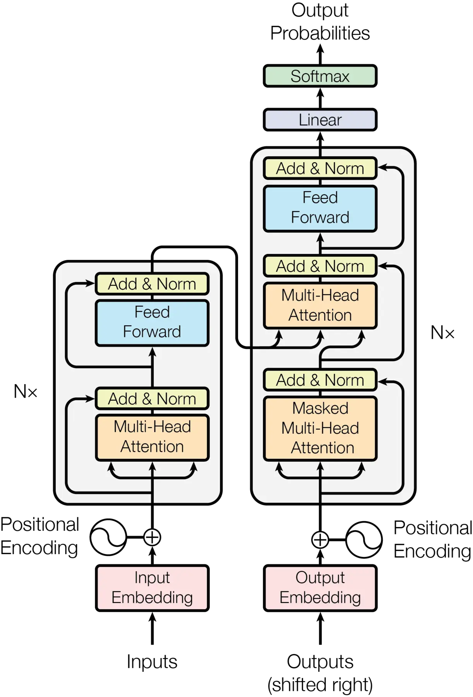

<!-- _class: lead -->

###### WEEK 04 · CONTEXTUAL EMBEDDINGS

# 문맥이 벡터를 바꾼다: Transformer 해부

**토큰 임베딩 → 자기 어텐션 → contextual 은닉 상태**

---

# 같은 표면형, 다른 의미


- **문장 A** — “**배**를 먹고 수업에 갔다.” → 과일
- **문장 B** — “**배**를 타고 섬에 갔다.” → 선박


정적 임베딩: $\mathbf e(\text{배})$ 하나

문맥 임베딩: $\mathbf h_i=f_\theta(w_{1:T})_i$ — 같은 토큰도 주변 전체에 따라 달라진다.


> **정의**
> **문맥 임베딩(contextual 임베딩)**: 시퀀스의 다른 위치를 조건으로 계산된 각 토큰 위치의 은닉 벡터.


---

# 학습목표

1. 입력 임베딩과 문맥 은닉상태를 구분한다.
2. 질의, key, value와 스케일 내적 어텐션을 계산한다.
3. 다중 헤드 어텐션, positional encoding, 잔차 연결, layer norm의 역할을 설명한다.
4. Transformer 원 논문의 Figure 1을 인코더/디코더 정보 흐름으로 읽는다.
5. Hands-On LLM 3장의 생성·표본 추출·KV 캐시를 표현 관점에서 설명한다.

---

# Transformer 입력은 세 정보의 합

대표적인 형태:

$$\mathbf x_i=\mathbf e_{token(i)}+\mathbf p_i+\mathbf s_i$$

| 항 | 의미 |
|---|---|
| 토큰 임베딩 $\mathbf e$ | 토큰 ID를 찾은 학습 벡터 |
| 위치 $\mathbf p$ | 순서/상대 위치 정보 |
| segment/type $\mathbf s$ | 문장 A/B 등 입력 구획(모델에 따라 없음) |


> **주의**
> 입력 임베딩 lookup은 아직 문맥을 모른다. 여러 Transformer layer를 지난 `hidden_state`가 문맥 표현이다.


---

# Self-어텐션의 세 역할

각 입력 $X\in\mathbb R^{T\times d}$에서 선형 투영:

$$Q=XW_Q,\qquad K=XW_K,\qquad V=XW_V$$


- **질의** — 이 위치가 지금 무엇을 찾는가?
- **Key** — 각 위치가 어떤 단서로 매칭되는가?
- **Value** — 매칭된 뒤 실제로 전달할 정보는?


같은 입력에서 만들지만 서로 다른 가중치 행렬을 학습한다.

---

# 스케일 내적 어텐션

$$\operatorname{Attention}(Q,K,V)=\operatorname{softmax}\left(\frac{QK^\top}{\sqrt{d_k}}+M\right)V$$

1. $QK^\top$: 모든 위치 쌍의 호환성 점수 $[T,T]$
2. $/\sqrt{d_k}$: 차원이 클 때 내적 분산이 커져 소프트맥스가 포화되는 현상 완화
3. $M$: 패딩/미래 토큰을 가리는 마스크
4. 소프트맥스: 각 질의 행을 합 1인 가중치로
5. $AV$: 다른 위치의 value를 가중합


> **논문 읽기**
> 어텐션 가중치는 정보 흐름의 한 단서지만, 그대로 인간 수준의 “설명” 또는 인과 기여도로 단정할 수 없다.


---

# 3개 토큰 손계산

$QK^\top/\sqrt{d_k}$가 다음과 같다고 하자.

$$S=\begin{bmatrix}1&0&-1\\0&2&0\\-1&0&1\end{bmatrix}$$

- 각 **행**에 소프트맥스를 적용한다.
- 첫 토큰은 첫 value를 가장 크게, 셋째 value를 가장 작게 섞는다.
- 마스크가 $S_{1,3}=-\infty$라면 셋째 위치의 가중치는 0이 된다.


> **실습**
> **실습:** NumPy로 `softmax(S, axis=-1) @ V`를 계산하고 행 합이 1인지 확인한다.


---

# 다중 헤드 어텐션: 서로 다른 관계를 병렬로

$$\operatorname{head}_h=\operatorname{Attention}(QW_Q^{(h)},KW_K^{(h)},VW_V^{(h)})$$

$$\operatorname{MHA}(Q,K,V)=\operatorname{Concat}(\operatorname{head}_1,\dots,\operatorname{head}_H)W_O$$

- 한 head가 문법, 다른 head가 동시 출현 관계를 “반드시” 담당하는 것은 아니다.
- 여러 투영 하위공간에서 다른 매칭 패턴을 학습할 **용량**을 준다.
- head 수가 늘면 head당 차원, 메모리, 구현 효율의 상충 관계가 생긴다.

---

# 순서를 넣는 방법

원 논문의 sinusoidal encoding:

$$PE_{(pos,2i)}=\sin(pos/10000^{2i/d})$$
$$PE_{(pos,2i+1)}=\cos(pos/10000^{2i/d})$$

현대 모델의 변형:

- learned absolute 위치
- relative 위치 bias
- RoPE(rotary positional 임베딩)
- ALiBi 등


> **최신 동향**
> 긴 문맥 성능은 최대 토큰 수 하나로 판단하지 않는다. 위치 외삽, “lost in the middle”, 메모리·prefill 비용을 실제 장문 과제로 평가한다.


---

# 한 Transformer block


**입력 $X$** → **자기 어텐션** → **Add & Norm** → **Feed Forward** → **Add & Norm**


- **잔차 연결 connection**: $x+F(x)$로 깊은 네트워크의 정보·gradient 흐름 지원
- **layer 정규화**: 한 토큰 벡터의 특징 방향을 정규화
- **FFN/MLP**: 각 위치에 동일하게 적용되는 비선형 변환
- 실제 모델은 사전/사후 층 정규화, 활성화 함수, 게이트형 MLP가 다르다.

---

# 논문 핵심 도판: Transformer 전체





*그림: Vaswani et al. (2017), Figure 1. 왼쪽 인코더 stack, 오른쪽 autoregressive 디코더 stack.*


> **교재 연결**
> Chapter 3의 은닉 상태, next-토큰 distribution, KV cache는 이 도판의 **입력 표현 → 어텐션 블록 → 출력 분포**를 실제 코드 tensor로 관찰하는 과정이다.


*출처: 원문/도판: [“Attention Is All You Need”](https://arxiv.org/abs/1706.03762), Fig. 1 · 강의 목적의 원문 인용*


---

# Figure 1 읽기: 화살표가 말하는 것


### 인코더(왼쪽)

- 입력 전체를 양방향 자기 어텐션
- 각 토큰의 문맥 표현 생성
- 번역에서는 디코더가 참고할 원문 표현
### Decoder (오른쪽)

- masked 자기 어텐션: 미래 토큰 차단
- 인코더–디코더 어텐션: 원문 표현 조회
- linear + 소프트맥스로 다음 토큰 분포


> **논문 읽기**
> GPT 계열은 주로 디코더-only, BERT는 인코더-only다. “Transformer”는 하나의 입출력 방식이 아니라 어텐션 블록 계열을 뜻한다.


---

# BERT: 양방향 인코더 표현

대표 사전학습 목표:

- **Masked Language Modeling (MLM)**: 가린 토큰을 좌우 문맥으로 예측
- 원 논문의 **Next Sentence Prediction (NSP)**: 문장 쌍 관계 예측

활용:

- 각 토큰의 `last_hidden_state`를 NER·QA 등에 사용
- `[CLS]` 또는 풀링 결과에 분류 head 추가
- 단순 `[CLS]`/평균이 곧 좋은 문장 유사도 벡터라는 보장은 없음 → SBERT(5주차)


*출처: Devlin et al. (2019), “BERT.” · [NAACL 2019](https://aclanthology.org/N19-1423/)*


---

# 인코더 전용과 디코더 전용

| 특성 | 인코더-only | 디코더-only |
|---|---|---|
| 어텐션 마스크 | 보통 양방향 | causal(왼쪽→오른쪽) |
| 주목적 | 이해/표현 | 다음 토큰 생성 |
| 대표 | BERT 계열 | GPT, Phi 계열 |
| 문장 임베딩 | 풀링/미세 조정에 자연스러움 | 마지막 토큰/mean + 추가 학습 필요 |
| 생성 | 별도 디코더 필요 | 기본 기능 |


> **최신 동향**
> 최근에는 디코더 LLM을 bidirectional 어텐션·masked next 토큰 prediction·대조학습으로 임베딩 모델로 전환하는 연구도 활발하다.


---

<!-- _class: section -->

# Hands-On LLM 연결

## 3장의 생성 과정을 은닉상태와 cache의 흐름으로 읽는다

---

# Phi-3 생성 코드의 데이터 흐름

```python
inputs = tokenizer(prompt, return_tensors="pt")
outputs = model.generate(
    **inputs,
    max_new_tokens=64,
    do_sample=True,
    temperature=0.7,
    top_p=0.9,
)
text = tokenizer.decode(outputs[0], skip_special_tokens=True)
```


> **교재 연결**
> **설명 순서:** 문자열 → ID → 은닉 상태 → logits → 확률 분포 → 토큰 선택 → ID를 입력에 붙여 반복.


- `temperature`는 임베딩을 바꾸는 값이 아니라 logits 분포를 재조정한다.
- `top_p`는 누적 확률 질량 안의 후보만 남기는 decoding 규칙이다.

---

# KV cache: 과거 표현을 재사용한다

생성 $t$번째 단계에서 과거 토큰의 key/value는 변하지 않는다.


**과거 K,V cache** → **새 토큰의 Q,K,V** → **어텐션** → **다음 토큰**


- 매 단계 전체 접두문의 K,V를 다시 계산하지 않아 decoding이 빨라진다.
- cache 메모리는 layer·head·길이·dtype에 따라 증가한다.
- **임베딩 색인**(검색용 영구 벡터)와 **KV cache**(생성 중 임시 상태)는 다른 개념이다.

---

# 문맥 벡터를 꺼낼 때의 함정

```python
with torch.no_grad():
    out = model(**tokens, output_hidden_states=True)
H = out.hidden_states[-1]       # [B, T, H]
mask = tokens["attention_mask"].unsqueeze(-1)
z = (H * mask).sum(1) / mask.sum(1).clamp(min=1)
z = torch.nn.functional.normalize(z, dim=-1)
```

- causal LLM의 각 위치가 보는 문맥 범위가 다르다.
- 패딩 side와 EOS 위치가 풀링에 영향을 준다.
- 생성 모델의 은닉 상태는 semantic 유사도에 직접 최적화되지 않았다.
- 반드시 SBERT/E5 등 목적 특화 모델과 비교한다.

---

# 최신 동향: 생성 모델을 범용 표현기로


- **LLM2Vec (2024)** — 디코더-only LLM에 양방향 어텐션, masked next 토큰 prediction, 대조학습을 적용해 텍스트 표현기로 변환.
- **Generative + Embedding** — 하나의 backbone이 생성과 표현 과제를 함께 수행하도록 instruction 데이터와 손실함수를 결합하는 방향.


> **주의**
> 큰 생성 모델이 항상 작은 전용 임베딩 모델보다 좋은 것은 아니다. MTEB/MMTEB의 과업·언어·비용별 결과를 확인한다.


*출처: [BehnamGhader et al., “LLM2Vec” (2024)](https://arxiv.org/abs/2404.05961) · [Muennighoff et al., “Generative Representational Instruction Tuning” (2024)](https://arxiv.org/abs/2402.09906)*


---

# 수업 활동: 어텐션은 무엇을 섞었나

1. 짧은 한국어 문장을 토큰화기로 분절한다.
2. 한 layer/head의 어텐션 matrix를 시각화한다.
3. 부정어, 주어, 목적어 토큰의 가중치를 비교한다.
4. 어텐션이 높지만 출력 변화가 작거나 그 반대인 사례를 찾는다.


> **실습**
> **결론:** “어텐션 map은 ___를 보여주지만, ___를 증명하지는 않는다.”를 완성한다.


---

# 형성평가

1. 토큰 임베딩과 contextual 은닉 상태의 차이는?
2. $1/\sqrt{d_k}$ scaling이 필요한 이유는?
3. causal 마스크가 없으면 생성 학습에 어떤 누수가 생기는가?
4. Transformer Figure 1의 인코더–디코더 어텐션은 어떤 Q/K/V를 쓰는가?
5. KV cache와 검색 vector 색인의 차이를 한 문장으로 설명하라.


> **교재 연결**
> **Notebook:** `../notebooks/week04.ipynb` · 어텐션 계산, 마스크, 풀링 차이를 수치로 확인한다.


---

# 핵심 정리

- 문맥 임베딩은 시퀀스 전체를 조건으로 위치마다 달라진다.
- 자기 어텐션은 Q–K 점수로 V를 가중합한다.
- Transformer의 성능은 어텐션만이 아니라 위치, 잔차 연결, 정규화, FFN의 결합이다.
- 인코더와 디코더는 마스크와 학습목표가 다르다.
- 생성 은닉 상태를 문장 임베딩으로 쓰려면 풀링과 목적 특화 학습을 검증해야 한다.

> **핵심**
> 다음 주: 문장 전체를 **비교 가능한 한 벡터**로 만든다.

---

<!-- _class: compact -->

# 참고문헌과 원본 연결

- Vaswani et al. (2017), “Attention Is All You Need.” [arXiv](https://arxiv.org/abs/1706.03762)
- Devlin et al. (2019), “BERT.” [ACL Anthology](https://aclanthology.org/N19-1423/)
- Reimers & Gurevych (2019), “Sentence-BERT.” [arXiv](https://arxiv.org/abs/1908.10084)
- BehnamGhader et al. (2024), “LLM2Vec.” [arXiv](https://arxiv.org/abs/2404.05961)
- Muennighoff et al. (2024), “Generative Representational Instruction Tuning.” [arXiv](https://arxiv.org/abs/2402.09906)
- Hands-On Large Language Models, Chapter 3. [upstream](https://github.com/HandsOnLLM/Hands-On-Large-Language-Models/tree/main/chapter03)
