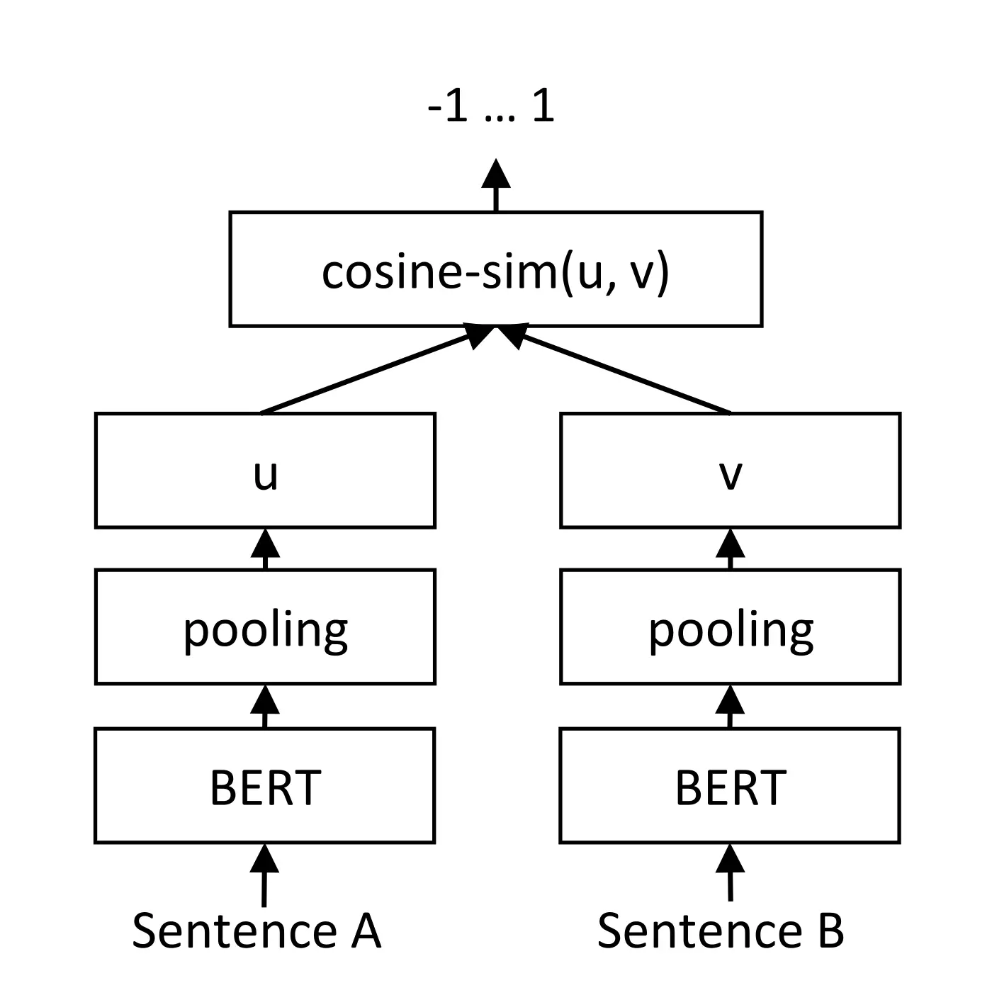

<!-- _class: lead -->

###### WEEK 05 · SENTENCE EMBEDDINGS

# 문장 전체를 검색 가능한 한 벡터로

**pooling → bi-encoder → contrastive learning → hard negatives**

---

# 문장 임베딩의 계약


> **정의**
> **문장 임베딩(sentence embedding)**: 가변 길이 텍스트 $x$를 고정 길이 벡터 $z=f_\theta(x)\in\mathbb R^d$로 바꾸어, 정의한 유사도 함수로 비교할 수 있게 한 표현.


성공 조건:

- 같은 의도·관련성을 가진 쌍은 가깝게
- 무관하거나 상충하는 쌍은 멀게
- 새 문장을 서로 독립적으로 encode 가능
- 대규모 corpus의 벡터를 미리 계산·색인 가능

---

# 학습목표

1. pooling 전략과 padding mask의 영향을 설명한다.
2. cross-encoder, bi-encoder, late-interaction을 비용–정확도 관점에서 비교한다.
3. pair/triplet/InfoNCE/MNRL loss의 positive·negative 구조를 설명한다.
4. SBERT 논문의 계산 효율 주장을 재구성한다.
5. Hands-On LLM 10장의 embedding fine-tuning 절차를 평가 누수 없이 설계한다.

---

# Token → Sentence: pooling

$H=[\mathbf h_1,\dots,\mathbf h_T]\in\mathbb R^{T\times d}$에서

| 방식 | 계산 | 특징 |
|---|---|---|
| CLS | $\mathbf h_{CLS}$ | 해당 토큰이 문장표현으로 학습됐는지 중요 |
| mean | $\sum_i m_i\mathbf h_i/\sum_i m_i$ | 모든 유효 토큰 평균, 강한 기본값 |
| max | 좌표별 $\max_i h_{ij}$ | 두드러진 feature 보존, 불안정 가능 |
| weighted | $\sum_i a_i\mathbf h_i$ | 학습된 가중치/IDF/attention 사용 |


> **주의**
> padding과 special token을 무심코 포함하면 길이별 편향이 생긴다. pooling 구현은 모델 카드의 권장법을 따른다.


---

# Cross-encoder vs Bi-encoder


- **Cross-encoder** — `[q; d]`를 함께 Transformer에 넣어 점수화. **장점:** 모든 토큰 쌍이 상호작용, 정밀. **약점:** 모든 query–document 쌍을 다시 계산.
- **Bi-encoder** — $f(q)$와 $g(d)$를 독립 encode 후 내적/코사인. **장점:** 문서 벡터 사전 계산, ANN 검색. **약점:** 한 벡터에 정보 압축.


---

# SBERT의 문제 정의: 조합 폭발

문장 10,000개에서 모든 쌍:

$$\frac{n(n-1)}{2}=49{,}995{,}000$$

SBERT 논문의 보고:

| 방식 | 작업 | 당시 보고 시간 |
|---|---|---:|
| BERT cross-encoder | 약 5천만 쌍 추론 | 약 65시간 |
| SBERT bi-encoder | 10,000개 encode | 약 5초 |
| cosine matrix | 벡터 비교 | 약 0.01초 |


*출처: Reimers & Gurevych (2019), [“Sentence-BERT”](https://arxiv.org/abs/1908.10084), 논문의 당시 V100 조건. 현대 하드웨어 절대시간으로 일반화하지 말고 복잡도 차이를 읽는다.*


---

# 논문 핵심 구조: Siamese SBERT



*그림: 두 문장을 공유 가중치 BERT와 pooling으로 각각 벡터화한 뒤 cosine similarity로 비교한다.*

> **교재 연결**
> Chapter 10의 `SentenceTransformer`, loss, evaluator는 이 bi-encoder 구조를 **학습 가능한 embedding model**로 만드는 세 구성요소다.

*출처: Reimers & Gurevych (2019), “Sentence-BERT,” Figure 2 · [원 논문](https://arxiv.org/abs/1908.10084)*


---

# 학습 데이터의 세 구조


- **Pair** — $(x_1,x_2,y)$: STS 점수 또는 NLI 라벨
- **Triplet** — $(a,p,n)$: anchor–positive–negative
- **Batch** — $(q_i,d_i^+)_{i=1}^B$: 다른 문서를 in-batch negative로 사용


> **정의**
> **양성(positive)**과 **음성(negative)**은 자연적 속성이 아니라 과업의 relevance 정의로 만든 훈련 신호다.


---

# Cosine regression과 pair loss

STS label $y\in[0,1]$에 맞추는 예:

$$\mathcal L_{MSE}=(\cos(f(x_1),f(x_2))-y)^2$$

분류형 pair:

$$o=\operatorname{softmax}(W[u;v;|u-v|])$$

- NLI의 entailment/neutral/contradiction으로 표현을 학습할 수 있다.
- 학습 label의 의미와 배포 과업의 “관련성”이 다르면 transfer gap이 생긴다.

---

# Triplet loss

$$\mathcal L=\max(d(a,p)-d(a,n)+m,0)$$

- $a$: anchor, $p$: positive, $n$: negative
- $m$: positive가 negative보다 최소한 더 가까워야 하는 margin
- 너무 쉬운 negative는 loss가 0이라 학습 정보가 적다.
- 너무 어렵지만 사실 관련 있는 false negative는 잘못된 방향으로 민다.


> **실습**
> **손계산:** $d(a,p)=0.4$, $d(a,n)=0.7$, $m=0.5$일 때 loss는? negative를 더 멀리 보내야 하는가?


---

# Multiple Negatives Ranking Loss

배치에서 $(a_i,p_i)$만 정답이고 다른 $p_j$를 음성으로:

$$\mathcal L_i=-\log\frac{e^{s(a_i,p_i)/\tau}}{\sum_{j=1}^{B}e^{s(a_i,p_j)/\tau}}$$

- 한 배치로 $B^2$ 점수를 만들어 데이터 효율이 높다.
- 큰 batch는 더 많은 negative를 제공하지만 메모리·false negative 위험도 증가한다.
- 동일 문서/중복 의미를 배치에서 제거하거나 multi-positive loss를 고려한다.

---

# Hard negative mining


> **정의**
> **hard negative**: 현재 모델이 높은 점수를 주지만 라벨 기준으로는 관련 없는 후보.


대표 절차:

1. baseline bi-encoder로 top-k 후보를 검색한다.
2. 정답을 제외한 상위 후보를 negative 후보로 만든다.
3. cross-encoder 또는 사람 라벨로 false negative를 걸러낸다.
4. 쉬운/어려운 음성을 섞어 재학습한다.


> **주의**
> 정답 목록이 불완전한 검색 데이터에서 “top인데 미라벨”을 바로 negative로 쓰면 실제 정답을 밀어내는 오류가 생긴다.


---

# Instruction과 비대칭 검색

현대 모델은 입력 역할을 명시하는 prefix/instruction을 사용한다.

```text
query: 장학금 신청 마감일은?
passage: 2026학년도 2학기 장학금 신청은 ...
```

- query는 정보 요구, document는 답의 근거라 분포가 비대칭이다.
- 모델 카드가 요구하는 prefix를 빼면 성능이 크게 변할 수 있다.
- symmetric STS와 asymmetric retrieval을 같은 prompt로 평가하지 않는다.

---

<!-- _class: section -->

# Hands-On LLM 연결

## 10장의 파인튜닝을 data–loss–evaluation 삼각형으로 읽는다

---

# Chapter 10 파이프라인


**데이터 pair/triplet** → **Base model + pooling** → **Loss objective** → **Evaluator** → **Train & save**


> **교재 연결**
> **원본 핵심:** cosine loss, MNRL, supervised fine-tuning, AugSBERT, TSDAE를 “코드 레시피”가 아니라 어떤 데이터 가정과 신호를 쓰는지 비교한다.


필수 기록:

- base checkpoint와 revision
- pooling/normalize/prompt
- split 기준(문서·주제·시간 중복 방지)
- seed, batch, learning rate, epoch
- best checkpoint 선택 metric

---

# Sentence Transformers 코드 읽기

```python
from sentence_transformers import SentenceTransformer

model = SentenceTransformer("model-name")
Z = model.encode(
    texts,
    batch_size=64,
    normalize_embeddings=True,
    convert_to_numpy=True,
)
scores = Z @ Z.T  # 정규화했을 때 cosine
```

질문:

1. `normalize_embeddings=False`면 이 내적은 무엇을 포함하는가?
2. 긴 문서는 어디서 잘리는가?
3. `model.max_seq_length`와 tokenizer limit이 일치하는가?
4. dtype을 float16/int8로 바꾸면 순위가 얼마나 변하는가?

---

# 평가: STS와 retrieval은 다르다

| 과업 | 입력 | 대표 지표 |
|---|---|---|
| STS | 문장 pair + 연속 유사도 | Spearman $\rho$ |
| classification | 벡터 + label | accuracy, macro-F1 |
| clustering | 벡터 집합 | V-measure, ARI |
| retrieval | query + corpus + qrels | nDCG@k, Recall@k, MRR |


> **주의**
> STS가 높은 모델이 장문 한국어 retrieval에서도 최고라는 보장은 없다. 학습목표·입력 길이·언어·도메인이 다르다.


---

# 최신 동향 ① 다기능·다국어 embedding

| 연구 | 보고된 방향 | 강의에서 확인할 것 |
|---|---|---|
| BGE-M3 (2024) | dense/sparse/multi-vector, 다국어·장문 | 모드별 비용과 결합 이득 |
| Gemini Embedding (2025) | 대규모 multilingual 모델 | 공개 평가 조건·접근 방식 |
| Qwen3 Embedding (2025) | 0.6B/4B/8B embedding·reranker | 크기–성능–지연시간 |
| jina-embeddings-v4 (2025) | multimodal, single/multi-vector, task LoRA | 모달리티·adapter별 성능 |


*출처: [BGE-M3](https://arxiv.org/abs/2402.03216) · [Gemini Embedding](https://arxiv.org/abs/2503.07891) · [Qwen3 Embedding](https://arxiv.org/abs/2506.05176) · [Jina v4](https://arxiv.org/abs/2506.18902)*


---

# 최신 동향 ② Matryoshka와 비용 조절

한 모델의 출력 차원을 서비스 예산에 맞춰 줄이는 경우:

| 차원 | 벡터 100만 개 float32 | 기대 효과 |
|---:|---:|---|
| 1024 | 약 3.81 GiB | 최대 표현 용량 |
| 256 | 약 0.95 GiB | 저장·bandwidth 1/4 |
| 64 | 약 0.24 GiB | 빠른 1차 후보 검색 |


> **최신 동향**
> 중요한 것은 차원 감소율이 아니라 자신의 corpus에서 Recall@k와 latency가 어떻게 변하는지 측정하는 것이다.


*출처: Kusupati et al. (2022), [Matryoshka Representation Learning](https://arxiv.org/abs/2205.13147)*


---

# 수업 활동: loss를 데이터로 선택하라

세 상황에 어떤 loss/data가 적합한가?

1. 문장 쌍에 0–5 유사도 점수가 있다.
2. 각 질문에 정답 문서 하나가 있고 corpus가 크다.
3. 라벨 없는 도메인 문서만 있다.

팀별로 다음을 명시한다.

- positive/negative의 정의
- false negative 방지책
- validation metric
- baseline과 ablation


> **실습**
> 정답은 하나가 아니다. 선택이 데이터 가정과 metric에 논리적으로 연결되는지가 평가 대상이다.


---

# 형성평가

1. cross-encoder가 정확하지만 1차 검색에 비싼 이유는?
2. mean pooling에서 attention mask가 필요한 이유는?
3. in-batch negative의 장점과 위험은?
4. hard negative를 사람이/교사 모델이 다시 확인해야 하는 이유는?
5. STS 성능만으로 검색 모델을 선택하면 안 되는 이유는?


> **교재 연결**
> **Notebook:** `../notebooks/week05.ipynb` · pooling과 모델별 유사도/검색 오류를 비교한다.


---

# 핵심 정리

- 문장 임베딩은 가변 길이 텍스트를 과업에 맞는 한 벡터로 압축한다.
- bi-encoder는 사전 계산으로 확장성을 얻고 세밀한 token interaction을 희생한다.
- loss의 이름보다 positive/negative가 무엇인지가 중요하다.
- hard negative는 강한 학습 신호이지만 false negative 검증이 필수다.
- 최신 모델 선택은 leaderboard 하나가 아니라 언어·도메인·길이·비용으로 결정한다.

> **핵심**
> 다음 주: 임베딩을 **분류·군집·토픽 분석의 데이터**로 쓴다.

---

<!-- _class: compact -->

# 참고문헌과 원본 연결

- Reimers & Gurevych (2019), “Sentence-BERT.” [arXiv](https://arxiv.org/abs/1908.10084)
- Gao et al. (2021), “SimCSE.” [EMNLP](https://aclanthology.org/2021.emnlp-main.552/)
- Wang et al. (2022), “Text Embeddings by Weakly-Supervised Contrastive Pre-training (E5).” [arXiv](https://arxiv.org/abs/2212.03533)
- Kusupati et al. (2022), “Matryoshka Representation Learning.” [NeurIPS](https://proceedings.neurips.cc/paper_files/paper/2022/hash/c32319f4868da7613d78af9993100e42-Abstract-Conference.html)
- Zhang et al. (2025), “Qwen3 Embedding.” [arXiv](https://arxiv.org/abs/2506.05176)
- Hands-On Large Language Models, Chapter 10. [upstream](https://github.com/HandsOnLLM/Hands-On-Large-Language-Models/tree/main/chapter10)
