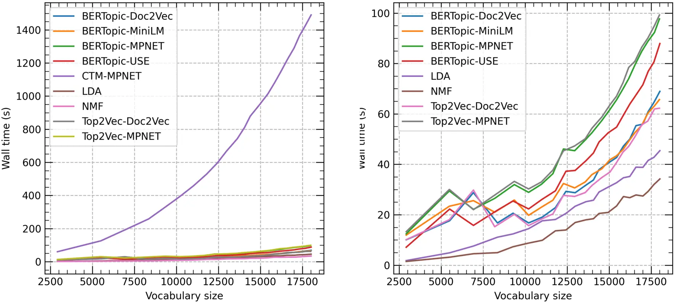

<!-- _class: lead -->

###### WEEK 06 · EMBEDDING ANALYTICS

# 임베딩을 데이터로: 분류·군집·토픽 분석

**벡터 생성은 분석의 끝이 아니라 feature engineering의 시작**

---

# 오늘의 중심 질문

> **핵심**
> 임베딩 공간에 구조가 “보인다”는 것과 **재현 가능한 분석 결과**는 어떻게 다른가?

- 시각화는 가설 생성 도구다.
- 분류/군집 지표는 정의한 label과 거리에 종속된다.
- 강한 baseline, split, 오류 분석이 없으면 점 구름은 증거가 아니다.

---

# 학습목표

1. 임베딩 행렬을 ML feature로 사용하는 파이프라인을 설명한다.
2. linear probe, k-NN, zero-shot prototype 분류를 비교한다.
3. k-means, hierarchical, DBSCAN/HDBSCAN의 가정을 구분한다.
4. PCA, t-SNE, UMAP 시각화를 과해석하지 않는다.
5. Hands-On LLM 4·5장의 분류와 BERTopic을 평가 가능한 분석으로 재구성한다.

---

# 분석 단위와 행렬을 먼저 고정한다

$$E\in\mathbb R^{n\times d},\qquad y\in\{1,\dots,C\}^{n}$$

체크할 것:

- 한 행은 문장, 문단, 문서, 사용자 중 무엇인가?
- 같은 원문에서 나온 여러 chunk가 train/test에 동시에 들어갔는가?
- 임베딩 모델이 test label/데이터로 이미 학습됐을 가능성은?
- normalize 전후 어떤 알고리즘을 쓰는가?
- missing/empty/truncated 문서는 어떻게 처리했는가?


> **주의**
> **그룹 누수:** 같은 문서의 chunk를 무작위 분할하면 거의 동일한 이웃이 train/test에 생겨 성능이 부풀려진다.


---

# Linear probe

임베딩을 고정하고 단순 분류기만 학습한다.

$$P(y=c\mid z)=\operatorname{softmax}(Wz+b)_c$$

- 표현 공간에서 label이 선형 분리되는지 측정
- 빠르고 해석 가능한 baseline
- 모델 전체 fine-tuning의 이득과 “표현 자체”의 품질을 구분
- regularization과 클래스 불균형 가중치 필요


> **정의**
> **probe**: 표현에 특정 정보가 얼마나 쉽게 읽히는지 측정하는 보조 모델. probe가 복잡할수록 표현과 probe 능력을 구분하기 어렵다.


---

# k-NN 분류

새 점 $z$의 최근접 학습 이웃 $N_k(z)$의 라벨로 결정:

$$\hat y=\arg\max_c\sum_{i\in N_k(z)}\mathbb 1[y_i=c]$$

가중 투표:

$$\hat y=\arg\max_c\sum_{i\in N_k(z)}s(z,z_i)\mathbb 1[y_i=c]$$

- 경계를 직접 학습하지 않고 공간의 국소 구조를 평가
- $k$, metric, 정규화, class density에 민감
- 큰 train set에서는 ANN index가 필요

---

# Zero-shot prototype 분류

각 클래스 설명을 임베딩해 prototype으로 사용:

$$p_c=f_\theta(\text{“이 문서는 클래스 }c\text{에 관한 글”})$$

$$\hat y=\arg\max_c\cos(f_\theta(x),p_c)$$

- label data 없이 빠르게 시작 가능
- 클래스 이름의 다의성과 prompt 문구에 민감
- 여러 prompt를 평균하는 ensemble 가능
- threshold/“기타” 클래스 없으면 모든 입력을 억지로 분류


> **실습**
> **비교:** label name만, 정의문, 3개 예시를 넣은 prototype의 macro-F1을 비교한다.


---

# 분류 평가: accuracy만으로 부족하다

| 지표 | 질문 | 주의 |
|---|---|---|
| accuracy | 전체 중 맞은 비율 | 불균형 데이터에서 다수 클래스 지배 |
| precision | 예측 양성 중 실제 양성 | false positive 비용 |
| recall | 실제 양성 중 찾은 비율 | false negative 비용 |
| macro-F1 | 클래스별 F1 평균 | 희귀 클래스 동일 가중 |
| confusion matrix | 어떤 클래스를 무엇과 혼동? | 원인 분석의 시작 |


> **주의**
> threshold는 validation에서 결정하고 test에서는 고정한다. test를 보며 threshold를 조절하면 누수다.


---

# k-means: 구형 군집 가정

$$\min_{C_1,\dots,C_K}\sum_{k=1}^{K}\sum_{z_i\in C_k}\|z_i-\mu_k\|_2^2$$

- $K$를 미리 정해야 한다.
- 비슷한 크기·밀도의 볼록/구형 군집에 잘 맞는다.
- 초기화와 scale에 민감 → 여러 seed, k-means++
- L2-normalized 벡터의 cosine 구조에는 spherical k-means가 더 자연스러울 수 있다.


> **정의**
> **cluster**는 데이터에 “원래 있는 정답”이 아니라 알고리즘·거리·해상도가 만든 분할일 수 있다.


---

# 다른 군집 알고리즘


- **Hierarchical** — 병합/분할의 dendrogram. 거리와 linkage 선택이 핵심.
- **DBSCAN** — 밀도 기반, noise 허용. $\epsilon$과 min samples에 민감.
- **HDBSCAN** — 여러 밀도 수준의 안정적 군집을 찾고 noise를 분리.


> **논문 읽기**
> BERTopic은 기본적으로 UMAP으로 축소한 표현에 HDBSCAN을 적용한다. 군집 결과는 두 알고리즘의 하이퍼파라미터에 함께 종속된다.


---

# 군집 품질: 내부와 외부

| 종류 | 예 | 무엇을 비교하나 |
|---|---|---|
| 내부 지표 | silhouette | 같은 군집 응집도 vs 다른 군집 분리도 |
| 외부 지표 | ARI, NMI, V-measure | 정답 label과 군집 일치 |
| 안정성 | seed/bootstrap overlap | 데이터·초기화 변화에 결과가 유지되는가 |
| 사람 평가 | coherence, usefulness | 사람이 해석·활용 가능한가 |


> **주의**
> silhouette가 높아도 실제 주제와 무관한 길이·언어·문체로 분리됐을 수 있다. 군집별 대표/경계/이상 문서를 읽는다.


---

# 차원축소 ① PCA

평균을 뺀 행렬 $X$에서 분산이 큰 직교 방향을 찾는다.

$$\max_{\|w\|=1}\operatorname{Var}(Xw)$$

- 선형, 빠름, transform을 새 데이터에 적용 가능
- explained variance ratio로 정보 압축 정도 확인
- 전역 선형 구조를 보존하지만 비선형 manifold는 제한적
- 2D 그림이 원래 $d$차원 거리 전체를 보존하지 않는다.

---

# 차원축소 ② t-SNE와 UMAP

| | t-SNE | UMAP |
|---|---|---|
| 주 초점 | 국소 이웃 확률 | 국소 manifold의 fuzzy graph |
| 전역 거리 | 매우 조심 | 상대적으로 낫지만 보장 아님 |
| 새 데이터 transform | 구현/설정 의존 | 일반적으로 지원 |
| 민감도 | perplexity, seed | neighbors, min_dist, metric, seed |


> **주의**
> **과해석 금지:** 점 사이 빈 공간의 크기, 군집 면적, 축 방향을 원래 의미 거리로 직접 읽지 않는다.


---

# BERTopic 파이프라인


**문서 embedding** → **UMAP 축소** → **HDBSCAN 군집** → **c-TF–IDF 대표어** → **topic label**


> **정의**
> **c-TF–IDF**: 한 군집의 문서들을 하나의 “클래스 문서”로 합쳐, 그 군집에 특이적인 단어를 높게 만드는 표현.


토픽 번호는 의미가 없으며, `-1`은 보통 noise/outlier다.

---

# 논문 도판: 품질뿐 아니라 계산비용도 비교한다



*그림: Trump 데이터에서 vocabulary 크기를 늘리며 측정한 topic model별 wall time. 오른쪽은 큰 CTM 값을 제외해 나머지 차이를 확대한다.*

> **교재 연결**
> Chapter 5의 embedding → UMAP → HDBSCAN → c-TF–IDF 파이프라인은 모듈별 품질뿐 아니라 **데이터 크기에 따른 실행시간**도 함께 평가해야 한다.

*출처: Grootendorst (2022), “BERTopic,” Figure 1 · [원 논문](https://arxiv.org/abs/2203.05794)*

---

<!-- _class: section -->

# Hands-On LLM 연결

## 4장 분류 + 5장 토픽 모델링을 하나의 분석 설계로 묶는다

---

# Chapter 4: 네 분류 전략

| 전략 | 학습 데이터 | 비용/특징 |
|---|---|---|
| task-specific model | 필요 | 작은 encoder + 분류 head |
| embedding + classifier | 필요 | 빠른 실험, 모델 교체 쉬움 |
| zero-shot classifier | 불필요 | label/prompt 민감 |
| generative classification | 예시/지시 | 유연하지만 출력 파싱·비용 문제 |


> **교재 연결**
> **강의 포인트:** 같은 test split과 macro-F1/confusion matrix로 비교해야 전략의 trade-off가 보인다.


---

# Embedding + logistic regression

```python
Z_train = encoder.encode(x_train, normalize_embeddings=True)
Z_test  = encoder.encode(x_test,  normalize_embeddings=True)

clf = LogisticRegression(
    max_iter=2000,
    class_weight="balanced",
    random_state=42,
)
clf.fit(Z_train, y_train)
pred = clf.predict(Z_test)
```

반드시 TF–IDF + 같은 classifier 기준선과 비교한다. 데이터가 작을 때 고차원 임베딩은 regularization이 중요하다.

---

# Chapter 5: 토픽 결과를 읽는 순서

1. topic size와 outlier 비율
2. top words와 representative documents
3. 경계 문서와 잘못 묶인 문서
4. seed/UMAP/HDBSCAN 변화에 대한 안정성
5. 기존 분류 label·시간·출처와의 관계
6. 사람이 붙인 topic name의 근거


> **주의**
> LLM이 생성한 토픽 이름은 군집의 “정답”이 아니라 요약 가설이다. 대표 문서 인용과 반례를 함께 제시한다.


---

# 오류 분석 표준 양식

| 필드 | 예시 |
|---|---|
| 입력 ID / 원문 | `doc_017`, 실제 텍스트 |
| 정답 / 예측 | 장학 / 수강 |
| top 이웃 | 어떤 train 문서가 영향을 줬나 |
| 가능한 원인 | truncation, lexical overlap, label ambiguity |
| 피해/비용 | 학생이 잘못된 절차를 따름 |
| 수정 가설 | chunk 변경, hard negative, metadata |
| 재실험 | 어떤 지표로 확인할까 |


> **실습**
> 오류 20개를 “모델이 틀림”이 아닌 원인 category로 코딩하고 빈도를 집계한다.


---

# Drift와 모니터링

시간이 지나면 입력·관계·라벨이 바뀐다.

- **data drift**: 입력 텍스트/언어/길이 분포 변화
- **concept drift**: 같은 입력과 정답의 관계 변화
- **embedding drift**: 모델/버전 변경으로 벡터 공간 자체 변화

모니터링 후보:

- norm·길이·언어별 분포, centroid 거리
- 최근 데이터의 분류 성능/검색 qrels
- cluster size/outlier 비율
- 모델 교체 전후 이웃 overlap@k

---

# 최신 동향: 한 표현, 여러 분석 과업

MTEB/MMTEB는 retrieval만이 아니라 classification, clustering, STS 등 다양한 과업을 분리 평가한다.


> **최신 동향**
> 큰 모델이 모든 과업을 지배하지 않는다. 표현을 선택할 때 “범용 평균 점수”보다 실제 분석 과업·언어·길이·비용을 먼저 고정한다.


2025 MMTEB는 500개가 넘는 품질관리 과업과 250개가 넘는 언어로 평가 범위를 확장했다.


*출처: Muennighoff et al. (2023), [MTEB](https://aclanthology.org/2023.eacl-main.148/) · Lee et al. (2025), [MMTEB](https://arxiv.org/abs/2502.13595)*


---

# 수업 활동: 그림을 믿지 말고 검증하기

같은 임베딩 $E$로 다음 네 그림을 만든다.

1. PCA 2D
2. t-SNE: 두 seed
3. UMAP: `n_neighbors=5`
4. UMAP: `n_neighbors=50`

그 다음 원래 $d$차원에서 k-NN overlap, silhouette, 분류 macro-F1을 계산한다.


> **실습**
> **보고:** 2D에서 보이는 군집 중 원공간/label/seed 변화에도 유지되는 것과 사라지는 것을 구분한다.


---

# 형성평가

1. linear probe가 측정하려는 것은?
2. k-means가 암묵적으로 가정하는 군집 형태는?
3. UMAP 뒤 HDBSCAN을 쓰면 결과가 어떤 파라미터에 종속되는가?
4. 2D 축 사이 거리를 원래 의미 거리로 읽으면 안 되는 이유는?
5. 같은 문서의 chunk가 train/test에 섞이면 왜 누수인가?


> **교재 연결**
> **Notebook:** `../notebooks/week06.ipynb` · 분류 지표와 시각화 seed를 함께 기록한다.


---

# 핵심 정리

- 임베딩은 ML feature이며 split·baseline·regularization 규칙을 그대로 따른다.
- 분류 전략은 label 비용, 정확도, 지연시간으로 비교한다.
- 군집은 알고리즘과 metric이 만든 가설이며 안정성·사람 평가가 필요하다.
- 차원축소 그림은 가설 생성용이고 원공간 지표로 검증해야 한다.
- BERTopic은 embedding–UMAP–HDBSCAN–c-TF–IDF의 연쇄 파이프라인이다.

> **핵심**
> 다음 주: “좋다”를 **재현 가능한 평가표**로 바꾼다.

---

<!-- _class: compact -->

# 참고문헌과 원본 연결

- van der Maaten & Hinton (2008), “Visualizing Data using t-SNE.” [JMLR](https://www.jmlr.org/papers/v9/vandermaaten08a.html)
- McInnes et al. (2018), “UMAP.” [arXiv](https://arxiv.org/abs/1802.03426)
- Grootendorst (2022), “BERTopic.” [arXiv](https://arxiv.org/abs/2203.05794)
- Muennighoff et al. (2023), “MTEB.” [ACL](https://aclanthology.org/2023.eacl-main.148/)
- Hands-On Large Language Models, [Chapter 4](https://github.com/HandsOnLLM/Hands-On-Large-Language-Models/tree/main/chapter04) · [Chapter 5](https://github.com/HandsOnLLM/Hands-On-Large-Language-Models/tree/main/chapter05)
