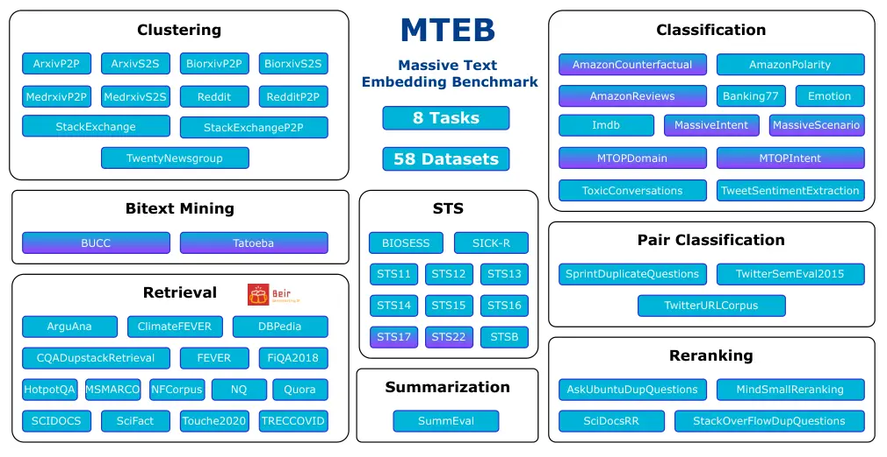

<!-- _class: lead -->

###### WEEK 07 · EVALUATION

# 임베딩의 “좋음”을 평가 설계로 증명하기

**task → dataset → metric → baseline → uncertainty → error**

---

# 점수 하나는 답이 아니다

> **핵심**
> 평가 결과는 모델의 고유 속성이 아니라 **모델 × 데이터 × 과업 × 지표 × 시스템**의 함수다.

$$R=R(M,D,T,\mu,S)$$

- MTEB 평균 1등 ≠ 우리 한국어 장학규정 검색 1등
- 정밀도 1% 개선이 latency 10배를 정당화하는가?
- 평균은 어떤 언어·길이·집단의 실패를 숨기는가?

---

# 학습목표

1. intrinsic, extrinsic, downstream/system evaluation을 구분한다.
2. STS·분류·군집·검색 지표를 계산하고 지표가 답하는 질문을 설명한다.
3. MTEB/MMTEB의 범위와 leaderboard 해석 한계를 설명한다.
4. 데이터 누수, benchmark contamination, 불완전 qrels를 진단한다.
5. 정확도–지연시간–메모리–비용 Pareto 비교표를 만든다.

---

# 평가의 세 층


- **Intrinsic** — 유사도·analogy 등 표현 자체의 제한된 특성.
- **Task / Extrinsic** — 분류·군집·검색 등 실제 downstream 과업.
- **System** — index·reranker·LLM·UI를 포함한 end-to-end 가치와 위험.


> **정의**
> 좋은 연구 질문은 “모델 A가 좋은가?”가 아니라 “조건 C에서 지표 M과 비용 K로 볼 때 A가 baseline B보다 나은가?”다.


---

# STS: 순위 상관을 본다

문장 쌍별 gold 유사도 $y_i$와 embedding cosine $s_i$의 관계.

**Spearman rank correlation**:

$$\rho=1-\frac{6\sum_i d_i^2}{n(n^2-1)}$$

- 점수의 절대선형성보다 **순위 일관성** 평가
- tie가 있을 때는 일반적인 rank-correlation 구현 사용
- STS label은 사람의 의미 유사성 판단이며 검색 relevance와 다를 수 있음

---

# 분류와 군집 지표


### 분류

- macro/micro/weighted F1 구분
- 불균형에서는 per-class recall
- calibration이 필요한 의사결정은 Brier/ECE 등 추가
### 군집

- ARI/NMI/V-measure: label과 일치
- silhouette: 내부 거리 구조
- 안정성: seed/bootstrap/시간


> **주의**
> 외부 label과의 일치도가 낮다고 군집이 무조건 나쁜 것은 아니며, label이 실제 사용 목적을 반영하는지도 검증한다.


---

# 검색 평가 데이터의 구조


**Queries $Q$** → **Corpus $D$** → **Relevance qrels** → **Run ranked lists** → **Metrics**


- binary qrels: relevant / not relevant
- graded qrels: 매우 관련/부분 관련/무관
- one-positive dataset은 Recall@k가 단순하지만 실제 다중 정답을 놓칠 수 있음
- unjudged 문서를 “무관”으로 처리하면 새 모델이 불리할 수 있음

---

# Precision@k와 Recall@k

$$P@k=\frac{|\operatorname{top}_k\cap R_q|}{k}$$

$$R@k=\frac{|\operatorname{top}_k\cap R_q|}{|R_q|}$$

- Precision@k: 보여준 결과 중 얼마나 맞는가?
- Recall@k: 가능한 정답 중 얼마나 놓치지 않았는가?
- 후보 생성 단계는 대개 Recall을, 최종 화면은 Precision을 더 중시
- 정답 수가 쿼리마다 다르면 macro 평균 해석에 주의

---

# MRR: 첫 정답까지 얼마나 기다리는가

$$\operatorname{RR}(q)=\frac{1}{\operatorname{rank}_q^{(first\ relevant)}}$$

$$\operatorname{MRR}=\frac{1}{|Q|}\sum_q\operatorname{RR}(q)$$

| 첫 정답 순위 | RR |
|---:|---:|
| 1 | 1.0 |
| 2 | 0.5 |
| 5 | 0.2 |
| 없음 | 0 |

첫 정답 이후의 관련 문서는 반영하지 않는다.

---

# DCG와 nDCG: 순위와 등급을 함께

$$\operatorname{DCG}@k=\sum_{i=1}^{k}\frac{2^{rel_i}-1}{\log_2(i+1)}$$

$$\operatorname{nDCG}@k=\frac{\operatorname{DCG}@k}{\operatorname{IDCG}@k}$$

- 높은 relevance를 상단에 둘수록 큼
- ideal ranking으로 나눠 쿼리별 정답 수/등급 차이를 보정
- binary qrels에도 쓸 수 있지만 graded relevance에서 특히 유용


> **실습**
> **손계산:** relevance `[3,0,2]`인 top-3의 DCG와 이상적 `[3,2,0]`의 nDCG를 계산한다.


---

# ANN 평가: 검색 모델과 인덱스를 분리

두 종류의 Recall을 혼동하지 않는다.


- **Task Recall@k** — gold relevant 문서를 찾았는가?
- **ANN recall@k** — exact top-k 이웃을 approximate index가 얼마나 재현했는가?


$$\operatorname{ANNRecall}@k=\frac{|NN_k^{approx}\cap NN_k^{exact}|}{k}$$

인덱스 파라미터를 바꾸면 embedding model이 같아도 task 성능과 latency가 달라진다.

---

# MTEB가 바꾼 평가 관행

원 MTEB 논문은 다양한 embedding을 한 틀에서 비교했다.

- 8개 task type
- 58개 dataset
- 112개 언어를 포함한 평가 범위
- classification, clustering, pair classification, reranking, retrieval, STS, summarization 등

핵심 결론: **모든 과업을 지배하는 단일 모델이 없었다.**


*출처: Muennighoff et al. (2023), “MTEB.” · [EACL 2023](https://aclanthology.org/2023.eacl-main.148/) · [arXiv](https://arxiv.org/abs/2210.07316)*


---

# 논문 도판: 하나의 평균이 여덟 과업을 숨긴다



*그림: 원 MTEB의 8개 과업과 58개 데이터셋. 보라색은 다국어 데이터셋을 뜻한다.*

> **교재 연결**
> Chapter 10의 MTEB 실행 결과는 전체 평균만 기록하지 않고, **강의 프로젝트와 일치하는 과업·데이터셋별 점수**로 다시 해석한다.

*출처: Muennighoff et al. (2023), “MTEB,” Figure 1 · [ACL Anthology](https://aclanthology.org/2023.eacl-main.148/)*

---

# MMTEB: 더 많은 언어와 과업

2025 연구 보고 범위:


- **500+** — 품질관리 평가 과업
- **250+** — 언어
- **다중 과업** — retrieval뿐 아니라 다양한 embedding 용도


논문에서는 560M 규모의 공개 모델이 더 큰 LLM보다 전체적으로 강한 사례도 보고했다. 크기만으로 선택할 수 없다는 증거다.


*출처: Lee et al. (2025), “Massive Multilingual Text Embedding Benchmark.” · [arXiv:2502.13595](https://arxiv.org/abs/2502.13595)*


---

# Leaderboard를 읽는 7문장

1. 내 과업과 같은 task subset인가?
2. 한국어와 내 도메인이 포함되는가?
3. 입력 길이와 query/document 형식이 같은가?
4. instruction/prompt 조건이 공정한가?
5. 모델 크기·차원·dtype·batch가 무엇인가?
6. 공개/비공개 데이터와 contamination 가능성은?
7. 점수 차이가 변동성과 운영 비용보다 큰가?


> **주의**
> 전체 평균은 서로 다른 dataset scale과 중요도를 숨긴다. 먼저 목표 과업 subset과 per-dataset 결과를 본다.


---

# 데이터 누수와 contamination

| 위험 | 예 | 방지 |
|---|---|---|
| split leakage | 같은 문서 chunk가 양쪽 | document/group split |
| temporal leakage | 미래 문서가 train | time split |
| duplicate leakage | 근사 중복 문장 | hash/semantic dedup |
| benchmark training | test를 학습 데이터로 | data statement, held-out private set |
| tuning leakage | test로 prompt/alpha 선택 | validation 고정 |


> **정의**
> **contamination**: 평가 항목 또는 가까운 변형이 사전학습/파인튜닝 데이터에 들어가 일반화가 아닌 기억으로 점수가 오르는 현상.


---

# 통계적 불확실성

평균 점수만 보고 “A가 B보다 낫다”고 하지 않는다.

- 쿼리를 bootstrap resampling해 metric 차이의 신뢰구간 계산
- 같은 쿼리의 두 모델 결과를 짝지은 paired 비교
- seed가 필요한 training/clustering은 여러 seed 보고
- per-query 차이 분포와 가장 크게 개선/악화된 사례 확인

```python
delta = metric(model_a, sample_q) - metric(model_b, sample_q)
# bootstrap delta distribution → 2.5%, 97.5% quantiles
```

---

# 정확도 외 운영 지표

| 축 | 측정 예 |
|---|---|
| 품질 | nDCG@10, Recall@100, macro-F1 |
| encode | docs/sec, queries/sec, p50/p95 latency |
| 저장 | dimension × dtype × corpus size |
| index | build time, peak RAM, disk size |
| energy/cost | GPU-hour, API 비용, 전력 측정 |
| 안정성 | timeout, error rate, OOM 비율 |


> **최신 동향**
> **Pareto frontier:** 다른 후보보다 품질은 낮고 비용은 높은 모델은 제거한다. 단일 가중 평균을 만들기 전에 비지배 후보를 본다.


---

<!-- _class: section -->

# Hands-On LLM 연결

## Chapter 10의 MTEB 평가를 우리 데이터셋의 실험표로 확장한다

---

# 최소 평가 프로토콜

1. **Frozen test**: 학기 초 qrels를 잠그고 변경 이력 관리
2. **Baselines**: BM25/TF–IDF, 작은 공개 embedding
3. **Candidates**: 모델 2–3개, 동일 truncation 조건
4. **Metrics**: Recall@k + nDCG@10 + latency + memory
5. **Slices**: 한국어, 영숫자, 부정, 장문, 최신 문서
6. **Errors**: 최악 query 20개를 원인 분류
7. **Uncertainty**: bootstrap interval 또는 여러 seed


> **교재 연결**
> **재현성:** 모델 이름만 쓰지 말고 revision, prompt, normalize, dimension, library version을 결과 표에 포함한다.


---

# 모델 카드형 결과표

| 모델 | dim | R@10 | nDCG@10 | p95 ms | 1M fp32 | 비고 |
|---|---:|---:|---:|---:|---:|---|
| TF–IDF | $|V|$ | — | — | — | sparse | 기준선 |
| Model A | 384 | — | — | — | 1.43 GiB | 한국어 |
| Model B | 1024 | — | — | — | 3.81 GiB | instruction |
| Model B-256 | 256 | — | — | — | 0.95 GiB | Matryoshka |


> **실습**
> 빈칸을 Notebook 측정값으로 채우고, 서비스 제약 안에서 선택한 모델과 버린 모델의 이유를 모두 쓴다.


---

# 수업 활동: leaderboard 반박하기

팀별로 임의의 “1위 모델” 주장에 대해 반박 질문을 만든다.

- 어떤 dataset과 subset의 1위인가?
- 차이가 통계적으로/운영적으로 의미 있는가?
- 우리 데이터 slice에서 오류는?
- 비용과 라이선스는?
- 재현 가능한 config가 공개됐는가?


> **실습**
> **결과물:** 모델 구매/도입 심의용 1페이지 평가 체크리스트.


---

# 형성평가

1. Recall@k와 ANN recall@k의 분모/정답은 어떻게 다른가?
2. MRR이 첫 정답 이후를 무시하는 이유와 한계는?
3. nDCG가 graded relevance에 적합한 이유는?
4. MTEB 평균 1등을 그대로 채택하면 안 되는 이유 세 가지는?
5. group split이 필요한 데이터 예를 하나 들어라.


> **교재 연결**
> **Notebook:** `../notebooks/week07.ipynb` · metric을 직접 계산하고 모델별 per-query 차이를 저장한다.


---

# 핵심 정리

- 평가 질문이 먼저이고 모델 점수는 나중이다.
- metric마다 보는 순위 행동이 다르므로 사용 시나리오와 연결한다.
- MTEB/MMTEB는 폭넓은 기준이지만 자체 한국어·도메인 test를 대체하지 않는다.
- 정확도와 함께 latency·memory·cost·stability를 측정한다.
- 평균 차이에는 불확실성과 오류 사례를 붙여야 한다.

> **핵심**
> 다음 주: 평가한 벡터를 **대규모 검색과 RAG 시스템**에 배치한다.

---

<!-- _class: compact -->

# 참고문헌과 원본 연결

- Muennighoff et al. (2023), “MTEB.” [EACL](https://aclanthology.org/2023.eacl-main.148/)
- Thakur et al. (2021), “BEIR.” [NeurIPS Datasets and Benchmarks](https://proceedings.neurips.cc/paper/2021/hash/65b9eea6e1cc6bb9f0cd2a47751a186f-Abstract-round2.html)
- Lee et al. (2025), “MMTEB.” [arXiv](https://arxiv.org/abs/2502.13595)
- Sakai (2007), “On the Reliability of Information Retrieval Metrics…” [DOI](https://doi.org/10.1016/j.ipm.2006.06.011)
- Hands-On Large Language Models, Chapter 10. [upstream](https://github.com/HandsOnLLM/Hands-On-Large-Language-Models/tree/main/chapter10)
