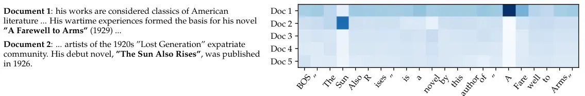

<!-- _class: lead -->

###### WEEK 08 · VECTOR SEARCH & RAG

# 벡터에서 근거까지: 검색과 RAG 시스템

**chunk → embed → index → retrieve → rerank → generate → evaluate**

---

# RAG의 핵심은 생성보다 검색 계약이다

> **핵심**
> 생성 모델이 답을 잘 쓰려면 먼저 **정답 근거가 검색 가능한 단위로 존재**해야 한다.

- 문서가 없으면 검색할 수 없다.
- 잘못 chunk하면 정답과 조건이 분리된다.
- top-k에 근거가 없으면 prompt 개선으로 복구하기 어렵다.
- 검색 성공과 근거 기반 답변 성공은 별도로 평가한다.

---

# 학습목표

1. exact k-NN과 ANN의 정확도–속도 trade-off를 설명한다.
2. HNSW, IVF, PQ의 핵심 아이디어를 구분한다.
3. chunking, metadata, sparse+dense hybrid, reranker를 설계한다.
4. DPR/ColBERT/RAG의 표현과 정보 흐름을 비교한다.
5. Hands-On LLM 8장의 FAISS–reranking–RAG 코드를 실패 단계별로 평가한다.

---

# 검색 시스템의 두 공간


- **원문 공간** — 텍스트, 표, 페이지, 날짜, 권한, 출처. 사람이 검증할 근거가 존재한다.
- **벡터 공간** — 검색을 위한 근사 표현. 원문의 모든 조건을 보존하지 않는다.


> **정의**
> **인덱스(index)**: 쿼리마다 모든 벡터를 순차 비교하지 않고 후보를 빠르게 찾도록 만든 자료구조.


---

# Exact k-NN vs Approximate NN

| | Exact search | ANN search |
|---|---|---|
| 결과 | 정의한 metric의 정확한 top-k | 높은 확률로 top-k 근사 |
| 비용 | 보통 corpus 크기에 선형 | sublinear에 가까운 후보 탐색 |
| 용도 | 작은 corpus, gold 기준 | 대규모 실서비스 |
| 평가 | task metric | task metric + ANN recall + latency |


> **주의**
> ANN이 반환한 결과가 틀린 이유는 (a) embedding 순위 자체가 나쁨, (b) index가 exact 이웃을 놓침으로 분해해야 한다.


---

# HNSW: 가까운 길을 그래프로 찾는다


> **정의**
> **Hierarchical Navigable Small World**: 벡터를 근접 그래프에 연결하고, 희소한 상위 층에서 멀리 이동한 뒤 조밀한 하위 층에서 국소 탐색한다.


핵심 파라미터:

- `M`: 노드 연결 수 — 메모리/구축시간/recall
- `efConstruction`: 구축 탐색 폭
- `efSearch`: 쿼리 탐색 폭 — latency/recall


> **논문 읽기**
> `efSearch`를 늘리면 보통 recall이 오르고 느려진다. 모델 교체 전 index 파라미터 Pareto 곡선을 그린다.


*출처: Malkov & Yashunin (2018), [“Efficient and Robust Approximate Nearest Neighbor Search Using HNSW Graphs”](https://arxiv.org/abs/1603.09320)*


---

# IVF와 Product Quantization


- **IVF** — 벡터를 coarse centroid 목록에 나누고 쿼리와 가까운 `nprobe` 목록만 검색.
- **PQ** — 벡터를 여러 subspace로 나눠 각 부분을 짧은 code로 양자화해 메모리·거리 계산 절약.


- IVF: `nlist`, `nprobe`가 recall–latency를 결정
- PQ: code size가 압축률–거리 왜곡을 결정
- 조합 예: `IndexIVFPQ`


*출처: Johnson et al. (2017), [“Billion-scale similarity search with GPUs”](https://arxiv.org/abs/1702.08734) (FAISS)*


---

# Chunking은 검색의 단위 설계


- **고정 길이** — 단순·빠름. 문장/표 경계를 자를 수 있음.
- **구조 기반** — 제목·문단·페이지·표 경계를 유지.
- **의미 기반** — 문장 간 변화로 분할. 비용·불안정성 증가.


**overlap**은 경계 손실을 완화하지만 중복 후보·저장비용·근거 중복을 늘린다.


> **실습**
> **평가:** chunk size 128/256/512 tokens에 대해 answer-containing recall과 전체 latency를 비교한다.


---

# 좋은 chunk의 조건

- 독립적으로 읽어도 주어·조건·날짜가 이해된다.
- 제목/문서명/시행일 같은 metadata와 연결된다.
- 정답 근거가 하나 또는 소수 chunk에 완결된다.
- 인용할 때 원문 위치로 되돌아갈 수 있다.
- 변경된 문서만 재임베딩할 stable ID가 있다.


> **주의**
> 표의 한 행만 텍스트로 떼면 열 제목·단위가 사라진다. PDF/표 문서는 layout-aware chunking 또는 페이지 이미지 검색을 고려한다.


---

# Dense retrieval: DPR의 이중 인코더

$$s(q,p)=E_Q(q)^\top E_P(p)$$


**질문 $q$** → **Query Encoder** → **$z_q$** → **$z_p$ corpus index**


- passage vector는 사전 계산
- positive passage와 in-batch/hard negatives로 학습
- lexical mismatch에 강하지만 정확한 이름·수치·부정은 놓칠 수 있음


*출처: Karpukhin et al. (2020), [“Dense Passage Retrieval”](https://arxiv.org/abs/2004.04906)*


---

# ColBERT: late interaction

쿼리 토큰 벡터 $Q_i$, 문서 토큰 벡터 $D_j$:

$$s(q,d)=\sum_i\max_j Q_i^\top D_j$$


- **Bi-encoder** — 문서 1벡터, 가장 빠른 압축
- **ColBERT** — 토큰별 벡터를 사전 계산, MaxSim
- **Cross-encoder** — 모든 토큰을 함께 계산, 가장 비쌈


*출처: Khattab & Zaharia (2020), [“ColBERT”](https://arxiv.org/abs/2004.12832) · 논문은 풍부한 interaction을 유지하며 cross-encoder보다 훨씬 빠른 검색을 목표로 한다.*


---

# Hybrid 후보 생성과 reranking


**BM25 top-100** → **Dense top-100** → **RRF / union** → **Cross-encoder top-20** → **Context top-5**


- 1단계: recall 최적화
- 2단계: 정밀한 query–document 상호작용
- 생성 입력: 중복 제거, 문서 다양성, token budget 고려


> **주의**
> reranker가 후보에 없는 문서를 복구할 수는 없다. 후보 recall과 rerank nDCG를 분리한다.


---

# RAG의 정의


> **정의**
> **Retrieval-Augmented Generation**: 생성 모델의 parametric memory와 외부 문서 index의 non-parametric memory를 결합해, 입력마다 근거 문서를 검색하고 그 조건에서 출력을 생성하는 방식.


원 논문의 두 변형:

- **RAG-Sequence**: 전체 출력 시퀀스에 같은 잠재 문서를 사용
- **RAG-Token**: 토큰마다 다른 잠재 문서 조합 가능

$$p(y\mid x)=\sum_{z\in top-k}p_\eta(z\mid x)p_\theta(y\mid x,z)$$


*출처: Lewis et al. (2020), [“Retrieval-Augmented Generation for Knowledge-Intensive NLP Tasks”](https://arxiv.org/abs/2005.11401)*


---

# 논문 도판: retriever와 generator는 함께 학습된다


*그림: query encoder와 document index가 top-k 문서를 찾고, generator가 각 문서를 조건으로 출력 확률을 계산한다.*

> **교재 연결**
> Chapter 8 실습은 이 구조를 **chunking → embedding → FAISS index → retrieve → prompt → generation**으로 분해해 구현한다.

*출처: Lewis et al. (2020), “Retrieval-Augmented Generation,” Figure 1 · [원 논문](https://arxiv.org/abs/2005.11401)*

---

# 논문 도판: 모델이 어떤 문서를 믿었나





*그림: RAG 논문의 문서 posterior 시각화. 생성 과정에서 검색 문서에 부여된 확률 질량을 분석한다.*


*출처: Lewis et al. (2020), RAG paper figure · [원문 HTML](https://arxiv.org/html/2005.11401)*


---

# 원 논문 수치에서 읽을 것

RAG 원 연구의 한 설정:

- Wikipedia를 100-word 단위 약 2,100만 passage로 분할
- DPR 계열 retriever와 MIPS/FAISS index 사용
- parametric seq2seq generator + non-parametric index 결합


> **논문 읽기**
> **해석:** 이 숫자는 오늘의 권장 chunk size가 아니다. “지식 corpus를 검색 가능한 단위로 만들고 retriever와 generator를 공동/연계한다”는 설계를 읽는다.


---

# RAG 실패를 단계별로 분해한다

| 단계 | 실패 | 진단 지표 |
|---|---|---|
| ingestion | 최신 문서 없음/OCR 오류 | coverage, freshness |
| chunking | 조건과 답 분리 | answer-containing recall |
| retrieval | 관련 chunk top-k 밖 | Recall@k |
| reranking | 정답 후보를 아래로 | nDCG/MRR before–after |
| context | 중복/잘림/순서 | context utilization |
| generation | 근거 무시/왜곡 | faithfulness, citation precision |

> **핵심**
> “RAG가 틀렸다”가 아니라 **어느 단계에서 정답이 사라졌는가**를 찾는다.

---

# RAG 평가는 세 질문


- **Retrieval** — 정답 근거가 top-k 안에 있는가?
- **Grounding** — 답의 주장과 인용이 제공 근거에 의해 지지되는가?
- **Answer** — 질문을 정확·완전하게 해결했는가?


- LLM-as-judge는 편리하지만 judge prompt/model/version과 사람 검증 표본이 필요
- 인용 존재 여부와 인용 정확성은 다르다.
- “모르겠습니다”를 허용하는 abstention threshold를 평가한다.

---

# 보안: 검색 문서는 신뢰할 수 없는 입력

- 문서 안 prompt injection: “이전 지시를 무시하라”
- 악성/오래된 문서의 index poisoning
- 권한 없는 문서가 vector search로 노출
- 개인 정보가 embedding/index/log에 잔존


> **주의**
> **방어:** 권한 필터를 검색 전에 강제, source allowlist/versioning, context를 데이터로 구분, 인용 검증, 민감 정보 정책, adversarial eval.


---

<!-- _class: section -->

# Hands-On LLM 연결

## Chapter 8의 코드를 관찰 가능한 검색 파이프라인으로

---

# Chapter 8 실행 흐름

```python
chunks = chunk_documents(documents)
X = encoder.encode(chunks, normalize_embeddings=True)
index.add(X.astype("float32"))

q = encoder.encode([query], normalize_embeddings=True)
scores, ids = index.search(q.astype("float32"), k=20)
candidates = [chunks[i] for i in ids[0]]
reranked = reranker.rank(query, candidates)[:5]
answer = generator(query, reranked)
```


> **교재 연결**
> **각 줄의 로그:** chunk ID/source, vector norm/dim, raw retrieval score, rerank score, 최종 context, 인용, latency.


---

# FAISS에서 자주 생기는 오류

- cosine을 원하면서 normalize 없이 inner-product index 사용
- `float64`/object array를 넣어 타입 오류 또는 비효율
- index의 dimension과 새 모델 출력 dimension 불일치
- 모델을 교체하고 기존 index를 재생성하지 않음
- query/document prefix를 다르게/빠뜨림
- ID mapping을 잃어 원문·metadata로 돌아가지 못함


> **실습**
> **단위 테스트:** 자기 자신 검색, exact NumPy top-k와 FAISS top-k 일치, 저장–재로딩 후 ID/score 일치.


---

# 최신 동향: 단일 텍스트 벡터 너머


- **Hybrid-native** — BGE-M3처럼 dense/sparse/multi-vector를 함께 학습.
- **Visual documents** — ColPali처럼 PDF 페이지 이미지를 직접 multi-vector 검색.
- **Adaptive retrieval** — 질문 난이도에 따라 검색·재검색·도구 사용을 조절.


> **최신 동향**
> 긴 context가 RAG를 없애는 것이 아니라 선택지를 바꾼다. corpus freshness, 권한, 인용, 비용이 필요하면 외부 검색은 여전히 중요하다.


*출처: [BGE-M3 (2024)](https://arxiv.org/abs/2402.03216) · [ColPali (2024)](https://arxiv.org/abs/2407.01449)*


---

# 수업 활동: 실패 위치 찾기

교수가 제공한 실패 query 5개에 대해:

1. gold evidence가 corpus에 있는가?
2. 어떤 chunk에 들어갔는가?
3. dense/BM25/hybrid의 rank는?
4. reranker 전후 rank는?
5. 최종 context에 포함됐는가?
6. generator가 근거를 지켰는가?


> **실습**
> **제출:** 각 실패를 ingestion/chunk/retrieval/rerank/context/generation 중 하나 이상으로 분류하고 최소 수정안을 제시한다.


---

# 형성평가

1. HNSW의 `efSearch`가 늘면 일반적으로 무엇이 변하는가?
2. PQ가 절약하는 자원과 잃을 수 있는 것은?
3. ColBERT와 bi-encoder의 문서당 벡터 수 차이는?
4. reranker가 후보 recall을 복구하지 못하는 이유는?
5. RAG의 retrieval, grounding, answer 평가를 분리해야 하는 이유는?


> **교재 연결**
> **Notebook:** `../notebooks/week08.ipynb` · exact/ANN, dense/hybrid, rerank 전후를 같은 query로 비교한다.


---

# 핵심 정리

- 벡터 검색은 표현 모델과 ANN 인덱스의 결합이다.
- chunking과 metadata가 검색 가능한 근거의 경계를 정한다.
- hybrid와 reranking은 서로 다른 오류를 줄이는 다단계 설계다.
- RAG는 검색과 생성을 결합하지만 실패는 단계별로 평가해야 한다.
- 보안·권한·출처·최신성은 정확도와 같은 1급 요구사항이다.

> **핵심**
> 다음 주: 텍스트뿐 아니라 **이미지와 문서 페이지도 같은 공간**에 놓는다.

---

<!-- _class: compact -->

# 참고문헌과 원본 연결

- Karpukhin et al. (2020), “Dense Passage Retrieval.” [arXiv](https://arxiv.org/abs/2004.04906)
- Khattab & Zaharia (2020), “ColBERT.” [arXiv](https://arxiv.org/abs/2004.12832)
- Lewis et al. (2020), “Retrieval-Augmented Generation…” [arXiv](https://arxiv.org/abs/2005.11401)
- Johnson et al. (2017), “Billion-scale similarity search with GPUs.” [arXiv](https://arxiv.org/abs/1702.08734)
- Faysse et al. (2024), “ColPali.” [arXiv](https://arxiv.org/abs/2407.01449)
- Hands-On Large Language Models, Chapter 8. [upstream](https://github.com/HandsOnLLM/Hands-On-Large-Language-Models/tree/main/chapter08)
