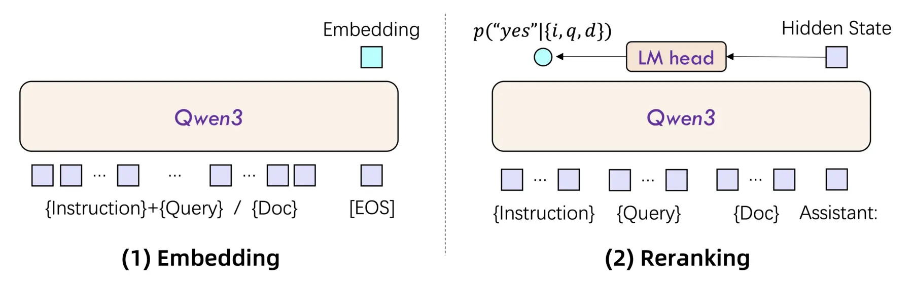

<!-- _class: lead -->

###### WEEK 10 · CAPSTONE & TRENDS

# 좋은 임베딩 실험을 좋은 데이터 서비스로

**요구사항 → baseline → model → index → evaluation → deployment**

---

# 종합 프로젝트의 중심 주장

> **핵심**
> 최신 모델을 쓴 프로젝트보다 **의사결정의 근거가 추적되는 프로젝트**가 강하다.

- 왜 이 표현을 선택했는가?
- 어떤 baseline보다 얼마나 나아졌는가?
- 어디서 실패하며 누구에게 피해가 가는가?
- 같은 commit과 config로 재현되는가?

---

# 학습목표

1. 데이터–표현–검색/분석–서비스를 end-to-end로 설계한다.
2. 기능 요구사항을 측정 가능한 quality/cost/safety 지표로 바꾼다.
3. baseline, ablation, error analysis가 포함된 실험계획을 작성한다.
4. 2013–2026 임베딩 기술 흐름을 문제 해결 방식의 변화로 설명한다.
5. 최종 보고서·데모·구술평가에서 자신의 기술 선택을 방어한다.

---

# 문제 정의 캔버스

| 항목 | 반드시 답할 질문 |
|---|---|
| 사용자 | 누가 언제 어떤 결정을 하는가? |
| 입력 | 텍스트/이미지/문서의 언어·길이·권한은? |
| 출력 | 순위, 분류, 군집, 답변 중 무엇인가? |
| 정답 | relevance/label을 누가 어떻게 정의하는가? |
| 오류비용 | FP와 FN 중 무엇이 더 위험한가? |
| 제약 | p95 latency, RAM, 비용, 라이선스, 개인정보 |


> **정의**
> “AI로 문서를 검색한다”는 문제 정의가 아니다. 사용자 행동과 성공 지표까지 써야 한다.


---

# End-to-end 참조 구조


**Source versioned** → **Parse & chunk** → **Embed & index** → **Retrieve & rerank** → **UI / API feedback**


횡단 관심사:

- evaluation dataset와 experiment tracking
- access control, privacy, source attribution
- monitoring, rollback, model/index versioning

---

# 기준선 사다리


- **0** — 규칙/빈도/무작위
- **1** — TF–IDF/BM25 + 고전 ML
- **2** — off-the-shelf embedding
- **3** — hybrid/rerank/fine-tune


> **논문 읽기**
> 각 단계가 이전 단계를 얼마나 개선하고 어떤 비용을 추가했는지 표로 남긴다. 복잡한 모델이 기준선을 못 이기면 데이터·과업 정의부터 점검한다.


---

# 모델 선택표

| 기준 | 질문 | 후보 기록 |
|---|---|---|
| 과업 | retrieval/STS/classification? | training objective |
| 언어·도메인 | 한국어·전문용어를 평가했나? | per-slice score |
| 길이 | 실제 p95 tokens를 수용하나? | truncation rate |
| 표현 | dense/sparse/multi-vector? | index 방식 |
| 비용 | dim, params, throughput? | p95 latency/RAM |
| 운영 | license, offline, revision? | model card |

---

# 데이터셋을 제품 요구사항에서 만든다

1. 실제 사용자 질문 유형을 sampling한다.
2. 중복·개인정보·권한을 처리한다.
3. relevance rubric과 annotator 교육을 만든다.
4. 다중 정답과 graded relevance를 허용한다.
5. 언어·길이·부정·숫자·최신성 slice를 태깅한다.
6. 문서/시간 단위 split으로 누수를 막는다.
7. test set을 잠그고 version을 부여한다.


> **주의**
> 공개 benchmark를 재현하는 것과 제품을 평가하는 것은 별도 목표다. 둘을 함께 보고하면 transfer gap을 설명할 수 있다.


---

# Ablation: 무엇이 실제로 기여했나

| 실험 | 바꾸는 것 | 고정할 것 |
|---|---|---|
| chunk | 128/256/512 | model/index/qrels |
| representation | BM25/dense/hybrid | chunk/test queries |
| dimension | 64/256/full | model/prompt/index family |
| reranker | off/on | candidates top-k |
| prompt | instruction A/B | evidence/model/decoding |


> **정의**
> **Ablation study**: 시스템 구성요소 하나를 제거·변경해 성능 변화로 그 기여를 추정하는 통제 실험.


---

# 오류 분석은 다음 실험을 만든다


**실패 수집** → **원인 coding** → **빈도·피해** → **수정 가설** → **재평가**


권장 오류 taxonomy:

- OOV/고유명사, 부정·수치, truncation, 다국어
- 불완전 label/qrels, ambiguous query
- ANN miss, metadata filter, reranker reversal
- 근거 누락, 인용 불일치, hallucination

---

# 재현성 패키지

```text
project/
├── README.md              # 실행·평가 순서
├── configs/               # model/index/chunk/prompt
├── data/README.md         # 출처·schema·split·license
├── src/                   # 재사용 가능한 코드
├── notebooks/             # 탐색·오류 분석
├── evaluation/            # qrels, metrics, frozen runs
└── reports/               # 결과표, model/data card
```

기록: git commit, package lock, seed, model revision, hardware, 실행시간.

---

# 데이터 카드와 모델 카드


- **Data card** — 출처·수집·동의·필터·언어·결측·split·known bias·허용 용도.
- **Model/System card** — 학습목표·입출력·metric·slice·비용·한계·금지 용도·monitoring.


> **주의**
> 카드는 홍보 문서가 아니라 다음 사용자가 오용하지 않게 하는 운영 인터페이스다.


---

# 배포: model과 index는 한 버전 단위

벡터 공간이 달라지면 기존 index를 재사용할 수 없다.

```text
embedding_model_revision + tokenizer + pooling + normalize
+ dimension + chunker_version + corpus_snapshot + index_config
= index_version
```

- blue/green index로 교체와 rollback
- 신규 문서 incremental update와 삭제 전파
- query 로그의 개인정보 최소화
- 품질/지연/오류율 dashboard와 alert

---

# 성능 예산

| 구간 | p50/p95 | throughput | 비용 |
|---|---:|---:|---:|
| query encode | — | q/s | GPU/API |
| ANN retrieve | — | q/s | RAM/CPU |
| rerank | — | pairs/s | GPU |
| generation | — | tokens/s | GPU/API |
| end-to-end | — | req/s | 전체 |


> **최신 동향**
> 성능 최적화 순서: 측정 → 병목 식별 → batch/cache/차원/index 조정 → 품질 회귀 테스트. 품질을 모른 채 latency만 줄이지 않는다.


---

# 2013–2026: 문제 해결 방식의 변화

| 시기 | 대표 흐름 | 핵심 변화 |
|---|---|---|
| 2013–2017 | Word2Vec, GloVe, fastText | 단어 분포를 정적 벡터로 |
| 2017–2019 | Transformer, BERT, SBERT | 문맥화와 문장 단위 비교 |
| 2020–2022 | DPR, ColBERT, RAG, CLIP, MRL | 검색·생성·멀티모달·가변 차원 |
| 2023–2024 | MTEB, BGE-M3, ColPali | 통합 평가, hybrid/multi-vector, 시각 문서 |
| 2025–2026 | Qwen3/Jina/Gemini 계열 | instruction, 다국어, omni-modal, 유연한 표현 |


> **논문 읽기**
> 연도표는 “이전 기술이 사라졌다”는 뜻이 아니다. 새 표현은 비용·데이터·평가 문제를 추가한다.


---

# 최신 기술 동향 ① 통합


- **Task integration** — embedding + reranking + generation을 instruction으로 통합.
- **Representation integration** — dense + sparse + multi-vector를 한 backbone에서.
- **Modality integration** — text + image + audio + video를 공동 공간에.


> **최신 동향**
> 통합 모델은 운영 단순화를 약속하지만, 각 mode의 최적 prompt·adapter·index·metric을 여전히 따로 검증해야 한다.


---

# 논문 도판: embedding과 reranking의 역할은 다르다



*그림: Qwen3-Embedding은 입력별 독립 벡터를, Qwen3-Reranker는 query–document를 함께 본 relevance score를 출력한다.*

> **교재 연결**
> Chapter 8의 1차 검색과 reranking, Chapter 10의 embedding 학습을 한 시스템으로 묶되 **후보 recall과 재정렬 품질을 분리 평가**한다.

*출처: Zhang et al. (2025), “Qwen3 Embedding,” Figure 1 · [원 논문](https://arxiv.org/abs/2506.05176)*

---

# 최신 기술 동향 ② 효율

- Matryoshka dimension truncation
- product quantization, binary/int8 embedding
- coarse-to-fine single→multi-vector retrieval
- distillation과 작은 encoder의 경쟁력
- synthetic query/negative로 데이터 효율 개선
- long-document encoding과 adaptive chunking


*출처: [Matryoshka Representation Learning](https://arxiv.org/abs/2205.13147) · [BGE-M3](https://arxiv.org/abs/2402.03216) · [Qwen3 Embedding](https://arxiv.org/abs/2506.05176)*


---

# 최신 기술 동향 ③ 평가의 확대

MTEB → MMTEB의 흐름은 “평균 점수”가 아니라 평가 범위를 확장한다.

- 더 많은 언어와 script
- retrieval 이외의 embedding 과업
- instruction/prompt의 공정한 처리
- 모델 크기·공개성·비용 비교
- contamination과 데이터 품질 점검


> **주의**
> 2026 preprint의 주장과 leaderboard 순위는 변할 수 있다. 학기 시작일에 버전·날짜를 표시하고 자체 frozen test를 우선한다.


---

# 윤리·법·안전 게이트

배포 전 “예/아니오”로 확인:

- 데이터 수집·재사용·모델 라이선스가 허용되는가?
- 개인/민감 정보가 embedding, log, cache에 남는가?
- 사용자 권한이 검색 전에 강제되는가?
- 집단별 오류와 가장 큰 피해를 측정했는가?
- 근거와 모델 한계를 UI에서 고지하는가?
- 삭제·정정·이의제기·rollback 경로가 있는가?

---

<!-- _class: section -->

# Hands-On LLM 종합 연결

## 2·3·4·5·8·9·10장의 예제를 하나의 증거 사슬로

---

# 책의 장을 프로젝트 단계에 매핑

| 프로젝트 단계 | Hands-On LLM | 질문 |
|---|---|---|
| 표현 이해 | Ch.2–3 | 토큰/hidden state/pooling은 무엇인가? |
| 분석 | Ch.4–5 | 분류·군집 결과를 어떻게 검증하나? |
| 검색·RAG | Ch.8 | chunk–index–rerank 중 병목은? |
| 멀티모달 | Ch.9 | OCR/text와 image representation 중 무엇을 보존? |
| 파인튜닝 | Ch.10 | data–loss–evaluator가 같은 relevance를 정의하나? |


> **교재 연결**
> **원칙:** 책 코드를 그대로 실행한 화면은 산출물이 아니다. 우리 데이터, baseline, metric, failure case를 추가해야 한다.


---

<!-- _class: compact -->

# 최종 프로젝트 필수 산출물

1. 문제정의서와 사용자 시나리오
2. data card와 frozen evaluation set
3. 실행 가능한 코드/Notebook/config
4. baseline 1개와 embedding 방법 1개의 비교표
5. dev에서 수행한 개선 실험 1개
6. 서로 다른 실패 사례 5개와 원인 분석
7. test 품질 지표와 질의·예제별 결과
8. 안전·라이선스·개인정보 검토
9. 10분 발표·시연과 5분 질의응답

> **선택 확장:** 두 번째 embedding 모델, 복수 ablation, 신뢰구간, latency·memory·비용 분석은 가산점 없는 심화 활동이다.

---

# 구술평가 질문 은행

- 왜 cosine이며 inner product/L2가 아닌가?
- normalize를 제거하면 rank가 어떻게 바뀌는가?
- test leakage를 어떤 split으로 막았는가?
- BM25가 이긴 query의 공통점은?
- 가장 큰 실패 유형과 피해는?
- index 파라미터를 바꾸면 model score와 어떻게 분리해 평가하는가?
- 새 문서/삭제/권한 변경은 어떻게 반영되는가?
- 예산이 절반이면 무엇을 줄이고 무엇을 지킬 것인가?

---

# 최종 발표 구조: 10분

| 시간 | 내용 |
|---:|---|
| 0:00–1:00 | 사용자, 입력, 출력과 위험한 오류 |
| 1:00–3:00 | 데이터, 정답, split과 baseline |
| 3:00–5:00 | embedding 방법과 선택 근거 |
| 5:00–7:00 | test 결과와 개선 실험 1개 |
| 7:00–8:00 | 실패 사례와 한계 |
| 8:00–10:00 | 새 입력 시연과 다음 단계 |


> **실습**
> 모델 이름보다 선택 근거와 실패 분석에 더 많은 시간을 배분한다.


---

# 제출 전 체크리스트

| 재현 | 증거 |
|---|---|
| 빈 환경에서 처음부터 실행 | baseline을 같은 조건으로 비교 |
| seed·revision·config 고정 | test를 tuning에 사용하지 않음 |
| data 경로와 license 기록 | 오류 원문과 문서 ID 보존 |
| 결과표 자동 생성 | 품질·비용·안전을 함께 보고 |


> **주의**
> Notebook 출력만 있고 실행 순서·환경·데이터 출처가 없으면 재현 가능한 제출로 보지 않는다.


---

# 과정 전체 핵심 정리

1. 임베딩은 과업에 필요한 관계를 공간에 보존하는 함수다.
2. 토큰화·pooling·정규화가 결과를 바꾼다.
3. 학습목표의 positive/negative가 “가까움”을 정의한다.
4. 분석 그림은 원공간 지표와 오류 사례로 검증한다.
5. 검색은 chunk–representation–index–rerank의 시스템이다.
6. 최신 모델도 baseline·자체 데이터·비용 평가를 대체하지 않는다.

> **핵심**
> **좋은 임베딩**이란 우리의 의사결정을 더 정확하고 책임 있게 만드는 표현이다.

---

<!-- _class: compact -->

# 참고문헌과 최신 동향 원문

- Vaswani et al. (2017), “Attention Is All You Need.” [arXiv](https://arxiv.org/abs/1706.03762)
- Reimers & Gurevych (2019), “Sentence-BERT.” [arXiv](https://arxiv.org/abs/1908.10084)
- Lewis et al. (2020), “RAG.” [arXiv](https://arxiv.org/abs/2005.11401)
- Muennighoff et al. (2023), “MTEB.” [ACL](https://aclanthology.org/2023.eacl-main.148/)
- Lee et al. (2025), “MMTEB.” [arXiv](https://arxiv.org/abs/2502.13595)
- Zhang et al. (2025), “Qwen3 Embedding.” [arXiv](https://arxiv.org/abs/2506.05176)
- Gemini Embedding 2 (2026 preprint). [arXiv](https://arxiv.org/html/2605.27295v1)
- Hands-On Large Language Models. [upstream](https://github.com/HandsOnLLM/Hands-On-Large-Language-Models)
